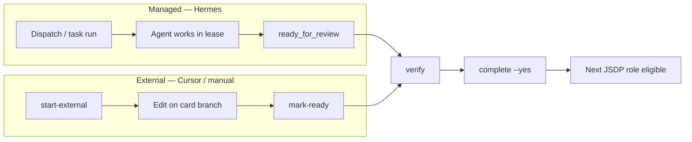

# JoyZoning

[](LICENSE)
[](global.json)

**Operator cockpit** · **Hermes optional** · **Cursor-ready JSDP**

| I want to… | Start here |
|------------|------------|
| Understand the strategy in one page | [Execution paths](docs/execution-paths.md) |
| Use **Cursor** with branch + merge discipline | [External-agent JSDP](docs/external-agent-jsdp.md) |
| Use **Hermes** dispatch in JoyZoning | [What's next](docs/onboarding/whats-next.md) |
| Run an **8-role** delivery chain | [JSDP](docs/jsdp.md) · `jz delivery-chain next --external` |

## Supervise AI coding on your machine.

JoyZoning is a **local operator cockpit** for agent-assisted software work:

- Plan in chat (optional)
- Track work as kanban cards
- Run changes in your **real repo** — one branch per card
- Verify with tests and builds
- **Merge only when you approve**

**Chat plans. The repo is truth. You merge.**

Most coding agents stop at chat. JoyZoning adds task tracking, branch discipline, verification evidence, audit trails, and a merge gate — so work stays reviewable before it becomes “done.”

### Cockpit, not engine

| JoyZoning owns | Your editor / agent owns |
|----------------|---------------------------|
| Task status, JSDP chain order | Editing source files |
| Branch `joyzoning/card-<id>` | Implementation details |
| Verification evidence | Running tools in the repo |
| Review and merge gates | When to stop coding |

**Hermes is optional.** You can run the same workflow from **Cursor**, **Claude Code**, **Copilot**, or **manual edits** — JoyZoning still supervises. See [Execution paths](docs/execution-paths.md) · [External-agent JSDP](docs/external-agent-jsdp.md).

JoyZoning is **not**:

- a second IDE
- an autonomous auto-merge bot
- “the agent said it’s done”

→ **New here?** [What's next](docs/onboarding/whats-next.md) (~20 min after install)  
→ **Full onboarding:** [onboarding/README.md](docs/onboarding/README.md)  
→ **Cursor / IDE-first delivery:** [External-agent JSDP](docs/external-agent-jsdp.md)

---

## Two ways to execute work

Same merge gate. Different engine.

| | **Managed** (Hermes) | **External** (Cursor, Claude Code, manual) |
|--|----------------------|---------------------------------------------|
| **Start** | `jz task run <id>` or Dispatch in desktop | `jz task start-external <id> --agent cursor` |
| **Hermes lease** | Yes | **No** |
| **Where you edit** | Hermes tools in JoyZoning / TUI | Your usual IDE or terminal |
| **Stop condition** | Agent → `ready_for_review` | You → `jz task mark-ready` |
| **Finish** | `jz task complete <id> --yes` | Same |

```bash
# Managed (default onboarding path)
jz task run <task-id>
jz task verify <task-id> --cmd "npm test"
jz task complete <task-id> --yes

# External (Cursor-first)
jz task start-external <task-id> --agent cursor
jz task prompt <task-id>                    # copy JSDP prompt into Cursor
jz task mark-ready <task-id>
jz task verify <task-id> --cmd "npm test"
jz task complete <task-id> --yes
```

Multi-role programs (product lock → architecture → ship): [JSDP](docs/jsdp.md) · [External-agent JSDP](docs/external-agent-jsdp.md)

### Lifecycle (same gates, different engine)



---

## Onboarding in four steps

| Step | Goal | Time | Guide |
|------|------|------|--------|
| **0 — Decide** | Is this the workflow you want? | ~5 min | [Before you begin](docs/onboarding/before-you-begin.md) |
| **1 — Install** | App running, repo opened | ~15 min | [Quickstart](docs/onboarding/quickstart.md) |
| **2 — First merge** | Start work → verify → merge → Complete | ~20 min | **[What's next](docs/onboarding/whats-next.md)** (managed) · **[External JSDP](docs/external-agent-jsdp.md)** (Cursor) |
| **3 — Daily use** | Desktop, CLI, or both | ongoing | [Setup checklist](docs/onboarding/setup-checklist.md) |

---

## Step 0 — Fit check

| You want… | Good fit? |
|-----------|-----------|
| Supervised agent work on a **real repo** with an audit trail | Yes |
| Review diffs and tests before anything ships | Yes |
| **JSDP** sequential roles with a merge between each | Yes |
| Work in **Cursor** but still want task/branch/merge discipline | Yes — [external-agent JSDP](docs/external-agent-jsdp.md) |
| A replacement IDE or chat-only workflow | No — keep your editor; use JoyZoning to supervise |
| Fully autonomous merge with no human gate | No |

[What is JoyZoning?](docs/what-is-joyzoning.md) (plain English) · [Philosophy](docs/philosophy.md)

---

## Step 1 — Install

**Need:** [.NET 8](https://dotnet.microsoft.com/download), Node 18+, pnpm, Python 3.11 (for Hermes managed path), one [diet-hermes](https://github.com/NousResearch/hermes-agent) install if using managed dispatch ([guide](docs/onboarding/hermes-setup.md)), LLM API key for Manager Chat ([keys](docs/onboarding/api-keys-and-models.md)).

> **Cursor-only workflow:** You still need the control plane (`pnpm dev`) and `jz`. Hermes gateway is only required for managed `jz task run` / Manager Chat — not for `jz task start-external`.

```bash
git clone https://github.com/CardSorting/JoyZoning.git
cd JoyZoning
pnpm install && pnpm setup && pnpm dev
```

Or: `./scripts/run-dev.sh` — [quickstart](docs/onboarding/quickstart.md).

**Ready for Step 2 when:** app open, health not **Blocked**, your repo selected (**Project → Open Workspace**).

---

## Step 2 — First task (verify → merge)

Full walkthrough: **[What's next](docs/onboarding/whats-next.md)** (managed) · **[External-agent JSDP](docs/external-agent-jsdp.md)** (Cursor-first).

| Step | Where | What you do | Done when… |
|------|--------|-------------|------------|
| **Plan** | Manager Chat (optional) | Describe the work | You have a goal |
| **Track** | Kanban | Create or pick a card | Card is on the board |
| **Start work** | Kanban **Dispatch** *or* `jz task start-external` | Agent or you begins on card branch | Branch `joyzoning/card-<id>` exists |
| **Review files** | Workspace | Check changed files | You see the real diff |
| **Verify** | Workspace or `jz` | Run tests/build | Evidence attached |
| **Merge** | Workspace → Kanban | Approve with `--yes` | Card is **Complete** |

Trust **Workspace**, not chat, for sign-off.

```bash
# Managed
jz task run <task-id> --poll 10
jz task verify <task-id> --cmd "dotnet test"
jz task complete <task-id> --yes

# External (no Hermes lease)
jz task start-external <task-id> --agent cursor
jz task mark-ready <task-id>
jz task verify <task-id> --cmd "dotnet test"
jz task complete <task-id> --yes
```

**Menus:** [desktop menu guide](docs/onboarding/desktop-menu-guide.md) · **Glossary:** [plain-language](docs/onboarding/plain-language-glossary.md)

---

## Step 3 — Daily use

| How you work | Start here |
|--------------|------------|
| Desktop (board + diffs) | [quickstart](docs/onboarding/quickstart.md) |
| Terminal (`jz`) | [first-run-cli](docs/onboarding/first-run-cli.md) |
| **Cursor + JSDP chains** | [external-agent-jsdp.md](docs/external-agent-jsdp.md) |
| Both | [choose-your-path](docs/onboarding/choose-your-path.md) |
| Browser UI (`http://127.0.0.1:9470`) | After `pnpm dev` |

**Habits:** one active role at a time on JSDP chains · verify before merge · trust Workspace for review · never mark Complete without merge.

[Use cases](docs/use-cases.md) · [FAQ](docs/faq.md)

---

## Stuck?

| Problem | Fix |
|---------|-----|
| App won't open | [Setup troubleshooting](docs/onboarding/troubleshooting-setup.md) |
| Red API / Dashboard | [Status indicators](docs/onboarding/status-indicators.md) |
| Chat won't reply | [API keys](docs/onboarding/api-keys-and-models.md) |
| Empty Workspace | Start work on the card first (dispatch or `start-external`), then re-select |
| `jz` errors | [first-run-cli](docs/onboarding/first-run-cli.md) |
| `mark-ready` blocked (branch / no changes) | [External-agent JSDP — troubleshooting](docs/external-agent-jsdp.md#troubleshooting) |
| Next JSDP role blocked | Prior role must be **Complete** after `jz task complete --yes` |

---

## Advanced — sequential delivery (JSDP)

Run **eight bounded roles** on one repo (product lock → architecture → core flow → … → release) with a **merge gate** between each role. Same physical workspace; one role at a time.

### Managed (Hermes per role)

```bash
jz delivery-chain create --program "My App" --workspace /path/to/repo
jz delivery-chain queue <chain-id>
jz task dispatch <role-1-task-id>    # when queue shows eligible
jz task complete <role-1-task-id> --yes
# repeat for roles 2–8
```

### External (Cursor / Claude Code per role — no Hermes lease)

```bash
jz delivery-chain create --program "My App" --workspace /path/to/repo

jz delivery-chain next <chain-id> --external --agent cursor
# → role name, task id, branch, copyable prompt, Role 2 blocked in queue

jz task prompt <task-id>             # paste into Cursor
# … edit in your IDE …

jz task mark-ready <task-id>
jz task verify <task-id> --cmd "npm test"
jz task complete <task-id> --yes       # Role 2 becomes eligible

jz delivery-chain next <chain-id> --external --agent cursor
```

| Doc | Contents |
|-----|----------|
| [jsdp.md](docs/jsdp.md) | Protocol, 8 roles, gates, handoff sections |
| [external-agent-jsdp.md](docs/external-agent-jsdp.md) | Cursor/Claude/manual path, API, troubleshooting |
| [philosophy.md](docs/philosophy.md) | Why canonical workspace + merge authority |

Legacy shell: `./scripts/role-chain-dispatch.sh --create --workspace … --program …`

---

## Documentation

| Learn… | Doc |
|--------|-----|
| **Whitepaper** (strategy + thesis) | [whitepaper.md](docs/whitepaper.md) |
| **Strategy** (cockpit vs engine, pick a path) | [execution-paths.md](docs/execution-paths.md) |
| **Cursor / IDE workflow** | [external-agent-jsdp.md](docs/external-agent-jsdp.md) |
| **8-role programs** | [jsdp.md](docs/jsdp.md) |
| **Why we built it this way** | [philosophy.md](docs/philosophy.md) |
| **REST API** (external + leases + chains) | [control-plane-api.md](docs/control-plane-api.md) |
| **CLI** | [cli.md](docs/cli.md) |
| **Onboarding hub** | [onboarding/README.md](docs/onboarding/README.md) |
| **Setup checklist** (full vs Cursor-first) | [setup-checklist.md](docs/onboarding/setup-checklist.md) |
| **Full doc index** | [docs/README.md](docs/README.md) |
| **Coding agents** | [AGENTS.md](AGENTS.md) |
| **Contribute** | [development.md](docs/development.md) · [CONTRIBUTING.md](CONTRIBUTING.md) |

---

## For contributors

```bash
dotnet build JoyZoning.sln
dotnet test tests/JoyZoning.Tests/JoyZoning.Tests.csproj --filter "FullyQualifiedName~ExternalAgentJsdp|JsdpChainIntegration"
./scripts/run-tests.sh medium
```

[architecture](docs/architecture.md) · [development](docs/development.md) · External JSDP tests: `ExternalAgentJsdpTests`, `JsdpChainIntegrationTests`

## License

[MIT](LICENSE) © 2026 CardSorting
