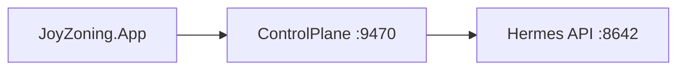

# JoyZoning

[](LICENSE)

Local-first **multi-agent operator cockpit** for supervising a **Manager** (planning) and **executor** (DietCode) on one [diet-hermes](https://github.com/NousResearch/hermes-agent) install. Roles are separated by **session**, not by duplicate Hermes trees; kanban and execution leases keep work aligned.

**Repository:** https://github.com/CardSorting/JoyZoning



## What it is

| | JoyZoning | Typical IDE |
|---|-----------|-------------|
| Purpose | Supervise agents, approvals, kanban, execution | Edit code directly |
| Agents | Hermes manager + DietCode worker via leases | N/A |
| State | SQLite + append-only events | Project files |
| Network | Loopback only (local-first) | Varies |

**Not in scope for MVP:** cloud control plane, second Hermes install, agents marking tasks **Complete** without human merge.

## Prerequisites

- [.NET 8 SDK](https://dotnet.microsoft.com/download) — repo pins `8.0.421` in `global.json`
- **diet-hermes** — [Hermes Agent](https://github.com/NousResearch/hermes-agent) checkout (auto-installed on first launch, or set `Hermes:InstallRoot` yourself)
- **macOS** recommended for publish scripts; control plane and CLI run on Linux

## Quick start

```bash
git clone https://github.com/CardSorting/JoyZoning.git
cd JoyZoning

cp src/JoyZoning.ControlPlane/appsettings.example.json \
   src/JoyZoning.ControlPlane/appsettings.Development.json
# Edit Hermes:InstallRoot in appsettings.Development.json

./scripts/run-dev.sh
```

Or run the desktop only (auto-starts control plane on `http://127.0.0.1:9470`):

```bash
dotnet run --project src/JoyZoning.App
```

**First launch:** auto-setup can install/configure diet-hermes (`joyzoning` profile, API on **8642**), start gateway/dashboard when needed, open a sample workspace, then land on **Manager Chat**. Use **Getting Started** if anything failed.

**Terminal operator CLI:**

```bash
./scripts/jz doctor
./scripts/install-jz.sh          # optional: ~/.local/bin/jz

jz task run <task-id> --poll 10
jz task verify <task-id> --cmd "dotnet test"
jz task complete <task-id> --yes

# Inside lease worktree (after human dispatch):
jz agent start --task <task-id>
jz agent verify --cmd "dotnet build"
jz agent done                    # ready_for_review — not Complete
```

See [docs/cli.md](docs/cli.md).

**macOS release build:**

```bash
./scripts/publish-macos.sh
./dist/run-joyzoning.sh
./scripts/bundle-macos-app.sh && open dist/JoyZoning.app
```

## Architecture

| Layer | Project | Role |
|-------|---------|------|
| Desktop | `JoyZoning.App` | Avalonia UI — six surfaces + onboarding hub |
| Control plane | `JoyZoning.ControlPlane` | REST `:9470`, SignalR `/hubs/operator`, lease orchestration |
| CLI | `JoyZoning.Cli` | `jz` / `jz agent` — same authority rules as UI |
| Domain | `JoyZoning.Domain` | Entities, lease rules, verification DTOs |
| Persistence | `JoyZoning.Persistence` | SQLite + EF Core |
| Agents | `JoyZoning.Agents` | Hermes / DietCode HTTP adapters |
| Adapters | `JoyZoning.Adapters` | Workspace tree + `git diff` |

```
JoyZoning.App  ──HTTP + SignalR──►  JoyZoning.ControlPlane (:9470)
                                         │
                                         ├── SQLite (joyzoning.db)
                                         └── Hermes API (:8642) / dashboard (:9119)
```

Default data (macOS): `~/Library/Application Support/JoyZoning/joyzoning.db`

## Product surfaces

1. **Getting Started** — health grade, checklist, quick actions, playbooks  
2. **Manager Chat** — Hermes lead; parse reply → tasks  
3. **Kanban** — board, drag columns, dispatch, critical approval, lease merge  
4. **Execution** — DietCode steps, terminal preview, Hermes TUI (PTY via dashboard)  
5. **Workspace** — tree, changed files, split diff  
6. **Approvals** — Once / Task / Session / Deny  
7. **Timeline** — event replay + JSON inspector  

Details: [docs/desktop-ui.md](docs/desktop-ui.md).

## Execution leases (governance)

Each kanban card can hold **one active execution lease**:

```
Dispatch → leased → running → verifying → ready_for_review → human merge → Complete
                └→ blocked / revoked (recoverable; worktree preserved)
```

- **Critical** cards (`risk: 3`) require `humanApprovedCritical` on every dispatch/retry.  
- Only **one** critical active lease globally (configurable via `LeaseRuntime:MaxCriticalLeases`).  
- Agents cannot set task **Complete** — `POST .../lease/merge` only.  

Deep dive: [docs/lease-lifecycle.md](docs/lease-lifecycle.md) · API: [docs/execution-orchestration-api.md](docs/execution-orchestration-api.md).

## Documentation

| Doc | Description |
|-----|-------------|
| [docs/README.md](docs/README.md) | Documentation index and learning paths |
| [docs/getting-started.md](docs/getting-started.md) | First run, Hermes setup, workflows |
| [docs/hermes-integration.md](docs/hermes-integration.md) | diet-hermes ports, profile, kanban, SSE |
| [docs/lease-lifecycle.md](docs/lease-lifecycle.md) | Lease state machine and evidence |
| [docs/architecture.md](docs/architecture.md) | Layers, leases, background services |
| [docs/desktop-ui.md](docs/desktop-ui.md) | UI surfaces and menus |
| [docs/cli.md](docs/cli.md) | `jz` operator CLI |
| [docs/control-plane-api.md](docs/control-plane-api.md) | Full REST reference |
| [docs/troubleshooting.md](docs/troubleshooting.md) | Symptom-first fixes |
| [docs/glossary.md](docs/glossary.md) | Terms and enums |
| [docs/configuration.md](docs/configuration.md) | Settings, paths, env vars |
| [docs/development.md](docs/development.md) | Build, test, contribute |
| [docs/mvp-roadmap.md](docs/mvp-roadmap.md) | Phase 0–27 history |

## Development

```bash
dotnet build JoyZoning.sln
dotnet test tests/JoyZoning.Cli.Tests/JoyZoning.Cli.Tests.csproj
dotnet test tests/JoyZoning.Tests/JoyZoning.Tests.csproj
./scripts/dogfood-validate.sh
```

See [CONTRIBUTING.md](CONTRIBUTING.md) and [docs/development.md](docs/development.md).

## License

[MIT](LICENSE) © 2026 CardSorting
