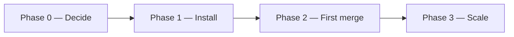
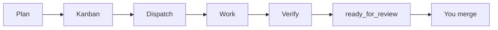

# JoyZoning

[](LICENSE)
[](global.json)

**Supervise AI coding on your machine** — kanban-shaped work, changes in your real repo, optional tests as proof, and **you** merge before anything counts as done.

One local [diet-hermes](https://github.com/NousResearch/hermes-agent). Not a second IDE. Not “the agent said it’s finished.”

> **New here?** Read this page top to bottom once (~10 min), then follow **[What's next](docs/onboarding/whats-next.md)** for your first dispatch and merge (~20 min).  
> **Guided hub:** [docs/onboarding/README.md](docs/onboarding/README.md)

---

## Onboarding in three phases



| Phase | Goal | Time | Go to |
|-------|------|------|--------|
| **0 — Decide** | Confirm JoyZoning matches your workflow | ~5 min | [Before you begin](docs/onboarding/before-you-begin.md) |
| **1 — Install** | App running, health grade visible, repo opened | ~15 min | [5-minute quickstart](docs/onboarding/quickstart.md) |
| **2 — First merge** | One card: dispatch → verify → merge → Complete | ~20 min | **[What's next](docs/onboarding/whats-next.md)** ← main walkthrough |
| **3 — Scale** | Daily habits, CLI, or multi-role JSDP | ongoing | [Setup checklist](docs/onboarding/setup-checklist.md) · [JSDP](docs/jsdp.md) |

---

## Phase 0 — Is JoyZoning for you?

| You want to… | JoyZoning is a good fit |
|--------------|-------------------------|
| Supervise agents on a **real repo** with an audit trail | Yes |
| **Approve** what ships (diff + tests + your sign-off) | Yes |
| Replace your IDE or use only chat | No — keep Cursor/VS Code; JoyZoning is the **cockpit** |
| Unattended auto-merge with no human gate | No — merge is always operator-owned |

**Still unsure?** [Before you begin](docs/onboarding/before-you-begin.md) · [What is JoyZoning?](docs/what-is-joyzoning.md) (plain English)

### Mental model (read once — used in every step)

1. **Chat plans; Workspace is truth** — Manager Chat = thinking; **Workspace** = files on disk (like a PR “Files changed” tab).  
2. **One card → one branch** — You open one project folder. After **Dispatch**, work is on `joyzoning/card-<task-id>` in that folder (no hidden sandbox copy).  
3. **Only you merge** — Agents stop at `ready_for_review`; **Complete** is yours after review (and verification if you run it).

[Full philosophy](docs/philosophy.md) · [Which folder am I viewing?](docs/workspace-state.md)

---

## Phase 1 — Install and open your repo

### Prerequisites

- [ ] [.NET 8 SDK](https://dotnet.microsoft.com/download) — `dotnet --version` shows 8.x (`global.json` in repo)
- [ ] Node.js 18+ and **pnpm**
- [ ] Python 3.11 (first-time Hermes setup only)
- [ ] One **diet-hermes** install — [Hermes setup guide](docs/onboarding/hermes-setup.md)
- [ ] LLM API key (before Manager Chat can reply) — [api-keys-and-models](docs/onboarding/api-keys-and-models.md)

### Commands

```bash
git clone https://github.com/CardSorting/JoyZoning.git
cd JoyZoning
pnpm install
pnpm setup    # interactive: ports, workspace, Python venv
pnpm dev      # control plane + desktop + watch UI
```

**Desktop-only shortcut:** `./scripts/run-dev.sh` after clone — details in [quickstart](docs/onboarding/quickstart.md).

### You are ready for Phase 2 when…

| Check | Where to look |
|-------|----------------|
| JoyZoning window is open | Desktop app |
| Health is **Healthy** or **Degraded** (not **Blocked**) | **Getting Started** |
| Status chips for API / Dashboard are green or yellow | Top status bar — [status indicators](docs/onboarding/status-indicators.md) |
| Your repo is selected | **Project → Open Workspace** |

First Hermes install can take **3–8 minutes** on a cold machine — normal.

**Ports (local only):** JoyZoning `9470` · Hermes API `8642` · Hermes dashboard `9119`

---

## Phase 2 — Your first supervised task

This is the habit you will repeat for every card. **Step-by-step with screenshots-level detail:** [What's next after setup](docs/onboarding/whats-next.md).



| Step | Open in app | You do | Success signal |
|------|-------------|--------|----------------|
| **1. Plan** | **Manager Chat** | Describe the outcome; optional **→ Task** | Assistant replies (needs API key) |
| **2. Track** | **Kanban** | Create or select a card; use **Low** risk while learning | Card visible on board |
| **3. Dispatch** | **Kanban** | **Dispatch** (approve if critical) | Execution viewport shows activity |
| **4. Observe** | **Execution** / **Timeline** | Watch the run — chat is not sign-off | Events in Timeline |
| **5. Verify** | **Workspace** or Terminal | Run tests/build you care about | Lease → `ready_for_review` |
| **6. Merge** | **Workspace** → **Kanban** | Review diff; **Merge** when satisfied | Card **Complete** |

**No Terminal?** [Desktop menu guide](docs/onboarding/desktop-menu-guide.md) — where to click for each step.  
**Words unfamiliar?** [Plain-language glossary](docs/onboarding/plain-language-glossary.md).

### Terminal (same steps)

```bash
./scripts/jz doctor
jz task run <task-id> --poll 10
jz task verify <task-id> --cmd "dotnet test"
jz task complete <task-id> --yes
jz task watch <task-id>
```

---

## Phase 3 — Choose how you work day to day

Same rules on every surface — pick what fits you:

| Path | Best for | Start here |
|------|----------|------------|
| **Desktop** | Board, diffs, approvals, checklist | [quickstart](docs/onboarding/quickstart.md) |
| **`jz` CLI** | Scripts, SSH, automation | [first-run-cli](docs/onboarding/first-run-cli.md) |
| **Both** | Plan in UI, verify in terminal | [choose-your-path](docs/onboarding/choose-your-path.md) |
| **Browser console** | Watch UI at `http://127.0.0.1:9470` | After `pnpm dev` |
| **8-role delivery** | Product → architecture → … → QA in sequence | [jsdp.md](docs/jsdp.md) |

### Multi-role programs (JSDP)

One role at a time, **accept-merge between roles**, same repo throughout:

```bash
./scripts/role-chain-dispatch.sh --create --workspace /path/to/repo --program "My App"
./scripts/role-chain-dispatch.sh --status
./scripts/role-chain-dispatch.sh --next
jz task complete <task-id> --yes
```

### Habits that scale

| Habit | Why |
|-------|-----|
| One active lease per card | Avoids conflicting branches |
| Verify before merge | Evidence in the audit trail |
| Trust **Workspace**, not chat, for sign-off | Cognition vs authority |
| Start at **Low** risk until the loop feels natural | Fewer approval interrupts |

[Use cases](docs/use-cases.md) · [concepts](docs/concepts.md) · [FAQ](docs/faq.md)

---

## Pick a shortcut (if you are not doing Phase 0→2 in order)

| You are… | Jump to |
|----------|---------|
| New — desktop first | [quickstart](docs/onboarding/quickstart.md) → [whats-next](docs/onboarding/whats-next.md) |
| From Hermes chat only | [coming-from-hermes-chat](docs/onboarding/coming-from-hermes-chat.md) |
| Coding agent / Cursor | [AGENTS.md](AGENTS.md) |
| Something broke | [troubleshooting-setup](docs/onboarding/troubleshooting-setup.md) |

---

## Stuck?

| Symptom | Fix |
|---------|-----|
| App won't open | [Setup troubleshooting](docs/onboarding/troubleshooting-setup.md) |
| Red **API** or **Dashboard** chip | [status-indicators](docs/onboarding/status-indicators.md) |
| Manager Chat never replies | [api-keys-and-models](docs/onboarding/api-keys-and-models.md) |
| Workspace empty after agent worked | Card not **Dispatched** — dispatch, re-select card |
| `jz` command fails | [first-run-cli](docs/onboarding/first-run-cli.md) |
| Old `.joyzoning/worktrees` folders on disk | Safe to remove — [jsdp.md](docs/jsdp.md) |

---

## Documentation map

| Stage | Docs |
|-------|------|
| Onboarding (all guides) | [onboarding/README.md](docs/onboarding/README.md) |
| Install deep-dive | [installation](docs/onboarding/installation.md) · [macOS](docs/onboarding/platform-macos.md) · [Linux](docs/onboarding/platform-linux.md) |
| Integrate / API | [control-plane-api](docs/control-plane-api.md) · [hermes-integration](docs/hermes-integration.md) |
| Contribute | [development](docs/development.md) · [CONTRIBUTING](CONTRIBUTING.md) |

---

## For contributors

`dotnet build JoyZoning.sln` · `dotnet test tests/JoyZoning.Tests/JoyZoning.Tests.csproj` · [architecture](docs/architecture.md)

## License

[MIT](LICENSE) © 2026 CardSorting
