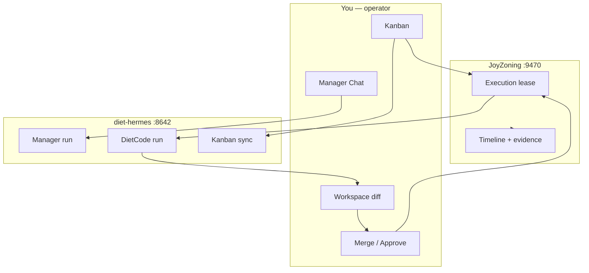

# JoyZoning

[](LICENSE)
[](global.json)

**The operator cockpit for multi-agent development** — plan with a Manager, execute in bounded **worktrees**, verify with evidence, and **merge only when you approve**.

Works with one local [diet-hermes](https://github.com/NousResearch/hermes-agent) install. Not a second IDE. Not unattended auto-ship.

**Repository:** https://github.com/CardSorting/JoyZoning · **Docs:** [docs/README.md](docs/README.md) · **Concepts:** [docs/concepts.md](docs/concepts.md)

---

## Why JoyZoning exists

Agent tools are good at **doing**. Operators still need **accountability**: what ran, in which folder, under what approval, with what proof, and who signed it off.

JoyZoning adds a control plane between you and Hermes:

| Without zoning | With JoyZoning |
|----------------|----------------|
| One chat, overlapping context | **Manager** session plans; **executor** works in lease worktrees |
| “The agent said it’s done” | **Verify** → `ready_for_review` → **human merge** → Complete |
| Risky tools fire quietly | **Approvals** inbox + scoped grants |
| Opaque restarts | **SQLite + timeline**; recovery for interrupted runs |

**Read the full model:** [docs/concepts.md](docs/concepts.md) (5 min, recommended before first dispatch).

---

## How it works (60 seconds)



1. **Plan** — Manager Chat (Hermes lead).  
2. **Track** — Kanban card per task (syncs with Hermes board).  
3. **Dispatch** — Control plane creates an **execution lease** + isolated worktree.  
4. **Work** — DietCode / `jz agent` inside the lease (cannot merge or Complete).  
5. **Verify** — Commands run in worktree; report attached to lease.  
6. **Merge** — You review diff and approve → task **Complete**.

Critical tasks (`risk: 3`) require explicit approval on every dispatch. One active critical lease globally by default.

---

## Three surfaces, one policy

| Surface | For | Examples |
|---------|-----|----------|
| **Desktop** (`JoyZoning.App`) | Visual supervision | Kanban drag, Execution TUI, Approvals, Timeline |
| **`jz`** | Human operator shell | `task run`, `task verify`, `task complete --yes` |
| **`jz agent`** | Worker in worktree | `agent verify`, `agent done` → review only |

Desktop, REST (`:9470`), and CLI all call the same orchestrator — **no back door to Complete**.

---

## Quick start

```bash
git clone https://github.com/CardSorting/JoyZoning.git
cd JoyZoning

cp src/JoyZoning.ControlPlane/appsettings.example.json \
   src/JoyZoning.ControlPlane/appsettings.Development.json
# Set Hermes:InstallRoot to your diet-hermes path (or use first-launch auto-setup)

./scripts/run-dev.sh
```

```bash
# Optional: terminal-only operator
./scripts/jz doctor
jz task run <task-id> --poll 10
jz task verify <task-id> --cmd "dotnet test"
jz task complete <task-id> --yes
```

**Prerequisites:** [.NET 8 SDK](https://dotnet.microsoft.com/download) (`global.json`), diet-hermes. **macOS** recommended for `.app` publish; control plane runs on Linux.

**Documentation:** [Onboarding hub](docs/onboarding/README.md) · [5-min quickstart](docs/onboarding/quickstart.md) · [Menu guide (no terminal)](docs/onboarding/desktop-menu-guide.md) · [Setup troubleshooting](docs/onboarding/troubleshooting-setup.md) · [Getting started](docs/getting-started.md)

---

## What you get

### Operator surfaces

| # | Surface | Role |
|---|---------|------|
| 1 | **Getting Started** | Health grade, setup checklist, playbooks |
| 2 | **Manager Chat** | Planning; parse reply → tasks |
| 3 | **Kanban** | Board, dispatch, critical approval, lease merge |
| 4 | **Execution** | Run steps, terminal, Hermes TUI (dashboard PTY) |
| 5 | **Workspace** | Changed files, split diff |
| 6 | **Approvals** | Once / Task / Session / Deny |
| 7 | **Timeline** | Audit stream + JSON inspector |

[docs/desktop-ui.md](docs/desktop-ui.md)

### Execution lease (the governance primitive)

```
Dispatch → leased → running → verifying → ready_for_review → merge → Complete
              └→ blocked / revoked (worktree + evidence preserved)
```

- One active lease per card.  
- Worktrees under `<workspace>/.joyzoning/worktrees/<task-id>/`.  
- Append-only **evidence** on every transition.  

[docs/lease-lifecycle.md](docs/lease-lifecycle.md) · [docs/execution-orchestration-api.md](docs/execution-orchestration-api.md)

---

## Architecture

| Project | Role |
|---------|------|
| `JoyZoning.App` | Avalonia 12 desktop |
| `JoyZoning.ControlPlane` | REST + SignalR + lease scheduler |
| `JoyZoning.Cli` | `jz` / `jz agent` |
| `JoyZoning.Domain` | Rules, entities, verification |
| `JoyZoning.Persistence` | SQLite + EF Core |
| `JoyZoning.Agents` | Hermes / DietCode adapters |
| `JoyZoning.Adapters` | Workspace + git diff |

```
App ──► Control plane :9470 ──► SQLite
                    └──► Hermes API :8642 / dashboard :9119
```

[docs/architecture.md](docs/architecture.md)

---

## Documentation

| Start here | …then |
|------------|-------|
| [concepts.md](docs/concepts.md) | Why leases, human merge, one Hermes |
| [getting-started.md](docs/getting-started.md) | Install and first dispatch |
| [use-cases.md](docs/use-cases.md) | Scenario walkthroughs |
| [cli.md](docs/cli.md) | Terminal recipes |
| [faq.md](docs/faq.md) | Short answers |

**Full index:** [docs/README.md](docs/README.md) — API, Hermes integration, troubleshooting, glossary, roadmap.

---

## Development

```bash
dotnet build JoyZoning.sln
dotnet test tests/JoyZoning.Cli.Tests/JoyZoning.Cli.Tests.csproj
dotnet test tests/JoyZoning.Tests/JoyZoning.Tests.csproj
./scripts/dogfood-validate.sh
```

[CONTRIBUTING.md](CONTRIBUTING.md) · [docs/development.md](docs/development.md)

## License

[MIT](LICENSE) © 2026 CardSorting
