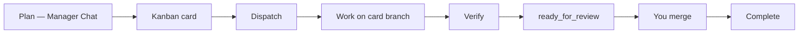

# JoyZoning

[](LICENSE)
[](global.json)

**Supervise AI coding work on your machine** — one kanban card at a time, real files in your real repo, tests as proof, and **you** merge when it is ready to ship.

Works with one local [diet-hermes](https://github.com/NousResearch/hermes-agent) install. Not a second IDE. Not “the agent said done.”

**Full onboarding hub:** [docs/onboarding/README.md](docs/onboarding/README.md) · **5-minute start:** [docs/onboarding/quickstart.md](docs/onboarding/quickstart.md)

---

## Start here — pick your path

| You are… | Start with | Time |
|----------|------------|------|
| **New — want the desktop app** | [5-minute quickstart](docs/onboarding/quickstart.md) → [What's next](docs/onboarding/whats-next.md) (first dispatch → merge) | ~20 min |
| **Prefer menus, not Terminal** | [Desktop menu guide](docs/onboarding/desktop-menu-guide.md) · [Plain-language glossary](docs/onboarding/plain-language-glossary.md) | 10 min read |
| **Terminal-first operator** | [First run CLI](docs/onboarding/first-run-cli.md) · `jz` recipes in [docs/cli.md](docs/cli.md) | ~15 min |
| **Multi-role delivery (8 agents, one repo)** | [JSDP guide](docs/jsdp.md) · `./scripts/role-chain-dispatch.sh --create` | Plan 1–2 h |
| **Coding agent (Cursor, CI)** | [AGENTS.md](AGENTS.md) · [docs/agent-operations.md](docs/agent-operations.md) | 5 min |
| **Something broke** | [Setup troubleshooting](docs/onboarding/troubleshooting-setup.md) | — |

Not sure JoyZoning fits your workflow? Read [Before you begin](docs/onboarding/before-you-begin.md) first.

---

## Three ideas to learn before you click anything

These shape every screen and command. Details: [docs/philosophy.md](docs/philosophy.md).

**1. Chat plans; the workspace is truth.**  
Manager Chat and Hermes TUI are for thinking. **Workspace** shows what actually changed on disk — like a PR “Files changed” tab for the card you selected.

**2. One card → one place in git.**  
You open **one project folder** per session. After **Dispatch**, the agent works on branch `joyzoning/card-<task-id>` in that same folder — not a hidden sandbox copy.

**3. Only you merge.**  
Agents may reach `ready_for_review`. **Complete** happens only after you verify (optional but recommended) and **merge**. Same rule in the desktop app, `jz`, and the API.

---

## Install (first time)

**You need:** [.NET 8 SDK](https://dotnet.microsoft.com/download) (`global.json`), Node.js 18+, pnpm, Python 3.11 (for Hermes on first setup). One diet-hermes install — [Hermes setup](docs/onboarding/hermes-setup.md).

```bash
git clone https://github.com/CardSorting/JoyZoning.git
cd JoyZoning
pnpm install
pnpm setup    # ports, workspace, Python venv — interactive
pnpm dev      # control plane + desktop + watch UI
```

**Faster path (desktop only):** clone → `./scripts/run-dev.sh` — see [quickstart](docs/onboarding/quickstart.md).

**You should see:** JoyZoning window, **Getting Started** with health grade **Healthy** or **Degraded**, then **Manager Chat** or the checklist. First Hermes install can take several minutes — that is normal.

**Open your repo:** **Project → Open Workspace** in the desktop app (or point a session at your path via CLI).

---

## The operator loop (your daily habit)

This is the journey every new operator practices once, then repeats for every card.



| Step | Where | What you do |
|------|--------|-------------|
| **1. Plan** | **Manager Chat** | Describe the outcome; optional **→ Task** to create a card |
| **2. Track** | **Kanban** | One card per piece of work; start with **Low** risk while learning |
| **3. Dispatch** | **Kanban** | Starts an execution lease on `joyzoning/card-<id>` |
| **4. Observe** | **Execution** / **Timeline** | Watch the Hermes run; terminal is conversation, not sign-off |
| **5. Verify** | **Workspace** + `jz task verify` | Run tests/build; evidence attaches to the lease |
| **6. Merge** | **Workspace** diff → **Merge** | Review files like a PR; only you approve → **Complete** |

**Walkthrough with “you should see…” checks:** [What's next after setup](docs/onboarding/whats-next.md)  
**Which folder am I looking at?** [workspace-state.md](docs/workspace-state.md)  
**Menu map (no Terminal):** [desktop-menu-guide.md](docs/onboarding/desktop-menu-guide.md)

### Terminal equivalents

```bash
./scripts/jz doctor
jz task run <task-id> --poll 10
jz task verify <task-id> --cmd "dotnet test"
jz task complete <task-id> --yes
jz task watch <task-id>          # poll workspace changes
```

---

## Multi-role programs (JSDP)

When one agent should not rewrite the whole app alone, use the **JoyZoning Sequential Delivery Protocol (JSDP)**: eight bounded roles, **one merge gate per role**, same canonical workspace throughout.

```bash
./scripts/role-chain-dispatch.sh --create --workspace /path/to/your/repo --program "My App"
./scripts/role-chain-dispatch.sh --status
./scripts/role-chain-dispatch.sh --next    # when previous role is Complete
jz task complete <task-id> --yes           # accept-merge between roles
```

**Read:** [docs/jsdp.md](docs/jsdp.md) · **Mental model:** line dance, not jazz band — [philosophy § JSDP](docs/philosophy.md#2-jsdp-by-default--line-dance-not-jazz-band)

---

## Surfaces you will use

| Surface | Use it for |
|---------|------------|
| **Getting Started** | Health grade, setup checklist |
| **Manager Chat** | Planning (cognition) |
| **Kanban** | Queue, dispatch, merge |
| **Workspace** | File list + diff before merge (authority) |
| **Execution** | Live run steps, Hermes TUI |
| **Approvals** | Risky tool grants (Once / Task / Session / Deny) |
| **Timeline** | Audit trail |
| **Watch UI** (`http://127.0.0.1:9470`) | Browser operator console |

Same rules everywhere: **`jz`** for operators, **`jz agent`** inside a lease (cannot merge). [docs/desktop-ui.md](docs/desktop-ui.md)

---

## Stuck?

| Symptom | Fix |
|---------|-----|
| App won't open | [troubleshooting-setup § App won't start](docs/onboarding/troubleshooting-setup.md) |
| Red API / Dashboard chip | [status-indicators.md](docs/onboarding/status-indicators.md) |
| Manager Chat silent | [api-keys-and-models.md](docs/onboarding/api-keys-and-models.md) |
| Empty Workspace after agent ran | Card not dispatched — **Dispatch**, re-select card |
| `jz` errors | [first-run-cli.md](docs/onboarding/first-run-cli.md) |
| Legacy `.joyzoning/worktrees` folders | Safe to delete; see [jsdp troubleshooting](docs/jsdp.md) |

---

## Learn more (by stage)

| Stage | Docs |
|-------|------|
| **Decide** | [Before you begin](docs/onboarding/before-you-begin.md) · [What is JoyZoning?](docs/what-is-joyzoning.md) |
| **Install** | [Installation](docs/onboarding/installation.md) · [macOS](docs/onboarding/platform-macos.md) · [Linux](docs/onboarding/platform-linux.md) |
| **Operate** | [Setup checklist](docs/onboarding/setup-checklist.md) · [concepts.md](docs/concepts.md) · [use-cases.md](docs/use-cases.md) |
| **Integrate** | [control-plane-api.md](docs/control-plane-api.md) · [hermes-integration.md](docs/hermes-integration.md) |
| **Contribute** | [development.md](docs/development.md) · [CONTRIBUTING.md](CONTRIBUTING.md) |

**All documentation:** [docs/README.md](docs/README.md)

---

## For contributors

```bash
dotnet build JoyZoning.sln
dotnet test tests/JoyZoning.Tests/JoyZoning.Tests.csproj
./scripts/dogfood-validate.sh
```

Architecture overview: [docs/architecture.md](docs/architecture.md)

## License

[MIT](LICENSE) © 2026 CardSorting
