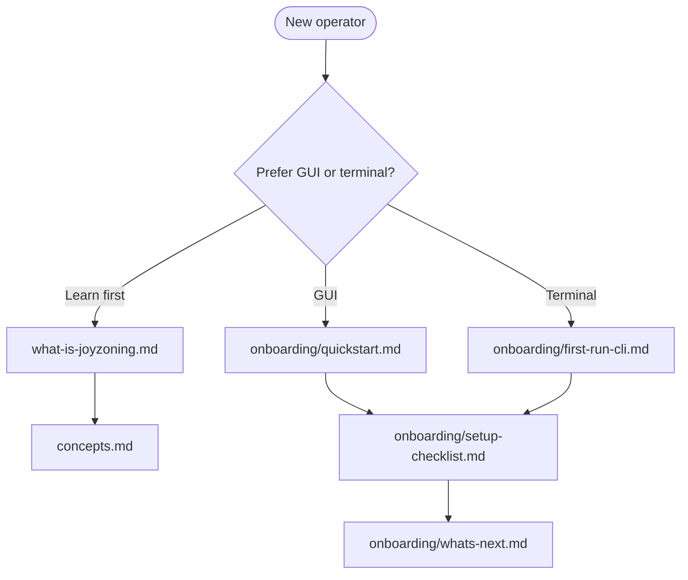

# JoyZoning documentation

**The operator cockpit for multi-agent development** — supervise Hermes Manager and executor agents on one local install; govern work with **execution leases** and **human merge**.

**License:** [MIT](../LICENSE) · **Source:** https://github.com/CardSorting/JoyZoning

**What did we actually build?** → **[what-is-joyzoning.md](what-is-joyzoning.md)** (plain English, start here if terms like “lease” or “orchestration” are unfamiliar)

---

## New here?



| Step | Page | Time |
|------|------|------|
| 0 | **[What is JoyZoning?](what-is-joyzoning.md)** | 10 min read |
| 1 | [Onboarding hub](onboarding/README.md) | — |
| 2 | [5-minute quickstart](onboarding/quickstart.md) or [Choose your path](onboarding/choose-your-path.md) | 5–20 min |
| 3 | [Setup checklist](onboarding/setup-checklist.md) | 10 min |
| 4 | [What's next](onboarding/whats-next.md) | 20 min |

**Big picture:** [what-is-joyzoning.md](what-is-joyzoning.md) · **Technical concepts:** [concepts.md](concepts.md) · **Operational modes:** [operational-modes.md](operational-modes.md) · **FAQ:** [faq.md](faq.md)

### Understand workspace state (recommended)

Before your first **Merge**, read how one kanban card maps to one folder — the same mental model as a **GitHub PR “Files changed”** tab:

| Doc | For |
|-----|-----|
| **[workspace-state.md](workspace-state.md)** | **1:1 card → folder** — plain language + diagrams |
| [desktop-menu-guide.md](onboarding/desktop-menu-guide.md) | Where to click: Kanban → Workspace → Merge |
| [plain-language-glossary.md](onboarding/plain-language-glossary.md) | Session workspace vs worktree |

---

## Documentation by role

### I am a new operator (non-technical friendly)

| Doc | Contents |
|-----|----------|
| **[what-is-joyzoning.md](what-is-joyzoning.md)** | **What we built** — cognition vs authority, no jargon |
| **[onboarding/README.md](onboarding/README.md)** | **Start here** — “I'm stuck”, reading levels, full index |
| [before-you-begin.md](onboarding/before-you-begin.md) | Do you need JoyZoning? Time, keys, privacy |
| [workspace-state.md](workspace-state.md) | **One card → one folder** (PR-style review) |
| [desktop-menu-guide.md](onboarding/desktop-menu-guide.md) | Where to click (no Terminal) |
| [plain-language-glossary.md](onboarding/plain-language-glossary.md) | Words explained with analogies |
| [troubleshooting-setup.md](onboarding/troubleshooting-setup.md) | Setup decision trees |
| [quickstart.md](onboarding/quickstart.md) | Desktop in ~5–15 min |
| [whats-next.md](onboarding/whats-next.md) | First dispatch → merge |

### I am a coding agent (Cursor, CLI automation)

| Doc | Contents |
|-----|----------|
| **[AGENTS.md](../AGENTS.md)** | **Start here** — do not scan the repo |
| **[agent-operations.md](agent-operations.md)** | Full agent ops layer reference |
| [AGENT.md](AGENT.md) | Short agent contract |
| [cli.md](cli.md#agent-operations-layer) | CLI command table |

### I run JoyZoning day to day

| Doc | Contents |
|-----|----------|
| [getting-started.md](getting-started.md) | Overview + links |
| [desktop-ui.md](desktop-ui.md) | All six surfaces |
| [workspace-state.md](workspace-state.md) | 1:1 inspection model (GitHub PR / VS Code analogies) |
| [cli.md](cli.md) | `jz` / `jz agent` / agent operations layer |
| [hermes-aligned-terminal-strategy.md](hermes-aligned-terminal-strategy.md) | Cognition vs authority; `jz` vs `hermes --tui` |
| [use-cases.md](use-cases.md) | Scenario walkthroughs |
| [troubleshooting.md](troubleshooting.md) | Symptom → fix |

### I install or administer locally

| Doc | Contents |
|-----|----------|
| [installation.md](onboarding/installation.md) | Full install + .NET 8 |
| [hermes-setup.md](onboarding/hermes-setup.md) | diet-hermes profile `joyzoning` |
| [configuration.md](configuration.md) | appsettings, env, leases |
| [hermes-integration.md](hermes-integration.md) | Ports, token, kanban sync |

### I need governance / audit detail

| Doc | Contents |
|-----|----------|
| [lease-lifecycle.md](lease-lifecycle.md) | State machine, evidence |
| [execution-orchestration-api.md](execution-orchestration-api.md) | Dispatch, verify, merge |
| [glossary.md](glossary.md) | Vocabulary |

### I integrate or contribute

| Doc | Contents |
|-----|----------|
| [architecture.md](architecture.md) | Layers, services |
| [broccoliq.md](broccoliq.md) | BroccoliQ hive + joy-bridge (:9471) |
| [control-plane-api.md](control-plane-api.md) | REST `:9470` |
| [event-catalog.md](event-catalog.md) | SignalR events |
| [development.md](development.md) | Build, test |
| [../CONTRIBUTING.md](../CONTRIBUTING.md) | PRs |

---

## Onboarding section (17 guides)

**Hub:** [onboarding/README.md](onboarding/README.md) — **Stuck?** [troubleshooting-setup.md](onboarding/troubleshooting-setup.md)

| Beginner | Operator | Technical |
|----------|----------|-----------|
| [before-you-begin](onboarding/before-you-begin.md) | [quickstart](onboarding/quickstart.md) | [installation](onboarding/installation.md) |
| [plain-language-glossary](onboarding/plain-language-glossary.md) | [whats-next](onboarding/whats-next.md) | [first-run-cli](onboarding/first-run-cli.md) |
| [desktop-menu-guide](onboarding/desktop-menu-guide.md) | [setup-checklist](onboarding/setup-checklist.md) | [platform-linux](onboarding/platform-linux.md) |
| [coming-from-hermes-chat](onboarding/coming-from-hermes-chat.md) | [status-indicators](onboarding/status-indicators.md) | [hermes-setup](onboarding/hermes-setup.md) |
| [platform-macos](onboarding/platform-macos.md) | [choose-your-path](onboarding/choose-your-path.md) | [settings-explained](onboarding/settings-explained.md) |

Also: [first-run-desktop](onboarding/first-run-desktop.md) · [api-keys-and-models](onboarding/api-keys-and-models.md) · [troubleshooting-setup](onboarding/troubleshooting-setup.md)

---

## Core concepts (one paragraph)

JoyZoning is a **governed execution runtime for AI-assisted software work**: chat is **cognition**, workspace is **truth**, and **you** merge when satisfied. It is **not** an IDE and **not** a second Hermes. Full plain-language explanation: [what-is-joyzoning.md](what-is-joyzoning.md). Technical detail: [concepts.md](concepts.md).

---

## Runtime map

```
JoyZoning.App          →  http://127.0.0.1:9470  →  JoyZoning.ControlPlane
                                                    ↓
                                            http://127.0.0.1:8642  (Hermes API)
                                            http://127.0.0.1:9119  (Hermes dashboard)
```

| Component | Default |
|-----------|---------|
| Control plane | `http://127.0.0.1:9470` |
| Hermes API | `http://127.0.0.1:8642` |
| Hermes dashboard | `http://127.0.0.1:9119` |
| SQLite (macOS) | `~/Library/Application Support/JoyZoning/joyzoning.db` |
| Example config | `src/JoyZoning.ControlPlane/appsettings.example.json` |

---

## Authority at a glance

| Action | Operator (you) | Agent |
|--------|----------------|-------|
| Dispatch, critical approval | ✓ | — |
| Code in lease worktree | — | ✓ |
| Verify + evidence | ✓ (via `jz task`) | ✓ (via `jz agent`) |
| Merge → Complete | ✓ | **never** |
| Revoke lease | ✓ | — |

---

## All docs (alphabetical)

| Doc | Audience |
|-----|----------|
| [agent-operations.md](agent-operations.md) | Coding agents / integrators |
| [AGENT.md](AGENT.md) | Coding agents (short contract) |
| [architecture.md](architecture.md) | Contributors |
| [cli.md](cli.md) | Terminal / CI |
| [what-is-joyzoning.md](what-is-joyzoning.md) | Everyone — plain-language product explanation |
| [concepts.md](concepts.md) | Everyone |
| [configuration.md](configuration.md) | Operators / ops |
| [control-plane-api.md](control-plane-api.md) | Integrators |
| [desktop-ui.md](desktop-ui.md) | Desktop users |
| [dogfood-report.md](dogfood-report.md) | QA |
| [event-catalog.md](event-catalog.md) | Integrators |
| [execution-orchestration-api.md](execution-orchestration-api.md) | Integrators |
| [faq.md](faq.md) | Everyone |
| [getting-started.md](getting-started.md) | New operators |
| [hermes-integration.md](hermes-integration.md) | Operators / integrators |
| [hermes-aligned-terminal-strategy.md](hermes-aligned-terminal-strategy.md) | Terminal / CLI architecture |
| [lease-lifecycle.md](lease-lifecycle.md) | Everyone |
| [mvp-roadmap.md](mvp-roadmap.md) | Product |
| [troubleshooting.md](troubleshooting.md) | Operators |
| [use-cases.md](use-cases.md) | Operators |
| [workspace-state.md](workspace-state.md) | Everyone — 1:1 card → folder |
| [yolo-mode.md](yolo-mode.md) | Operators / automation |
| [glossary.md](glossary.md) | Everyone |
| [development.md](development.md) | Contributors |

---

## Scripts

| Script | Purpose |
|--------|---------|
| `scripts/run-dev.sh` | Control plane + desktop |
| `scripts/install-jz.sh` | `~/.local/bin/jz` |
| `scripts/install-diet-hermes.sh` | Hermes stack |
| `scripts/jz-env.sh` | Shell exports for CLI |
| `scripts/dogfood-validate.sh` | E2E governance tests |
| `scripts/examples/*.sh` | Happy path, critical, verify fail, merge |
