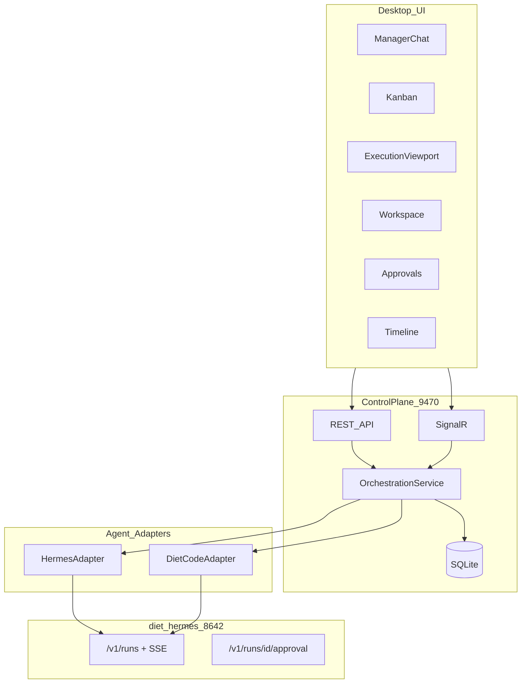

# JoyZoning architecture

## Overview

JoyZoning is a **human operator cockpit** for multi-agent software workflows on a single local **diet-hermes** install. It is not an IDE, not a chatbot wrapper, and not a VS Code clone.

**Product concepts (read first):** [concepts.md](concepts.md) — operator cockpit, execution leases, human merge, one Hermes / two roles.

**Terminal strategy:** [hermes-aligned-terminal-strategy.md](hermes-aligned-terminal-strategy.md) — **cognition vs authority**: Hermes owns agent chat (`hermes --tui`); JoyZoning owns runtime governance (`jz` / `jz tui`). Chat does not hold final authority on merge or Complete.

**Stack:** .NET 8, Avalonia 12 desktop, ASP.NET Core control plane, SQLite + EF Core, SignalR, optional `jz` CLI.



### BroccoliQ hive (embedded)

High-volume timeline mirroring uses a **second SQLite file** (`broccoliq.db`) via a localhost Node worker (`:9471`). See [broccoliq.md](broccoliq.md). EF Core `joyzoning.db` stays authoritative; the hive is audit/index only.

## Agent roles (one Hermes install)

JoyZoning uses **one** diet-hermes checkout (`Hermes:InstallRoot` in config). There is no second Hermes install for “master” vs “slave” — that split is **session-based** and **kanban-synced**:

| Role | UI surface | Backend (MVP) |
|------|------------|----------------|
| **Manager** (lead) | Manager Chat, kanban routing | `POST /v1/runs` with manager toolsets on the shared gateway |
| **Executor** (worker) | Execution viewport, DietCode task runs | Same gateway and install; bounded executor toolsets per run |

The control plane and kanban board coordinate work between manager and executor **sessions** on the same `:8642` API. DietCode does **not** use Firestore `operator_api.py` in MVP.

### Kanban execution orchestration (under existing board)

Each `WorkTask` (kanban card) can hold **one active `ExecutionLease`** at a time:

```
Card → ExecutionLease (leased) → HandoffPacket → DietCode run (running)
     → verification → ready_for_review → human merge/revoke
```

| Concept | Role |
|---------|------|
| `ExecutionLease` | Bounded authority: worktree path, branch, path allow/deny, risk, status |
| `HandoffPacket` | Executor prompt: objective, acceptance criteria, verification commands |
| `VerificationReport` | Evidence attached to lease; preserved if lease is revoked |

**Rules (enforced in `KanbanExecutionRules` + `KanbanExecutionOrchestrator`):**

- One active lease per card; critical cards need `humanApprovedCritical` on dispatch.
- Only one **critical** lease in `running`/`verifying` globally.
- DietCode may transition lease → `blocked` | `verifying` | `ready_for_review` only.
- DietCode cannot set task `Complete`; merge is human-only after verification passes.
- Revoke keeps `VerificationReportJson` and appends to `EvidenceLogJson`.

**API (control plane):** see [execution-orchestration-api.md](execution-orchestration-api.md) and [control-plane-api.md](control-plane-api.md).

**Runtime enforcement:** `LeaseRuntimeService` applies caps (`MaxGlobalActiveLeases`, `MaxCriticalLeases`), heartbeat staleness (`LeaseStaleOptions`), and absolute expiration before orchestrator mutations. Evidence is append-only JSON on the lease row (`EvidenceLogJson`).

**Worktrees:** `WorktreePlanner` creates sandbox directories under `<workspace>/.joyzoning/worktrees/<task-id>/`. Paths are never deleted on revoke — only lease status changes.

## Layer responsibilities

### Desktop UI (`JoyZoning.App`)

- Renders six product surfaces
- Calls control plane REST on `127.0.0.1:9470`
- Subscribes to SignalR `/hubs/operator` for live events (Phase 1+)

### Control plane (`JoyZoning.ControlPlane`)

- Owns operator state in SQLite (`~/Library/Application Support/JoyZoning/joyzoning.db` on macOS)
- Normalizes Hermes SSE into `joy_events` via `HermesRunEventConsumer`
- Correlates approvals to tasks and runs (`ApprovalService` + `approval_grants`)
- Spawns Hermes gateway/dashboard via `HermesConnectivityService` / `HermesDashboardConnectivityService`
- **Hosted services:**
  - `KanbanAutoSyncHostedService` — periodic Hermes kanban import when enabled in config
  - `LeaseReconciliationHostedService` — stale leases, orphan runs, missing worktrees, merged tasks with active leases
- On startup: marks interrupted executions; bootstraps runtime config from SQLite

### Persistence (`JoyZoning.Persistence`)

Append-only `joy_events` + relational tasks, sessions, executions, approvals.

### Agent adapters (`JoyZoning.Agents`)

`IAgentAdapter` implemented by `HermesAdapter` and `DietCodeAdapter` (shared `HermesHttpClient`).

## Task status mapping

JoyZoning UI statuses map to Hermes kanban when sync is enabled:

| JoyZoning | Hermes kanban |
|-----------|---------------|
| Backlog | `todo` / `triage` |
| Planned | `ready` / `scheduled` |
| In Progress | `running` |
| Needs Approval | `review` + pending approval |
| Verifying | `review` |
| Blocked | `blocked` |
| Complete | `done` |

## Design principles

1. **Explicit orchestration** — state machines, not hidden agent magic
2. **Human visibility** — every risky action surfaces in Approvals
3. **Recoverability** — SQLite survives restarts; interrupted runs marked `Interrupted`
4. **Local-first** — loopback only; no cloud dependency for core operation
5. **Complement IDEs** — workspace viewer + external editor, not replacement

## CLI layer (`JoyZoning.Cli`)

Two surfaces share the same HTTP API. See [hermes-aligned-terminal-strategy.md](hermes-aligned-terminal-strategy.md) for the full cognition/authority split.

| Surface | Role |
|---------|------|
| **`jz` / `jz tui`** | Operator shell — slash commands, live SignalR events, lease workflows; launches `hermes --tui` via `jz hermes tui` (does not reimplement agent chat) |
| **`jz agent`** | Constrained worker — heartbeat, verify, blocked, `done` → `ready_for_review` only |

`LeaseContextResolver` infers task/session from cwd (worktree), env vars, or single active lease. `AgentGuard` blocks forbidden raw paths and CLI subcommands in agent mode. `JOYZONING_NO_TUI=1` forces JSON automation mode (no interactive REPL).

## Persistence schema (high level)

| Table | Purpose |
|-------|---------|
| `operator_sessions` | Workspace + Hermes profile scope |
| `work_tasks` | Kanban cards, risk, Hermes kanban link id |
| `execution_sessions` / `execution_steps` | DietCode run tracking |
| `execution_leases` | Lease lifecycle, handoff JSON, verification, evidence |
| `approval_requests` / `approval_grants` | Human approval inbox + scoped grants |
| `joy_events` | Append-only audit + replay cursor |
| `app_config` | Serialized UI/settings blob |

Migrations: `JoyZoning.Persistence/Migrations/`.

## Configuration

See [configuration.md](configuration.md) and `src/JoyZoning.ControlPlane/appsettings.json`:

- `Hermes:InstallRoot` — path to diet-hermes checkout
- `Hermes:ApiBaseUrl` — default `http://127.0.0.1:8642`
- `ControlPlane:ListenUrl` — default `http://127.0.0.1:9470`
- `LeaseRuntime:*` — scheduler caps, durations, stale thresholds

## Related docs

- [hermes-aligned-terminal-strategy.md](hermes-aligned-terminal-strategy.md) — Hermes vs JoyZoning terminal roles  
- [concepts.md](concepts.md) — why JoyZoning is structured this way  
- [use-cases.md](use-cases.md) — scenarios  
- [getting-started.md](getting-started.md) — first run  
- [hermes-integration.md](hermes-integration.md) — diet-hermes wiring  
- [lease-lifecycle.md](lease-lifecycle.md) — lease state machine  
- [desktop-ui.md](desktop-ui.md) — Avalonia surfaces  
- [development.md](development.md) — build and test  
- [troubleshooting.md](troubleshooting.md) — common failures  
- [README.md](README.md) — documentation index  
