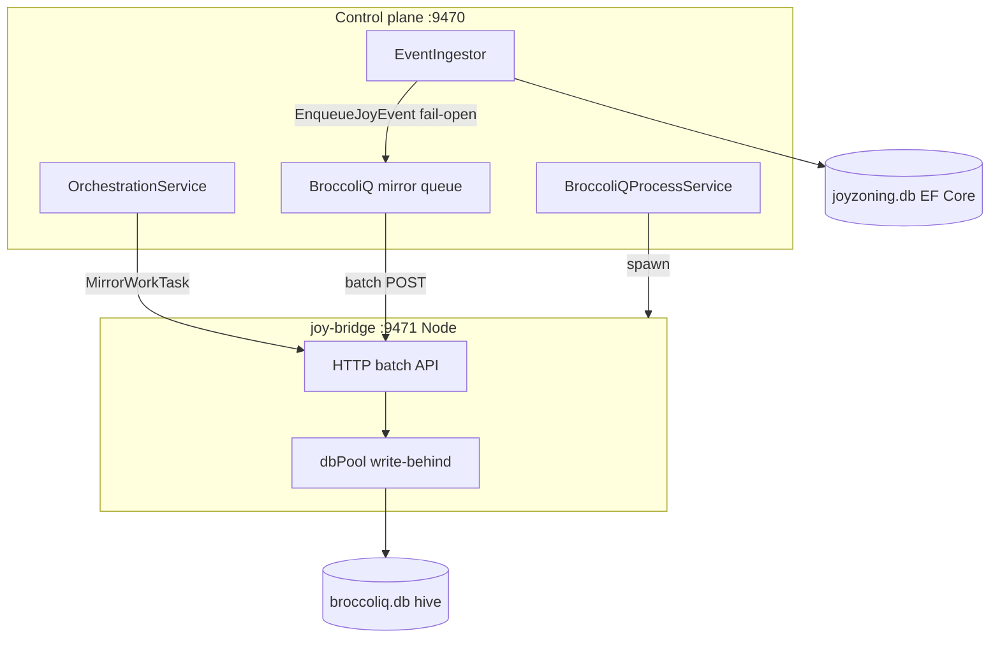

# BroccoliQ integration

JoyZoning embeds **[BroccoliQ](https://github.com/cardsorting/broccoliq)** (`broccoliq/`) as a **write-behind SQLite hive** beside the primary `joyzoning.db`. The control plane mirrors timeline activity into BroccoliQ for high-throughput audit and task indexing. **EF Core remains the source of truth** — BroccoliQ never blocks ingest or dispatch.

## Architecture



| Component | Role |
|-----------|------|
| `EventIngestor` | After each `joy_events` row → **non-blocking** `EnqueueJoyEvent` |
| `BroccoliQBridgeClient` | Bounded channel (default 8192), batches up to 64 events / 75ms |
| `OrchestrationService` | Task create/status/kanban sync → `hive_tasks` |
| `BroccoliQWorkerHostedService` | Start + **supervisor** restart if bridge dies |
| `jz doctor` | `broccoliq_bridge` + `GET /api/broccoliq/health` |

## Production invariants

1. **Fail-open** — Mirror failures never fail API requests or agent runs.
2. **Bounded queue** — When full, events are **dropped** (counted in `mirror.dropped`); ingest continues.
3. **Idempotent events** — Bridge upserts `hive_audit` with id `joy:{joyEventId}` (safe retries).
4. **Idempotent tasks** — Bridge upserts `hive_tasks` on `task_id`.
5. **Localhost only** — Bridge binds `127.0.0.1`; rejects non-local `Host` headers.
6. **Supervisor** — Every 30s (configurable), unhealthy bridge → restart worker process.
7. **Dist gate** — Worker refuses to start if `broccoliq/dist` is missing.
8. **Startup backfill** — Replays `joy_events` after cursor `broccoliq.last_backfill_event_id` (config table).
9. **Pump retries** — Batch mirror retries when bridge is warming up.
10. **Shutdown flush** — Control plane calls `POST /v1/flush` before exit.

## Build (required once per clone)

```bash
./scripts/broccoliq-build.sh
```

## Configuration (`BroccoliQ` in appsettings)

| Key | Default | Meaning |
|-----|---------|---------|
| `Enabled` | `true` | Mirror + bridge integration |
| `AutoStartWorker` | `true` | Spawn joy-bridge on startup |
| `SupervisorEnabled` | `true` | Periodic health + restart |
| `BridgeListenUrl` | `http://127.0.0.1:9471` | Must be localhost |
| `DatabasePath` | `{joyzoning dir}/broccoliq.db` | Hive file |
| `MirrorQueueCapacity` | `8192` | In-process event queue |
| `MirrorBatchSize` | `64` | Events per HTTP batch |
| `MirrorFlushIntervalMs` | `75` | Max batch wait |
| `WorkerSupervisorIntervalSeconds` | `30` | Supervisor tick |
| `MaxRequestBodyBytes` | `1048576` | Bridge payload cap |

## Observability

```bash
curl -s http://127.0.0.1:9470/api/broccoliq/health | jq
```

Response includes:

- `status` — `ok` when bridge HTTP health succeeds
- `bridgeBuilt` — `broccoliq/dist` present
- `workerManaged` — child process running
- `mirror` — `{ enqueued, delivered, dropped, failed, queueDepth, ... }`

Bridge worker:

```bash
curl -s http://127.0.0.1:9471/health
curl -s http://127.0.0.1:9471/ready   # flush probe
```

## CLI

```bash
jz broccoliq status      # alias: health
jz broccoliq backfill    # replay events + tasks
jz broccoliq backfill --max 1000
jz broccoliq flush       # force dbPool flush
```

## Manual bridge (debug)

```bash
source scripts/broccoliq-env.sh
export BROCCOLIQ_DB_PATH="$HOME/Library/Application Support/JoyZoning/broccoliq.db"
cd broccoliq && npm run joy:bridge
```

## Disable integration

```json
"BroccoliQ": { "Enabled": false }
```

Or keep mirroring but run your own bridge: `"AutoStartWorker": false`.

## Failure modes

| Symptom | Likely cause | Fix |
|---------|----------------|-----|
| `bridgeBuilt: false` | No `npm run build` | `./scripts/broccoliq-build.sh` |
| `mirror.dropped` rising | SSE burst > queue | Raise `MirrorQueueCapacity` or reduce event noise |
| `workerManaged: false` | Node missing / port in use | Install Node 18+; free `:9471` |
| Tasks stale in hive | Bridge down during sync | Supervisor restart; re-sync kanban |

## Relation to diet-hermes BroccoliDB

**BroccoliQ** (this tree) = sharded SQLite hive for JoyZoning telemetry. **BroccoliDB** in diet-hermes = Hermes forensic toolset under the install root. They are complementary, not the same directory.
