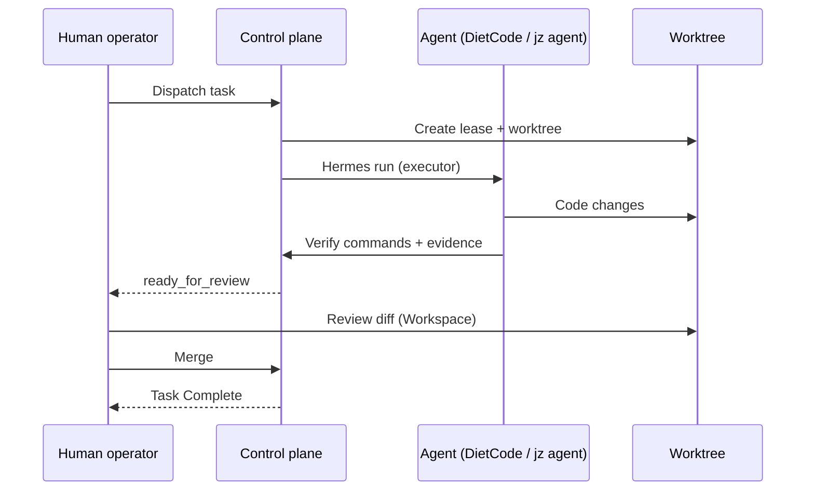

# Core concepts

JoyZoning is built around one idea: **software work with agents needs an operator**, not just another chat window. You remain accountable for what ships; agents get **bounded authority** inside leases you can audit, recover, and approve.

This page is the conceptual spine. **Hands-on setup:** [onboarding/README.md](onboarding/README.md). Implementation details: [architecture.md](architecture.md), [lease-lifecycle.md](lease-lifecycle.md), [hermes-integration.md](hermes-integration.md).

---

## The problem JoyZoning solves

| Without an operator layer | With JoyZoning |
|---------------------------|----------------|
| Manager and worker agents share one chat or one terminal — context collides | **Manager** plans in chat; **executor** works in isolated worktrees |
| “Done” means the model said so | **Done** means verification passed **and** a human merged |
| Risky tool calls are invisible until something breaks | **Approvals** inbox + scoped grants |
| Restarts lose track of in-flight runs | **SQLite + events** survive restarts; recovery flows |
| Two Hermes installs drift out of sync | **One diet-hermes**; kanban syncs sessions |

JoyZoning does not replace your IDE, Hermes CLI, or kanban plugin. It **sits above them** as the place you dispatch, watch, approve, and sign off.

---

## Three pillars

### 1. Operator cockpit (not an IDE)

You interact through **surfaces** tuned for supervision:

- **Plan** — Manager Chat with Hermes as project lead  
- **Track** — Kanban aligned with Hermes board (two-way sync)  
- **Observe** — Execution viewport, terminal preview, optional Hermes TUI  
- **Review** — Workspace diffs before merge  
- **Govern** — Approvals + Timeline audit trail  

The cockpit is **local-first** (`127.0.0.1` only). Your code stays on disk; the control plane stores **orchestration state**, not source-of-truth repositories.

### 2. One Hermes, two roles

```
┌─────────────────────────────────────────────────────────┐
│  diet-hermes (single gateway + API)                     │
│                                                         │
│   Session A — Manager          Session B — Executor     │
│   (planning runs)                (dispatch / DietCode)    │
│            \                          /                 │
│             \   kanban + JoyZoning   /                  │
│              └──────────┬────────────┘                  │
└─────────────────────────┼───────────────────────────────┘
                          ▼
              JoyZoning control plane (:9470)
```

Roles are **sessions and toolsets**, not duplicate installs. JoyZoning imports/pushes kanban so the board stays the shared contract between you, the manager agent, and workers.

### 3. Execution lease (governance boundary)

An **execution lease** is the unit of agent authority for one kanban card:

| Lease carries | Why it matters |
|---------------|----------------|
| **Worktree path** | Agent edits are sandboxed under `.joyzoning/worktrees/<task-id>/` |
| **Handoff packet** | Objective, acceptance criteria, suggested verify commands |
| **Risk level** | Critical work needs explicit human approval per dispatch |
| **Status machine** | Explicit transitions — no hidden “done” |
| **Evidence log** | Append-only history for audit and recovery |
| **Verification report** | Proof of `dotnet test` (etc.) before human merge |



**Merge is the only door to Complete.** Agents may reach `ready_for_review`; they cannot call merge or set `WorkTaskStatus.Complete`. The same rule applies in the desktop UI, REST API, `jz`, and `jz agent` (enforced by `KanbanExecutionRules`, `AgentGuard`, and API 403s).

---

## Human vs agent authority

Think of two hats:

| Hat | Tools | Can |
|-----|-------|-----|
| **Operator** | Desktop, `jz` | Dispatch, approve critical work, revoke, recover, **merge** |
| **Worker** | `jz agent`, DietCode in lease | Heartbeat, run verify commands, block with reason, submit for review |

This split is **intentional**. Autonomous agents are productive inside a lease; **accountability** stays with the human who merges. That is how JoyZoning scales to critical tasks (`risk: 3`) with a global cap on concurrent critical leases.

`.joyzoning/context.json` in each worktree makes the rules visible to scripts and harnesses — not just documentation.

---

## How this relates to Hermes

| Hermes provides | JoyZoning adds |
|-----------------|----------------|
| Agent runtime, tools, SSE runs | Operator state, leases, verification gate |
| Kanban plugin API | Two-way sync + dispatch hooks |
| Dashboard + PTY | Embedded TUI in Execution surface |
| Approvals at tool boundary | Inbox + grants correlated to tasks |

JoyZoning **orchestrates**; Hermes **executes**. Neither duplicates the other.

---

## Design principles (why it feels different)

1. **Explicit state machines** — Leases and kanban columns have defined transitions; background reconciliation fixes orphans instead of hoping agents self-heal.  
2. **Evidence over vibes** — Failed verification is stored; merge requires a passing report.  
3. **Recoverability** — Revoke/block does not delete worktrees; recovery modes reopen or replace leases.  
4. **One policy, many surfaces** — UI, API, and CLI share `KanbanExecutionOrchestrator`; no “back door” Complete.  
5. **Complement, don’t replace** — Edit in VS Code / Cursor; supervise in JoyZoning.

---

## When JoyZoning is the right fit

**Good fit:**

- You run Hermes (diet-hermes) locally for multi-step coding tasks  
- You want a **kanban-shaped** queue with human sign-off before merge  
- You need **audit** (timeline, evidence) for agent work on a repo  
- You operate **critical** changes with explicit approval gates  

**Not the right fit (today):**

- Cloud-only agent hosting with no local Hermes  
- Single-chat pair programming with no task boundaries  
- Fully unattended auto-merge pipelines (merge is always human in MVP)  

---

## Concept map (read next)

| Question | Doc |
|----------|-----|
| How do I install and run it? | [getting-started.md](getting-started.md) |
| What is each lease state? | [lease-lifecycle.md](lease-lifecycle.md) |
| How does Hermes connect? | [hermes-integration.md](hermes-integration.md) |
| What can I run in the terminal? | [cli.md](cli.md) |
| Quick answers | [faq.md](faq.md) |
| Scenario walkthroughs | [use-cases.md](use-cases.md) |
| Terms | [glossary.md](glossary.md) |
