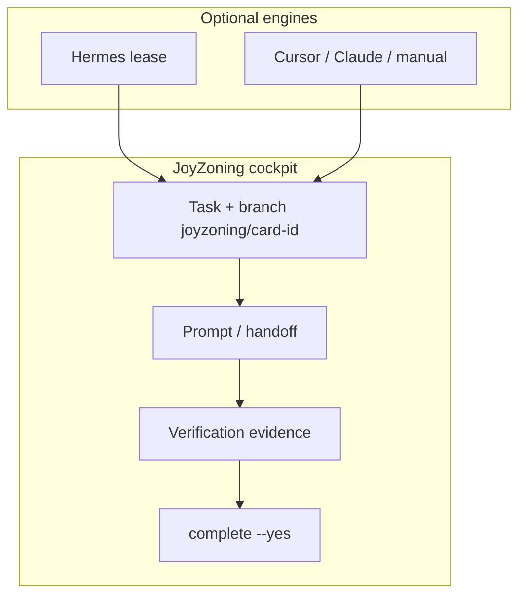

# Execution paths

JoyZoning supervises work on your machine. **How files get edited** is your choice; **when work counts as done** is not.

**One rule:** verify → human `jz task complete --yes`. No path skips that.

---

## Pick a path in 30 seconds

| You are… | Path | Start command |
|----------|------|----------------|
| Using JoyZoning + **Hermes** tools in-app | **Managed** | `jz task run <id>` or Kanban **Dispatch** |
| Using **Cursor** (or Claude Code) on the repo | **External** | `jz task start-external <id> --agent cursor` |
| Running an **8-role JSDP program** in Cursor | **External chain** | `jz delivery-chain next <chain-id> --external --agent cursor` |
| Running an **8-role JSDP program** in Hermes | **Managed chain** | `jz delivery-chain queue <id>` → dispatch each role |
| **Long-horizon repo** (Hermes + `.jsdp/` harness) | **JSDP autonomous** | Dispatch → agent uses `jsdp(start\|apply\|advance)` — [jsdp-autonomous-path.md](jsdp-autonomous-path.md) |
| A **coding agent** reading this repo | **Contract** | [AGENTS.md](../AGENTS.md) · [external-agent-jsdp.md](external-agent-jsdp.md) |

---

## Same gates, different engine



| Stage | Managed | External |
|-------|---------|----------|
| Start | `dispatch` / `task run` | `task start-external` / `delivery-chain next --external` |
| Work | Hermes tools + lease | Your IDE on card branch |
| Ready for review | Agent → `ready_for_review` | `jz task mark-ready` |
| Verify | `jz task verify` | Same |
| Done | `jz task complete --yes` | Same |
| Lease row | Yes | **No** (404 on `/lease` is normal) |

---

## Command cheat sheet

### Single task

```bash
# External
jz task start-external <id> --agent cursor
jz task prompt <id>
jz task mark-ready <id>
jz task verify <id> --cmd "npm test"
jz task complete <id> --yes

# Managed
jz task run <id>
jz task verify <id> --cmd "npm test"
jz task complete <id> --yes
```

### JSDP chain (8 roles)

```bash
jz delivery-chain create --program "My App" --workspace /path/to/repo

# External — repeat per role
jz delivery-chain next <chain-id> --external --agent cursor
jz task prompt <task-id>
# … edit …
jz task mark-ready <task-id>
jz task verify <task-id> --cmd "npm test"
jz task complete <task-id> --yes

# Inspect gate
jz delivery-chain queue <chain-id>
```

---

## Prerequisites by path

| Path | Control plane (`pnpm dev`) | `jz` | Hermes gateway | LLM keys |
|------|---------------------------|------|----------------|----------|
| External single task | Yes | Yes | No | No* |
| External JSDP chain | Yes | Yes | No | No* |
| Managed dispatch | Yes | Yes | Yes | Yes (for runs) |
| Manager Chat only | Yes | Optional | Yes | Yes |

\*Unless you use an external tool that needs its own API keys.

---

## Mixing paths

Allowed within one JSDP chain:

- Role 1: external (Cursor)
- Role 2: managed (Hermes)
- Role 3: external again

Not allowed:

- Two roles **in progress** at once on the same chain
- `Complete` without verify (when required) or without merge
- Agents calling APIs to set `Complete` on bounded/external tasks

---

## JSDP autonomous (Hermes + harness)

Operators only **Dispatch** from JoyZoning. Agents use the Hermes **`jsdp`** tool — no yaml paths.

```text
jsdp(start) → jsdp(apply, proposal_json) → jsdp(advance) … → operator jz task complete --yes
```

Full guide: [jsdp-autonomous-path.md](jsdp-autonomous-path.md) · harness detail: [jsdp-convergence-harness.md](jsdp-convergence-harness.md)

---

## Where to read more

| Topic | Doc |
|-------|-----|
| JSDP autonomous (operators + agents) | [jsdp-autonomous-path.md](jsdp-autonomous-path.md) |
| External path (full) | [external-agent-jsdp.md](external-agent-jsdp.md) |
| JSDP protocol | [jsdp.md](jsdp.md) |
| Philosophy | [philosophy.md](philosophy.md) |
| Framework (C2 merge authority, C7 stable coordinates, constraint persistence) | [whitepaper-summary.md](whitepaper-summary.md) |
| CLI | [cli.md](cli.md) |
| FAQ | [faq.md](faq.md) |
| Use cases | [use-cases.md](use-cases.md) |
| Troubleshooting | [external-agent-jsdp.md#troubleshooting](external-agent-jsdp.md#troubleshooting) · [troubleshooting.md](troubleshooting.md) |
| Setup (Cursor-first checklist) | [onboarding/setup-checklist.md](onboarding/setup-checklist.md) |
| Desktop menus | [onboarding/desktop-menu-guide.md](onboarding/desktop-menu-guide.md) |
| API (external) | [control-plane-api.md#external-execution-no-lease](control-plane-api.md#external-execution-no-lease) |
| API (leases) | [execution-orchestration-api.md](execution-orchestration-api.md) |
| Events | [event-catalog.md](event-catalog.md) |
