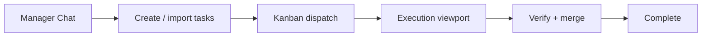

# Getting started

JoyZoning is a **desktop operator console** (and optional `jz` CLI) for running multi-agent workflows on one local **diet-hermes** install. You supervise a **Manager** session (planning) and **executor** sessions (DietCode runs) on the same gateway, coordinated through kanban and execution leases.

## Prerequisites

| Requirement | Notes |
|-------------|--------|
| **.NET 8 SDK** | Pinned in `global.json` (`8.0.421`, `rollForward: latestFeature`) |
| **diet-hermes** | Single checkout; default `~/Downloads/diet-hermes-main-master` |
| **macOS** (primary) | Dev scripts and `.app` bundle target arm64; control plane runs on Linux too |
| **Disk / time** | First Hermes install via JoyZoning: ~3–8 minutes (venv + gateway) |

Hermes must expose the **API server** on profile `joyzoning` (port **8642**). JoyZoning can install and configure this on first launch.

## Quick start (desktop)

```bash
git clone <your-repo-url> JoyZoning
cd JoyZoning
./scripts/run-dev.sh
```

`run-dev.sh` starts the control plane in the background, then launches the Avalonia app. The app **also** auto-starts the control plane on `http://127.0.0.1:9470` if nothing is listening — you only need a separate terminal when debugging the API.

Alternative:

```bash
dotnet run --project src/JoyZoning.App
```

## First launch (what actually happens)

1. **Control plane** binds to `http://127.0.0.1:9470` (unless already running).
2. **Auto-setup** (`OnboardingAutoSetup`, default on) runs when `AutoSetupOnLaunch` is enabled:
   - Detects or installs diet-hermes at the configured install root
   - Ensures Hermes gateway + API on profile `joyzoning`
   - Starts dashboard when needed and acquires session token for kanban sync / TUI
   - Opens a **sample workspace** under Application Support if you have no project yet
3. A **“Setting up JoyZoning…”** overlay shows progress; on success you land on **Manager Chat**.
4. **Getting Started** hub remains available (menu: Settings → Open Getting Started) if any step failed or you want the checklist UI.

You do **not** need to complete a blocking wizard before using the app — the wizard and **Hermes → Connection…** are advanced paths.

## Open your own workspace

When you are ready to leave the sample project:

1. **Project → Open Workspace** — pick a folder (or **Open last** if you used one before).
2. Manager Chat and kanban tasks are scoped to the active **operator session** for that workspace.

## Hermes connection (manual path)

Use when the status bar shows API or Dashboard unavailable:

1. **Hermes → Connection…** (or click the API/Dashboard chips).
2. **Connect all** or step through: install path → ensure gateway → connect dashboard.
3. **Hermes → Ensure Gateway** from the menu if only the API chip is red.

Kanban import/sync and **Execution → Hermes TUI** need a valid **dashboard session token** (scraped automatically after dashboard connect).

## Daily operator workflow



1. **Manager Chat** — send planning messages; optional **Parse** / **→ Task** from replies.
2. **Kanban** — create tasks, drag columns, **Dispatch** to DietCode (critical cards need approval checkbox).
3. **Execution** — watch tool steps and terminal; connect **Hermes TUI** via dashboard WebSocket.
4. **Approvals** — resolve Once / Task / Session / Deny for risky Hermes tool calls.
5. **Workspace** — tree, changed files, split diff preview.
6. **Timeline** — audit events; select a row to inspect JSON payload.

**Complete** on a card requires a passing verification report and **merge** (human-only). Dragging to Complete in the UI routes through the merge API when a lease is `ready_for_review`.

## Terminal-only workflow (`jz`)

Same gates as the desktop, scriptable:

```bash
./scripts/jz doctor
./scripts/install-jz.sh   # optional: ~/.local/bin/jz

jz session create --name my-run --workspace "$HOME/src/myrepo"
export JOYZONING_SESSION_ID="<session-guid>"

TASK=$(jz --field .id task create --title "Fix build" --risk 1)
jz task run "$TASK" --poll 10
jz task verify "$TASK" --cmd "dotnet test"
jz task complete "$TASK" --yes
```

Agent work inside the lease worktree:

```bash
cd "$WORKTREE"
jz agent start --task "$TASK"
jz agent verify --cmd "dotnet build" --cmd "dotnet test"
jz agent done    # ready_for_review only
# Human: jz task complete "$TASK" --yes
```

Full reference: [cli.md](cli.md).

## Release build (macOS arm64)

```bash
./scripts/publish-macos.sh
./dist/run-joyzoning.sh

# Optional .app bundle:
./scripts/bundle-macos-app.sh
open dist/JoyZoning.app
```

## Troubleshooting

| Symptom | What to try |
|---------|-------------|
| API chip red | Hermes → Ensure Gateway; check `Hermes:InstallRoot` in appsettings |
| Kanban sync empty | Connection → Connect dashboard; confirm token in Settings → Advanced |
| Interrupted execution on restart | **Recovery** menu or startup prompt; resume or dismiss |
| Support bundle | Settings → **Copy health report** |

Diagnostics CLI:

```bash
jz doctor
jz config explain
```

## Next steps

- [desktop-ui.md](desktop-ui.md) — surface-by-surface UI guide  
- [configuration.md](configuration.md) — paths and settings  
- [execution-orchestration-api.md](execution-orchestration-api.md) — lease API contract  
