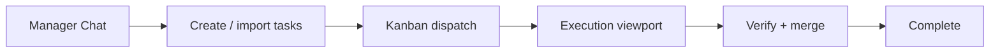

# Getting started

> **New onboarding hub:** Step-by-step guides, checklists, and non-technical paths live in **[onboarding/](onboarding/README.md)**. This page is the short overview; use the hub for install detail, CLI vs desktop, and troubleshooting playbooks.

JoyZoning is a **desktop operator console** (and optional `jz` CLI) for running multi-agent workflows on one local **diet-hermes** install. You supervise a **Manager** session (planning) and **executor** sessions (DietCode runs) on the same gateway, coordinated through kanban and execution leases.

---

## Start here

| You are… | Go to |
|----------|-------|
| **New — want the fastest path** | [5-minute quickstart](onboarding/quickstart.md) |
| **Non-technical — menus only** | [Desktop menu guide](onboarding/desktop-menu-guide.md) · [Plain-language glossary](onboarding/plain-language-glossary.md) |
| **Choosing desktop vs terminal** | [Choose your path](onboarding/choose-your-path.md) |
| **From Hermes/ChatGPT chat only** | [Coming from Hermes chat](onboarding/coming-from-hermes-chat.md) |
| **Installing from scratch** | [Installation guide](onboarding/installation.md) · [macOS](onboarding/platform-macos.md) · [Linux](onboarding/platform-linux.md) |
| **Understanding the product** | [Before you begin](onboarding/before-you-begin.md) · [concepts.md](concepts.md) |
| **Something failed** | [Setup troubleshooting trees](onboarding/troubleshooting-setup.md) · [troubleshooting.md](troubleshooting.md) |

---

## Prerequisites (summary)

| Requirement | Notes |
|-------------|--------|
| **.NET 8 SDK** | Pinned in `global.json` — see [installation § .NET 8](onboarding/installation.md#net-8-on-macos) |
| **diet-hermes** | One checkout; [hermes-setup.md](onboarding/hermes-setup.md) |
| **macOS** (primary) | `.app` targets arm64; control plane runs on Linux |
| **LLM API keys** | Before Manager Chat replies — [api-keys-and-models.md](onboarding/api-keys-and-models.md) |

Hermes must expose the **API server** on profile `joyzoning` (port **8642**). JoyZoning can install and configure this on first launch.

---

## Quick start (desktop)

```bash
git clone https://github.com/CardSorting/JoyZoning.git
cd JoyZoning

cp src/JoyZoning.ControlPlane/appsettings.example.json \
   src/JoyZoning.ControlPlane/appsettings.Development.json
# Set Hermes:InstallRoot in Development.json (or use auto-setup)

./scripts/run-dev.sh
```

Full detail: [onboarding/quickstart.md](onboarding/quickstart.md) · [first-run-desktop.md](onboarding/first-run-desktop.md).

`run-dev.sh` starts the control plane, then the Avalonia app. The app **also** auto-starts the control plane on `http://127.0.0.1:9470` if nothing is listening.

---

## First launch (summary)

1. **Control plane** on `:9470`  
2. **Auto-setup** (default): diet-hermes, gateway, dashboard token, sample workspace  
3. **Getting Started** hub with health grade and checklist  
4. Land on **Manager Chat** when healthy  

No blocking wizard required. See [first-run-desktop.md](onboarding/first-run-desktop.md).

---

## Setup checklist (five core steps)

1. Control plane online  
2. diet-hermes ready  
3. API gateway (`:8642`)  
4. Dashboard & token (`:9119`)  
5. Workspace opened  

Printable version: [onboarding/setup-checklist.md](onboarding/setup-checklist.md).

---

## Daily operator workflow



Walkthrough: [onboarding/whats-next.md](onboarding/whats-next.md).

| Step | Surface |
|------|---------|
| Plan | Manager Chat |
| Track | Kanban |
| Dispatch | Kanban → Execution |
| Approve tools | Approvals |
| Review diff | Workspace |
| Audit | Timeline |

**Complete** requires verification + **human merge** — agents cannot skip this gate.

---

## Terminal workflow (`jz`)

Same policy as desktop:

```bash
./scripts/install-jz.sh
source scripts/jz-env.sh
jz doctor

jz session create --name my-run --workspace "$HOME/src/myrepo"
# export JOYZONING_SESSION_ID=...

jz task run <task-id> --poll 10
jz task verify <task-id> --cmd "dotnet test"
jz task complete <task-id> --yes
```

Full path: [onboarding/first-run-cli.md](onboarding/first-run-cli.md) · [cli.md](cli.md).

---

## Release build (macOS arm64)

```bash
./scripts/publish-macos.sh
./dist/run-joyzoning.sh
./scripts/bundle-macos-app.sh && open dist/JoyZoning.app
```

---

## Troubleshooting (quick)

| Symptom | Doc |
|---------|-----|
| Red API / Dashboard chips | [status-indicators.md](onboarding/status-indicators.md) |
| First install slow | [installation.md](onboarding/installation.md) |
| `jz` / .NET errors | [first-run-cli.md](onboarding/first-run-cli.md) |

```bash
jz doctor
jz config explain
```

Full tables: [troubleshooting.md](troubleshooting.md).

---

## Next steps

| Topic | Doc |
|-------|-----|
| **Onboarding hub** | [onboarding/README.md](onboarding/README.md) |
| Desktop UI | [desktop-ui.md](desktop-ui.md) |
| Hermes ports & sync | [hermes-integration.md](hermes-integration.md) |
| Lease states | [lease-lifecycle.md](lease-lifecycle.md) |
| Settings | [configuration.md](configuration.md) |
| Terms | [glossary.md](glossary.md) |
