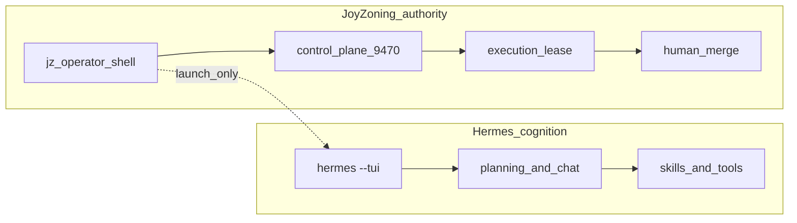

# Hermes-aligned terminal strategy

JoyZoning separates **cognition** from **authority**.

- **Hermes** owns agent cognition: chat, planning, skills, tools, and the conversational TUI.
- **JoyZoning** owns runtime governance: kanban scheduling, execution leases, verification, human merge, recovery, evidence, and operator commands.

`jz` is **not** a Hermes clone. `jz` is the **operator shell** for the JoyZoning local kanban runtime — the same control plane the desktop app uses, with the same gates and evidence rules.

**See also:** [cli.md](cli.md) (command reference) · [concepts.md](concepts.md) (why leases exist) · [workspace-state.md](workspace-state.md) (1:1 card → folder) · [architecture.md](architecture.md) (layers) · [diet-hermes TUI architecture](https://github.com/NousResearch/hermes-agent/blob/main/AGENTS.md#tui-architecture-ui-tui--tui_gateway) (upstream pattern we follow for agent chat)

---

## 1. Summary

| Cockpit | Command | What it is |
|---------|---------|------------|
| **Agent cognition** | `hermes --tui` (via `jz hermes tui`) | Full Hermes terminal: multiline chat, slash skills, tool streaming, session resume |
| **Operator / runtime** | `jz` or `jz tui` | JoyZoning operator shell: leases, dispatch, verify, merge, approvals, live `OnJoyEvent` stream |



**Rule of thumb:** if the question is “what should the agent think or do next?”, use Hermes. If the question is “what is allowed to become project state?”, use JoyZoning (`jz`, desktop, or REST).

---

## 2. Why this exists

Without a deliberate split, the **chat surface becomes the operating system**. That failure mode looks familiar:

- Planning, dispatch, verification, merge, recovery, and scheduling all collapse into one conversational UI.
- “The agent said it’s done” replaces durable lease state and evidence.
- Tool output in chat is mistaken for governance truth.
- Operators lose scriptable, auditable commands in favor of prose.

JoyZoning exists so **conversation stays volatile** and **runtime state stays durable**. Hermes is excellent at cognition; JoyZoning is the kernel that decides what crosses into kanban, SQLite, and git merge.

---

## 3. Architecture map

| Layer | Hermes | JoyZoning |
|-------|--------|-----------|
| **Agent chat** | `hermes --tui` | `jz hermes tui` / `/hermes` launcher (no .NET reimplementation) |
| **Operator shell** | Classic CLI + central slash registry | `jz` / `jz tui` + `OperatorSlashRegistry` |
| **Live events** | Tool streams, gateway events | SignalR `OnJoyEvent` + manager chat deltas |
| **Automation** | Non-TTY / flags / pipes | `JOYZONING_NO_TUI=1` + JSON on stdout |

Process model (aligned with upstream Hermes TUI docs):

```
jz tui                    # Ink-style operator REPL (C#)
    └── HTTP :9470        # control plane
    └── SignalR hub       # live tool / lease / manager events

jz hermes tui             # spawns hermes --tui (Node Ink + Python gateway)
    └── diet-hermes       # agent sessions, tools, skills — unchanged
```

**Do not re-implement the primary agent chat experience in JoyZoning.** The desktop embeds Hermes TUI over dashboard PTY for the same reason: one transcript, one composer, one slash-command behavior.

### Workspace state stays 1:1 (not in chat)

| Layer | Shows |
|-------|--------|
| Hermes TUI / Manager Chat | Plans, tool streams, reasoning |
| JoyZoning **Workspace** | Files on disk for the **selected card** (lease worktree after dispatch) |
| JoyZoning **Timeline** | Same paths, persisted as `git.status.changed` / `workspace.file.changed` |

`jz /workspace` with `/use <task>` hits the same APIs as the desktop — not a second copy of git state. See [workspace-state.md](workspace-state.md).

---

## 4. Responsibilities

### Hermes (cognition)

- Planning and decomposition (Manager role)
- Agent chat and conversational reasoning
- Tool and skill invocation
- Streaming assistant output and tool progress
- Session resume, model/skill selection inside chat

### JoyZoning (authority)

- Task / card lifecycle on the kanban board
- **Execution lease** lifecycle (dispatch → verify → review → merge)
- Worktree and session scope for workers
- **Verification reports** attached as evidence
- **Merge** and **revoke** (human-only for Complete)
- Recovery and reconciliation (reopen, reattach, replacement lease)
- Append-only **operator evidence** and event timeline

---

## 5. Operator workflows

### Interactive operator TUI

```bash
jz                                    # auto-starts TUI on a real TTY
jz tui --session <guid> --task <guid> # pre-bind context
```

Inside `jz tui`, bind a task then run lease workflows:

```text
/use <task-guid>
/dispatch                             # or /run; add --approve-critical for risk 3
/watch                                # stream OnJoyEvent + manager deltas
/complete --yes                       # human merge only
```

Plain text (no `/`) sends **Manager Chat** when a session is active — planning input, not merge authority.

### Agent cognition (delegated to Hermes)

```bash
jz hermes tui                         # full hermes --tui
jz hermes tui -c                      # resume latest Hermes TUI session
```

Inside operator TUI: `/hermes` does the same launch and returns when Hermes exits.

### JSON automation (no TUI)

```bash
JOYZONING_NO_TUI=1 jz task list --pretty
jz task run <id> --poll 10
jz task complete <id> --yes
```

Use `source scripts/dotnet-env.sh` before build/test if macOS `dotnet` points at .NET 6 only ([development.md](development.md)).

---

## 6. Governance invariant

These rules are non-negotiable across desktop, REST, and `jz`:

| Statement | Meaning |
|-----------|---------|
| Hermes can **think** and **act** as an agent worker | Tools, edits, and plans inside a lease worktree |
| JoyZoning decides what becomes **project state** | Kanban column, lease status, evidence rows |
| `jz agent done` → **`ready_for_review` only** | Never `Complete` |
| **`jz task complete --yes`** → human merge | Only path to Complete after verification |
| **Chat never owns final authority** | Manager Chat does not merge, revoke, or bypass leases |

The chat layer proposes; the control plane records; the human signs off.

---

## 7. Why this is safer

| Property | Benefit |
|----------|---------|
| **Runtime state is durable** | SQLite + `joy_events` survive restarts; chat context does not |
| **Chat context is volatile** | Replanning does not silently rewrite lease or verification history |
| **Leases constrain mutation** | Worktree path, risk, caps, one active lease per card |
| **Verification gates truth** | Commands run in worktree; reports stored on the lease |
| **Human approval preserves governance** | Critical dispatch, merge, revoke require explicit operator intent |
| **Terminal automation stays scriptable** | `JOYZONING_NO_TUI=1`, JSON stdout, exit codes for CI |

---

## 8. Anti-goals

This strategy explicitly does **not**:

- Rebuild Hermes or embed a second Ink/React chat stack in JoyZoning
- Make `jz` a general-purpose AI assistant
- Let agents bypass execution leases or mark tasks **Complete**
- Let Manager Chat or Hermes TUI merge, revoke, or replace verification without the control plane API
- Add a second messaging gateway or duplicate Hermes slash-command registry for agent skills

If a feature belongs in agent cognition, it belongs in **diet-hermes**. If it belongs in project authority, it belongs in **JoyZoning**.

---

## 9. Examples

### Operator (runtime cockpit)

```bash
jz
/use 550e8400-e29b-41d4-a716-446655440000
/dispatch --approve-critical    # when risk: 3
/watch                          # live tool + event stream
/complete --yes
```

Equivalent automation:

```bash
JOYZONING_NO_TUI=1 jz task dispatch 550e8400-e29b-41d4-a716-446655440000 --approve-critical
JOYZONING_NO_TUI=1 jz task verify 550e8400-e29b-41d4-a716-446655440000 --cmd "dotnet test"
JOYZONING_NO_TUI=1 jz task complete 550e8400-e29b-41d4-a716-446655440000 --yes
```

### Agent (cognition + constrained worker)

```bash
jz hermes tui                     # plan and use tools in Hermes
cd "$WORKTREE"
jz agent heartbeat
jz agent verify --cmd "dotnet test"
jz agent done                     # ready_for_review — not Complete
```

### Automation (CI / scripts)

```bash
JOYZONING_NO_TUI=1 jz task list --pretty
JOYZONING_NO_TUI=1 jz --field .status task lease "$TASK_ID"
```

---

## 10. Closing mental model

| Piece | Role |
|-------|------|
| **Hermes** | Cognition cockpit — how agents think, talk, and use tools |
| **JoyZoning** | Runtime kernel — what is allowed to become durable project state |
| **`jz`** | Operator shell — human-supervised commands against the control plane |
| **`jz agent`** | Constrained worker harness — inside a lease worktree only |
| **Kanban** | Scheduler — cards, dispatch, sync with Hermes board |
| **Human merge** | Final authority — Complete after evidence and review |
| **Workspace (1:1)** | One card → one folder — PR-style file review, not chat scrollback |

Use Hermes to **explore and execute**. Use JoyZoning to **govern and sign off** — and use **Workspace** to see what actually changed on disk.
