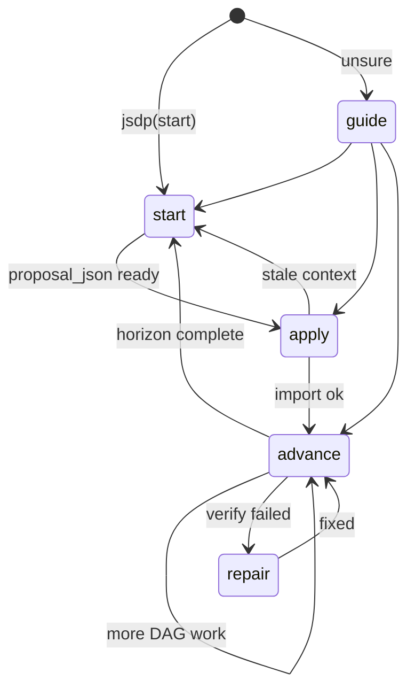

# JSDP autonomous path

One execution path for **long-horizon repo work** when you use **JoyZoning + Hermes**. No nested config, no twelve CLI steps.

| Audience | Read this |
|----------|-----------|
| **Operator** (you click Dispatch) | [Operators](#operators) below |
| **Hermes agent** | `jsdp` tool: `start` → `apply` → `advance` |
| **CLI expert** | [jsdp-convergence-harness.md](jsdp-convergence-harness.md) (manual `jz jsdp horizon …`) |

Related: [execution-paths.md](execution-paths.md) · [hermes-integration.md](hermes-integration.md)

---

## Operators

### What you do (three steps)

1. **Open workspace** in JoyZoning (your real project folder).
2. **Dispatch** the kanban card (or `jz task run <id>`).
3. When the agent finishes, **`jz task complete <id> --yes`** after you review.

You do **not**:

- Edit Hermes `config.yaml` for `jz_cli` paths
- Run `jz jsdp init` yourself (the agent does it on first `jsdp(start)`)
- Memorize horizon export / validate / import

### What happens automatically

| System | Responsibility |
|--------|----------------|
| JoyZoning dispatch | Sets workspace env, branch `joyzoning/card-<id>` |
| Hermes `jsdp` tool | Finds JoyZoning CLI, inits `.jsdp/`, plans 3–5 nodes at a time |
| JoyZoning harness | Validates proposals, runs verify, append-only ledger |
| You | Merge gate (`complete --yes`) |

### When something is wrong

| Symptom | What to do |
|---------|------------|
| Agent says CLI not found | Run JoyZoning desktop setup or `./scripts/install-diet-hermes.sh` |
| Agent stuck after failure | Let it call `jsdp(advance)` — repair loop |
| You need status | `jz jsdp doctor` in the project folder (optional) |

---

## Agents (Hermes)

### State machine



### Tool calls (only four)

```text
jsdp(action='start')                              # session begin
jsdp(action='apply', proposal_json='{...}')       # ≤5 nodes
jsdp(action='advance')                            # repeat
jsdp(action='guide')                              # phase + next_call
```

Every response includes:

| Field | Use |
|-------|-----|
| `phase` | `start` · `plan` · `apply_plan` · `execute` · `repair` · `operator_merge` |
| `operator_summary` | Plain English for logs |
| `agent_next_call` | Exact next tool invocation |
| `setup_required` | `true` only if JoyZoning CLI missing (human fixes) |

### Anti-patterns

- Full-project `import-plan` or `export-planning-context` every cycle
- More than five nodes per `apply`
- Skipping `start` before first `apply`
- Calling `kanban_complete` before habitat review on governed tasks

---

## How this fits execution paths

| Path | Planning engine | Merge gate |
|------|-----------------|------------|
| External Cursor task | You + `jz task prompt` | `jz task complete --yes` |
| Managed Hermes task | Hermes tools + optional `jsdp` | `jz task complete --yes` |
| **JSDP harness + Hermes** | **`jsdp` rolling horizon** | Per-node verify + operator merge |
| 8-role delivery chain | `jz delivery-chain` | `jz task complete --yes` per role |

The harness path is for **multi-week repos** where planning must stay bounded. Delivery-chain JSDP is for **role choreography** on a single product increment.

---

## CLI reference (optional)

Experts and CI may use `jz jsdp` directly — see [jsdp-convergence-harness.md](jsdp-convergence-harness.md).

Manifest workflow id: `jsdpHarnessHermesAutonomous`.
