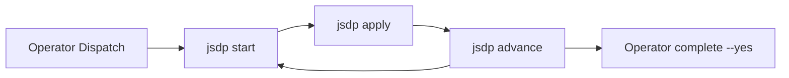

# JSDP Autonomous Convergence Harness

Local runtime for long-horizon software: bounded planning → prompt DAG → verify → repair → append-only ledger.

| Audience | Start here |
|----------|------------|
| **Operator + Hermes (default)** | **[jsdp-autonomous-path.md](jsdp-autonomous-path.md)** — no setup |
| **Cursor / external agent** | [external-agent-jsdp.md](external-agent-jsdp.md) |
| **8-role delivery chain** | [jsdp.md](jsdp.md) |
| **CLI / audit (this doc)** | Manual `jz jsdp` below |

---

## Autonomous path (recommended)

**Operators:** JoyZoning → Dispatch. **Agents:** `jsdp(start)` → `jsdp(apply)` → `jsdp(advance)`.

No `joyzoning.jsdp.harness.jz_cli` in Hermes config. See [hermes-integration.md](hermes-integration.md).



---

## Planning modes

| Mode | Tokens | When |
|------|--------|------|
| **Rolling horizon** | Bounded (~32 KiB) | **Default** — Hermes `jsdp` or `horizon` CLI |
| Manual DAG edits | Minimal | Experts |
| Full `plan.json` | Unbounded | Discouraged |

---

## Manual CLI (experts & CI)

### Rolling horizon cycle

```bash
cd /path/to/project
jz jsdp init --spec ./PROJECT_SPEC.md   # once
jz jsdp analyze

jz jsdp horizon export --nodes 3
jz jsdp horizon prompt --nodes 3
# write horizon.json

jz jsdp horizon validate ./horizon.json
jz jsdp horizon diff ./horizon.json
jz jsdp horizon import ./horizon.json --dry-run
jz jsdp horizon import ./horizon.json

jz jsdp next && jz jsdp verify && jz jsdp continue
jz jsdp horizon status
```

### Hermes tool mapping

| CLI | Autonomous tool |
|-----|-----------------|
| `horizon export` + `prompt` | `jsdp(action='start')` |
| `validate` + `diff` + `import` | `jsdp(action='apply', proposal_json=…)` |
| `next` / `verify` / `continue` | `jsdp(action='advance')` |
| `horizon status` / `doctor` | `jsdp(action='guide')` |

---

## Storage (`.jsdp/`)

```text
.jsdp/
  run.json
  ledger.jsonl
  state/horizon-context.json
  prompts/
  reports/
```

Atomic JSON writes. Context budget: 32 KiB.

---

## Horizon proposal shape

```json
{
  "contractVersion": "1",
  "nodes": [
    {
      "title": "Wire keyboard movement for MiniApp overworld",
      "intent": "Add MonoGame input for OverworldScene player.",
      "dependencies": ["002"],
      "acceptanceCriteria": ["Player moves within bounds"],
      "verificationCommands": ["dotnet build MiniApp.sln"],
      "allowedMutationSurface": ["src/", "tests/"]
    }
  ],
  "rationale": "Why this horizon",
  "stopAfter": "What not to plan yet"
}
```

Validation rejects: duplicate titles, full-project rewrite language, >5 nodes, import over failures (unless `--force`).

---

## Convergence invariants

1. Append-only ledger  
2. No silent verification skips  
3. Rolling horizon only (no whole-DAG replace without `--force`)  
4. Context bound to `runId` + byte budget  

---

## vs delivery-chain

| | Harness `.jsdp/` | `jz delivery-chain` |
|--|------------------|---------------------|
| Planning | 3–5 nodes / cycle | 8 roles |
| State | Project dir | Control plane |
| Hermes | `jsdp` tool | Kanban + handoff |

---

## Samples

- [samples/jsdp/](../samples/jsdp/)
- [tests/JoyZoning.Cli.Tests/Fixtures/jsdp/](../tests/JoyZoning.Cli.Tests/Fixtures/jsdp/)
