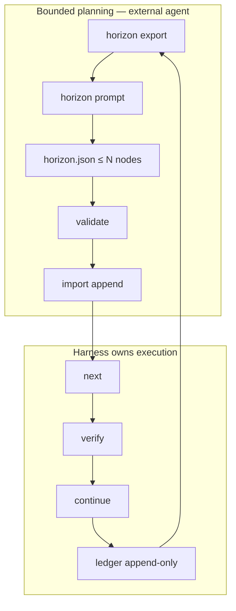

# JSDP Autonomous Convergence Harness

Local, deterministic runtime for long-horizon software mutation: spec → prompt DAG → verify → repair → append-only ledger.

JoyZoning is the operator habitat. This harness is a **project-aware compiler for staged agent execution** — not a generic agent loop.

| Doc | Scope |
|-----|--------|
| [jsdp.md](jsdp.md) | 8-role `jz delivery-chain` |
| [external-agent-jsdp.md](external-agent-jsdp.md) | Task-level external JSDP |
| **This doc** | `.jsdp/` harness (`jz jsdp`) |

---

## Choose a planning mode

| Mode | Token profile | DAG | Use when |
|------|---------------|-----|----------|
| **Manual** | Minimal | You own the graph | Expert conductor |
| **Rolling horizon** | Bounded (~32 KiB context) | Append 3–5 nodes | **Safe automation (default)** |
| **Full `plan.json`** | Unbounded (spec + scan + ledger) | Replace all | Discouraged |

### Anti-patterns (automation)

| Do not | Why |
|--------|-----|
| `planning-prompt` every turn | Pulls full spec, repo scan, ledger — token explosion |
| `import-plan` over verified DAG without `--force` | Destroys convergence history |
| `horizon import` with failed nodes | Extends graph before repair |
| Skip `horizon export` after verify/continue | Stale frontier misleads the planner |
| Plan >5 nodes per horizon | Violates rolling contract; rejected |

---

## Rolling horizon (core design)

**Never plan the whole project in one automatic pass.**



```text
projectSummary + frontier + 5 ledger summaries + failures + repoSummary
        ↓  (horizon-context.json, typically < 32 KiB)
External agent → horizon.json (JSON only, ≤ N nodes, N ∈ [3,5])
        ↓
validate (live frontier) → import append → execute → verify → repair
        ↓
horizon export again (context auto-refreshed on import)
```

**Harness owns:** state, limits, validation, verification, repair, convergence, history.  
**External agent owns:** the next few proposed nodes only.

---

## Quick start

```bash
jz jsdp init --spec ./PROJECT_SPEC.md
jz jsdp analyze
jz jsdp plan --mode vertical-slices          # seed DAG (or import-plan once)

jz jsdp horizon export --nodes 3
jz jsdp horizon prompt --nodes 3
# agent: write horizon.json only (no markdown wrapper)

jz jsdp horizon validate ./horizon.json
jz jsdp horizon import ./horizon.json --dry-run   # projected ids e.g. 003, 004
jz jsdp horizon import ./horizon.json

jz jsdp next && jz jsdp verify && jz jsdp continue
jz jsdp horizon status
# repeat export → prompt → validate → import
```

---

## Storage layout

```text
.jsdp/
  run.json
  tree.json
  project-spec.json
  ledger.jsonl
  config.json
  prompts/
    <node-id>.md
    horizon-external.md
    planning-external.md
  reports/
    <id>-verification.md
    horizon-import-<stamp>.md
  state/
    project-summary.json
    repo-summary.json
    frontier.json
    horizon-context.json
    horizon-schema.json
    horizon-proposal.json
    horizon-last-import.json
    planning-context.json
    plan-schema.json
```

Atomic JSON writes (temp file + rename).

---

## Horizon commands

| Command | Purpose |
|---------|---------|
| `horizon export --nodes <3-5>` | Bounded context + byte size report |
| `horizon prompt --nodes <3-5>` | `horizon-external.md` + schema |
| `horizon validate <file>` | Validate; live frontier; runId binding |
| `horizon import <file>` | Append nodes, report, ledger, **refresh context** |
| `horizon import --dry-run` | Validate + **projected final node ids** |
| `horizon import --force` | Import despite verification failures |
| `horizon status` | Frontier, stale flag, suggested action, context bytes |

---

## Horizon context contract

Exported fields (and only these) in `horizon-context.json`:

| Field | Content |
|-------|---------|
| `contractVersion` | `"1"` |
| `runId` / `dagSizeAtExport` | Bind export to active run |
| `projectSummary` | Goal, systems, stack (no raw spec markdown) |
| `currentFrontier` | verified / ready / blocked / failed ids |
| `recentLedgerSummaries` | Last **5** entries (summary + pass/fail only) |
| `activeFailures` | Failed node ids + repair hint |
| `repoSummary` | Stack, paths, test commands (no source tree) |
| `requestedNodeCount` | 3–5 |
| `previousStopAfter` | From last horizon import |
| `planningGuidance` | Operator hints (repair first, execute ready) |

**Budget:** `horizon-context.json` should stay ≤ 32 KiB (`JsdpContract.MaxHorizonContextBytes`). Export warns if exceeded.

**Excluded by design:** full `PROJECT_SPEC.md`, `ledger.jsonl`, verification stdout, full repo scan dumps, entire DAG node payloads.

---

## Horizon proposal (`horizon.json`)

```json
{
  "contractVersion": "1",
  "nodes": [
    {
      "title": "Wire keyboard movement for MiniApp overworld",
      "intent": "Add MonoGame input polling for OverworldScene player entity.",
      "dependencies": ["002"],
      "acceptanceCriteria": ["Player moves within collision bounds"],
      "verificationCommands": ["dotnet build MiniApp.sln"],
      "allowedMutationSurface": ["src/", "tests/"]
    }
  ],
  "rationale": "Why these nodes are the logical next horizon",
  "assumptions": ["002 verified"],
  "stopAfter": "Do not plan inventory, quests, or multiplayer yet"
}
```

### Validation (production)

| Rule | Result |
|------|--------|
| Node count > `requestedNodeCount` | Error |
| `runId` ≠ active run | Error — re-export |
| Active failed nodes | Error (unless `--force`) |
| Vague / short title/intent | Error |
| Missing acceptance / verify / surface | Error |
| Unknown dependency | Error |
| Not anchored to verified/ready frontier | Error |
| Full-project rewrite language | Error |
| Protected paths in surface | Error |
| Ready nodes not yet executed | Warning |
| DAG size changed since export | Warning (frontier still live-refreshed) |
| Stale context file | Warning |

### Import

- Allocates **new** ids (`003`, `004`, …) — never collides with existing
- Preserves verified/failed on existing nodes
- Appends ledger (`horizon-import`) — never truncates
- Writes `reports/horizon-import-<stamp>.md`
- **Refreshes** `horizon-context.json` + `frontier.json` for the next cycle

---

## Full-plan path (discouraged)

```bash
jz jsdp export-planning-context --mode vertical-slices
jz jsdp planning-prompt --mode vertical-slices
jz jsdp validate-plan ./plan.json
jz jsdp diff-plan ./plan.json
jz jsdp import-plan ./plan.json --dry-run
jz jsdp import-plan ./plan.json    # --force if replacing verified DAG
```

Use only for initial seeding or deliberate full replans.

---

## Built-in heuristic path

```bash
jz jsdp init --spec ./PROJECT_SPEC.md
jz jsdp analyze && jz jsdp plan --mode vertical-slices
jz jsdp next && jz jsdp verify && jz jsdp continue
```

No LLM — rules from spec analysis.

---

## Operations

| Command | Purpose |
|---------|---------|
| `inspect` | Spec, DAG, planning + **horizon** paths, last import |
| `doctor` | Integrity, staleness, horizon budget, failures |
| `status` / `record` | Runtime + operator ledger |

`jz jsdp horizon status` returns `suggestedAction` (e.g. `jz jsdp next` when ready nodes exist).

---

## Audit checklist

| Step | Command |
|------|---------|
| Health | `jz jsdp doctor` |
| Context fresh & bounded | `jz jsdp horizon export --nodes 3` |
| Proposal valid | `jz jsdp horizon validate ./horizon.json` |
| Preview ids | `jz jsdp horizon import ./horizon.json --dry-run` |
| Commit horizon | `jz jsdp horizon import ./horizon.json` |
| Execute | `jz jsdp next` → `verify` → `continue` |
| Next cycle | `jz jsdp horizon status` |

---

## Convergence invariants

1. No silent verification skips  
2. No continue past failed nodes without repair  
3. No ledger truncation  
4. No invalid horizon/plan import  
5. No harness self-mutation via declared surfaces  
6. No full DAG replace over verified work without `--force`  
7. No horizon extension over active failures without `--force`  
8. Horizon context bound to `runId` and byte budget  
9. Operator reviews diffs vs `allowedMutationSurface`

---

## vs delivery-chain

| | Harness (`jz jsdp`) | Delivery chain |
|--|---------------------|----------------|
| State | `.jsdp/` in cwd | Control plane + branches |
| Planning | Rolling horizon / plan / heuristic | 8 fixed roles |
| Merge gate | Per-node verify | `jz task complete --yes` |

---

## Samples & fixtures

- [samples/jsdp/](../samples/jsdp/)
- [tests/JoyZoning.Cli.Tests/Fixtures/jsdp/](../tests/JoyZoning.Cli.Tests/Fixtures/jsdp/)
