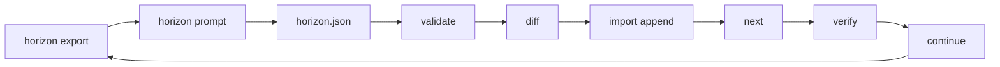

# JSDP Autonomous Convergence Harness

Local, deterministic runtime for long-horizon software mutation: spec → prompt DAG → verify → repair → append-only ledger.

JoyZoning is the operator habitat. This harness is a **project-aware compiler for staged agent execution** — not a generic agent loop.

| Doc | Scope |
|-----|--------|
| [jsdp.md](jsdp.md) | 8-role `jz delivery-chain` |
| [external-agent-jsdp.md](external-agent-jsdp.md) | Task-level external JSDP |
| **This doc** | `.jsdp/` harness (`jz jsdp`) |

---

## Planning modes

| Mode | Token profile | DAG mutation | When |
|------|---------------|--------------|------|
| **Manual** | Minimal | You control the graph | Expert / conductor |
| **Rolling horizon** | Bounded (~32 KiB) | Append 3–5 nodes | **Default for automation** |
| **Full `plan.json`** | Unbounded | Replace entire DAG | Discouraged |

### Anti-patterns

| Avoid | Why |
|-------|-----|
| `planning-prompt` every cycle | Exports full spec + scan + ledger |
| `import-plan` over verified work | Wipes convergence unless `--force` |
| `horizon import` with failed nodes | Plans past broken verification |
| Skipping export after verify/continue | Stale planner context |
| >5 nodes per horizon | Rejected by contract |
| Validating without `horizon export` | No `requestedNodeCount` / run binding |

---

## Rolling horizon (recommended)

**Never auto-plan the whole project.** Plan only the next **3–5** nodes.



```text
horizon-context.json  (bounded)
        ↓
External agent → horizon.json  (≤ N nodes, JSON only)
        ↓
validate → diff → import --dry-run → import
        ↓
execute → verify → repair → export again
```

| Role | Owns |
|------|------|
| External agent | Next few nodes in `horizon.json` |
| Harness | State, limits, validation, verify, repair, ledger, id allocation |

---

## Quick start

```bash
jz jsdp init --spec ./PROJECT_SPEC.md
jz jsdp analyze
jz jsdp plan --mode vertical-slices

jz jsdp horizon export --nodes 3
jz jsdp horizon prompt --nodes 3
# agent writes horizon.json (JSON only)

jz jsdp horizon validate ./horizon.json
jz jsdp horizon diff ./horizon.json
jz jsdp horizon import ./horizon.json --dry-run
jz jsdp horizon import ./horizon.json

jz jsdp next && jz jsdp verify && jz jsdp continue
jz jsdp horizon status
```

---

## Storage layout

```text
.jsdp/
  run.json
  tree.json
  project-spec.json
  ledger.jsonl
  config.json
  prompts/
    <node-id>.md
    horizon-external.md
    planning-external.md
  reports/
    <id>-verification.md
    horizon-import-<stamp>.md
  state/
    project-summary.json
    repo-summary.json
    frontier.json
    horizon-context.json      # required before validate/import/diff
    horizon-schema.json
    horizon-proposal.json
    horizon-last-import.json
```

Atomic JSON writes (temp + rename).

---

## Horizon commands

| Command | Purpose |
|---------|---------|
| `horizon export --nodes <3-5>` | Write context; reports byte size + warnings |
| `horizon prompt --nodes <3-5>` | Agent handoff prompt + schema |
| `horizon validate <file>` | Validate (requires prior export; live frontier) |
| `horizon diff <file>` | Preview projected ids, titles, deps, new DAG size |
| `horizon import <file>` | Append nodes; refresh context; ledger + report |
| `horizon import --dry-run` | Validate + projected ids only |
| `horizon import --force` | Import despite active failures |
| `horizon validate --nodes N` | Override requested count from export |
| `horizon status` | Frontier, stale flag, `suggestedAction`, bytes |

---

## `horizon-context.json` contract

| Field | Included |
|-------|----------|
| `contractVersion`, `runId`, `dagSizeAtExport` | Run binding |
| `projectSummary` | Compact goal/systems/stack |
| `existingNodeSummaries` | Up to 24 × `{id, title, status}` — not full node payloads |
| `currentFrontier` | verified / ready / blocked / failed ids |
| `recentLedgerSummaries` | Last **5** ledger lines (summary only) |
| `activeFailures` | Failed ids + short report excerpt |
| `repoSummary` | Stack, paths, test commands |
| `requestedNodeCount` | 3–5 |
| `previousStopAfter`, `planningGuidance` | Prior horizon + operator hints |

**Budget:** ≤ 32 KiB (`MaxHorizonContextBytes`).

**Never exported:** `rawMarkdown`, full `ledger.jsonl`, verification stdout dumps, complete repo file lists, per-node `verificationCommands` from existing DAG.

---

## `horizon.json` proposal

```json
{
  "contractVersion": "1",
  "nodes": [
    {
      "title": "Wire keyboard movement for MiniApp overworld",
      "intent": "Add MonoGame input polling for OverworldScene player entity.",
      "dependencies": ["002"],
      "acceptanceCriteria": ["Player moves within collision bounds"],
      "verificationCommands": ["dotnet build MiniApp.sln"],
      "allowedMutationSurface": ["src/", "tests/"]
    }
  ],
  "rationale": "Why this is the next horizon",
  "assumptions": ["002 verified"],
  "stopAfter": "What we are intentionally not planning yet"
}
```

### Validation rejects

| Condition | Result |
|-----------|--------|
| No prior `horizon export` | Error |
| `runId` mismatch | Error |
| Nodes > `requestedNodeCount` | Error |
| Active failures | Error (unless `--force`) |
| Duplicate titles in proposal | Error |
| Title matches existing DAG node | Error |
| Vague / missing fields | Error |
| Unknown deps / bad frontier anchor | Error |
| Rewrite-all language | Error |
| Ready nodes exist | Warning |
| Blocked nodes exist | Warning |
| Stale context file | Warning (live frontier used) |

### Import

- New ids allocated (`003`, `004`, …)
- Existing node statuses preserved
- `horizon-import` ledger append
- Context + frontier refreshed automatically
- Report: `reports/horizon-import-<stamp>.md`

---

## Other paths

**Full plan (discouraged):** `export-planning-context` → `planning-prompt` → `validate-plan` → `import-plan`

**Heuristic:** `jz jsdp plan --mode vertical-slices` (no LLM)

---

## Operations

```bash
jz jsdp doctor      # horizon staleness, budget, failures
jz jsdp inspect     # horizon paths + last import
jz jsdp horizon status
```

---

## Audit checklist

| # | Step |
|---|------|
| 1 | `jz jsdp doctor` |
| 2 | `jz jsdp horizon export --nodes 3` (check bytes) |
| 3 | `jz jsdp horizon prompt --nodes 3` |
| 4 | Agent writes `horizon.json` |
| 5 | `jz jsdp horizon validate ./horizon.json` |
| 6 | `jz jsdp horizon diff ./horizon.json` |
| 7 | `jz jsdp horizon import ./horizon.json --dry-run` |
| 8 | `jz jsdp horizon import ./horizon.json` |
| 9 | `jz jsdp next` → verify → continue |
| 10 | `jz jsdp horizon status` → repeat from step 2 |

---

## Convergence invariants

1. No silent verification skips  
2. No continue past failed nodes without repair  
3. No ledger truncation  
4. No invalid horizon/plan import  
5. No protected-path mutation surfaces  
6. No full DAG replace without `--force`  
7. No horizon import over failures without `--force`  
8. Context bound to `runId` + byte budget  
9. Validate/import require prior export  
10. Operator reviews diffs vs `allowedMutationSurface`

---

## vs delivery-chain

| | Harness | Delivery chain |
|--|---------|----------------|
| State | `.jsdp/` | Control plane |
| Planning | Rolling horizon | 8 roles |
| Merge | Per-node verify | `task complete --yes` |

---

## Samples

- [samples/jsdp/](../samples/jsdp/)
- [tests/JoyZoning.Cli.Tests/Fixtures/jsdp/](../tests/JoyZoning.Cli.Tests/Fixtures/jsdp/)
