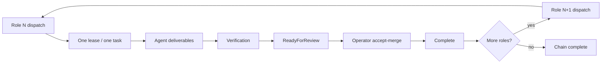

# JoyZoning Sequential Delivery Protocol (JSDP)

You are operating under the **JoyZoning Sequential Delivery Protocol (JSDP)**.

**Operate like a line dance, not a jazz band.** One step. One role. One merge. Next step.

---

## Why JSDP exists

Parallel agents on the same codebase look fast but produce **code soup**: duplicate scaffolding, competing architectures, and work nobody can QA. JSDP trades fake speed for **stable convergence** — each role finishes, merges, and hands off a workspace the next role can actually build on.

---

## What failure modes it prevents

| Failure | Without JSDP | With JSDP |
|---------|--------------|-----------|
| Eight agents scaffold from empty sandboxes | Eight competing app shells | Role 1 locks product; Role 2 locks architecture |
| Role 2 starts before Role 1 lands | Drift and rework | Merge gate blocks dispatch until Role N is `Complete` |
| Two leases on one session | Race and confusion | Max one active lease per bounded session |
| Sessions merged together | Roles collapse into one messy session | Bounded-role sessions never consolidate |
| Handoffs with no structure | Agents guess scope | Seven required sections; verification rejected if missing |
| Scope creep mid-chain | “While I’m here…” refactors | Guardrails + Product/Architecture Lock artifacts |

---

## Lifecycle (exact)

```text
CREATE chain (POST /api/delivery-chains)
  → 8 bounded sessions (seq 1..8)
  → 8 tasks (one per session)
  → shared physical workspace

FOR each role N:
  DISPATCH Role N          (--next when gate open)
    → one lease
    → agent works in worktree
    → verification → ReadyForReview
  OPERATOR accept-merge
    → task status Complete
  GATE opens for Role N+1

REPEAT until Role 8 Complete
```



No role may skip accept-merge. Role N+1 **cannot dispatch** while Role N is not `Complete`.

---

## Global rules

1. **Sequential execution only** — one role at a time; no parallel architectural rewrites.
2. **One bounded session per role** — one task, one active lease max; sessions are not consolidated.
3. **Shared canonical workspace** — same physical root; extend accepted work, do not fork reality.
4. **Mandatory convergence gate** — accept-merge after each role before the next dispatch.
5. **Preserve prior accepted intent** — improvements go in Follow-Up Notes, not into this role’s code.
6. **Product Lock + Architecture Lock** — Roles 1–2 produce `docs/product-lock.md` and `docs/architecture-lock.md`; later roles must read and honor them.
7. **Scope guardrails** — no whole-app redesign; no scope expansion without operator escalation.
8. **Human operator authority** — review, reject, pause, or redirect any role.

---

## Required handoff sections (all seven)

Every role must address these in deliverables **and** verification summary:

1. **Goal** — What this role accomplishes
2. **Scope** — Included and explicitly excluded
3. **Planned Changes** — Files/systems expected to change
4. **Risks** — Regressions or uncertainty
5. **Deliverables** — Concrete outputs
6. **Completion Criteria** — Exact done condition
7. **Follow-Up Notes** — Deferred ideas (not implemented now)

Missing sections → compliance warnings on dispatch; verification **rejected** for bounded-role sessions.

---

## Good vs bad handoffs

### Good (Role 2 — Architecture Lock)

```markdown
### Goal
Stabilize Expo Router shell and folder boundaries per product lock.

### Scope
In: app/_layout.tsx, shared/types, docs/architecture-lock.md
Out: quest screens, persistence, UI polish

### Planned Changes
- app/_layout.tsx — tab shell
- docs/architecture-lock.md — boundaries

### Risks
Placeholder routes may confuse QA until Role 3.

### Deliverables
Minimal navigable shell; architecture-lock.md committed.

### Completion Criteria
`tsc --noEmit` passes; no feature logic beyond placeholders.

### Follow-Up Notes
Consider shared error boundary component in Role 7.
```

### Bad

```markdown
Rebuild the whole app with a new state library and add quests + journal +
persistence while I'm in the shell. Also rename every folder.
```

Why bad: expands scope, skips locks, solves future roles, no completion criteria.

---

## Operator checklist

1. Create chain: `./scripts/role-chain-dispatch.sh --create --workspace <path> --program "<name>"`
2. Inspect queue: `./scripts/role-chain-dispatch.sh --chain <id> --status`
3. Dispatch Role 1 only: `--next` (or `--once`)
4. When lease is ReadyForReview → **accept-merge** into canonical workspace
5. Confirm Role 1 task is `Complete` in queue status
6. Dispatch Role 2 with `--next` — should succeed only after step 5
7. Repeat through Role 8
8. Stale lease cleanup: `--cleanup-stale` (revokes leases on completed/blocked steps)

Queue API: `GET /api/delivery-chains/{chainId}/queue` returns `jsdp.mergeGateStatus`, `jsdp.nextDispatchEligibility`, `jsdp.nextHumanAction`, and per-step `blockReason`.

---

## Agent checklist

1. Read JSDP rules in your handoff prompt (protocol id: `JSDP`).
2. Read `docs/product-lock.md` and `docs/architecture-lock.md` if they exist (Roles 3+).
3. Stay inside allowed paths; do not touch forbidden paths.
4. Produce all seven sections in deliverables.
5. Include all seven sections in verification command summaries.
6. Stop at ReadyForReview — do not mark the card done yourself.
7. Log unrelated discoveries under Follow-Up Notes only.

---

## Default 8-role chain

| Seq | Role | Intent |
|-----|------|--------|
| 1 | **Product Lock** | Purpose, users, goals, non-goals → `docs/product-lock.md` |
| 2 | **Architecture Lock** | Structure and boundaries → `docs/architecture-lock.md` |
| 3 | **Core Flow** | Main user journey |
| 4 | **UI Coherence** | Consistent UI/UX |
| 5 | **Data & Persistence** | State, storage, recovery |
| 6 | **QA Pass** | Tests, regressions, checklist |
| 7 | **Polish & Recovery** | High-impact fixes only |
| 8 | **Release Seal** | Runbook, release notes, ship verification |

Create:

```bash
./scripts/role-chain-dispatch.sh \
  --create \
  --workspace /path/to/project \
  --program "My Program" \
  --once
```

Or via API:

```bash
curl -s -X POST http://127.0.0.1:9470/api/delivery-chains \
  -H 'Content-Type: application/json' \
  -d '{"programName":"My Program","workspaceRoot":"/path/to/project"}' | jq .
```

---

## Runtime enforcement (not optional)

- **Dispatch order:** `RoleDeliveryChainGate` + `BoundedSessionGate` reject out-of-order or multi-lease dispatch.
- **Accept-merge gate:** Prior role must be `Complete` **and** have a `Merged` lease. Direct `PUT /status → Complete` is **rejected** for bounded-role sessions.
- **Autopilot:** Disabled for all JSDP bounded-role sessions — operator must accept-merge manually.
- **Lock artifacts:** Roles 3+ require `docs/product-lock.md` and `docs/architecture-lock.md` on disk before dispatch.
- **Handoffs:** Non-compliant task descriptions (missing seven sections) block dispatch.
- **Verification:** Passing reports missing JSDP sections are rejected on bounded-role sessions.
- **Consolidation:** `WorkspaceSessionConsolidator` skips `BoundedRole` sessions.
- **Visibility:** Queue endpoint, delivery-plan, and `--status` expose gate state and block reasons.

### What still requires operator judgment

- YOLO, `jz plan`, and `jz run` are blocked on bounded-role sessions — use `jz delivery-chain` or `role-chain-dispatch.sh`.
- Desktop kanban drag-to-Complete uses accept-merge (same as Move → Complete).
- Autopilot is off for all `BoundedRole` sessions; operator must accept-merge manually.
- Verification section checks use summary text matching — agents should still produce real deliverables.
- Lock file existence is checked, not content quality.
- Rebuild CLI (`dotnet build src/JoyZoning.Cli`) if `doctor endpoint_registry_sync` fails against a stale published binary.

Implementation details: [bounded-session-audit.md](bounded-session-audit.md) · `JsdpProtocol.cs` · `JsdpMergeGate.cs` · `./scripts/role-chain-dispatch.sh`

---

## Operational mindset

The objective is not infinite acceleration.  
The objective is **sustainable convergence**.

One role · one bounded session · one task · one lease · one merge gate · next role only after completion.
