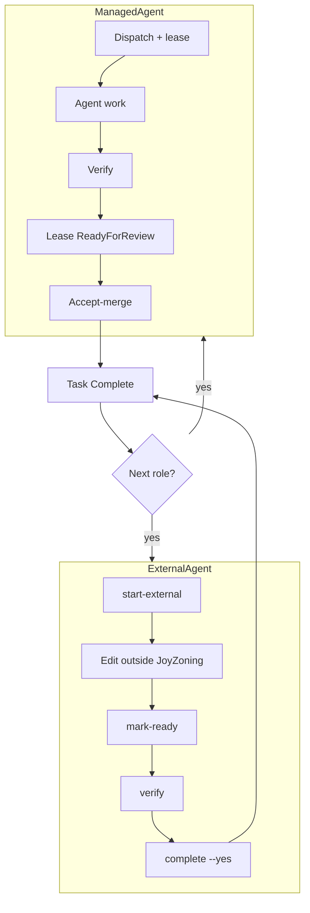

# JoyZoning Sequential Delivery Protocol (JSDP)

You are operating under the **JoyZoning Sequential Delivery Protocol (JSDP)**.

**Operate like a line dance, not a jazz band.** One step. One role. One merge. Next step.

### Quick pick

| You work in… | Start with |
|--------------|------------|
| JoyZoning + Hermes dispatch | [Operator checklist — managed](#operator-checklist) below |
| **Cursor / Claude Code / manual** | [external-agent-jsdp.md](external-agent-jsdp.md) · `jz delivery-chain next <chain-id> --external --agent cursor` |
| **Project-local prompt DAG** (any repo) | [jsdp-convergence-harness.md](jsdp-convergence-harness.md) · `jz jsdp init` → `plan` → `next` → `verify` |
| Unsure | Read [Execution modes](#execution-modes-managed-vs-external) — same gates, different engine |

---

## Why JSDP exists

Parallel agents on the same codebase raise **coordination complexity** faster than they lower **implementation complexity** — duplicate scaffolding, overlapping architecture, and units that are hard to review. JSDP trades propose-throughput for **stable convergence**: each role finishes, merges, and hands off a workspace the next role can build on. Framework terms: [whitepaper-summary.md](whitepaper-summary.md) (C1, C4, C7).

---

## What failure modes it prevents

| Failure | Without JSDP | With JSDP |
|---------|--------------|-----------|
| Eight agents scaffold from empty sandboxes | Eight competing app shells | Role 1 locks product; Role 2 locks architecture |
| Role 2 starts before Role 1 lands | Drift and rework | Merge gate blocks dispatch until Role N is `Complete` |
| Two leases on one session | Race and confusion | Max one active lease per bounded session |
| Sessions merged together | Roles collapse into one messy session | Bounded-role sessions never consolidate |
| Handoffs with no structure | Agents guess scope | Seven required sections; verification rejected if missing |
| Scope creep mid-chain | “While I’m here…” refactors | Guardrails + Product/Architecture Lock artifacts |
| Cursor edits without task discipline | “Done” in chat, no merge record | External-agent JSDP: branch + mark-ready + verify + complete |
| Hermes required for every role | Friction for IDE-native teams | `ExternalAgent` mode — no lease, same merge gate |

---

## Execution modes (managed vs external)

JSDP enforces **one role at a time** and **one merge gate per role**. *How* the role executes is your choice:

| Mode | Driver | Hermes lease? | Typical start |
|------|--------|---------------|---------------|
| **ManagedAgent** | `Hermes` / DietCode | Yes | `jz task dispatch`, `jz delivery-chain` + managed dispatch |
| **ExternalAgent** | `ExternalCursor`, `ExternalClaudeCode`, `ExternalCopilot`, `ExternalManual`, … | **No** | `jz task start-external`, `jz delivery-chain next --external` |

JoyZoning always owns task state, branch, verification, review, and merge. External tools only mutate files.

**Full reference:** [external-agent-jsdp.md](external-agent-jsdp.md)

---

## Lifecycle (exact)

```text
CREATE chain (POST /api/delivery-chains)
  → 8 bounded sessions (seq 1..8)
  → 8 tasks (one per session)
  → shared physical workspace

FOR each role N (when gate open):

  MANAGED path:
    DISPATCH Role N  (jz task dispatch / managed --next)
      → one Hermes lease
      → worker on canonical workspace (card branch)
      → verification → lease ReadyForReview
    OPERATOR accept-merge (jz task complete --yes)
      → lease Merged, task Complete

  EXTERNAL path:
    START Role N  (jz delivery-chain next --external --agent cursor)
      → NO lease; branch joyzoning/card-<task-id>; prompt printed
      → edit in Cursor / Claude Code / manual
    MARK READY → VERIFY → COMPLETE (jz task mark-ready / verify / complete --yes)
      → ExternalMergeCompleted, task Complete

  GATE opens for Role N+1

REPEAT until Role 8 Complete
```



No role may skip accept-merge (managed: lease `Merged`; external: `ExternalMergeCompleted`). Role N+1 **cannot start** while Role N is not `Complete`.

---

## Global rules

1. **Sequential execution only** — one role at a time; no parallel architectural rewrites.
2. **One bounded session per role** — one task per session; at most one **managed** active lease per session (external roles use **no lease**).
3. **Shared canonical workspace** — same physical root; extend accepted work, do not fork reality.
4. **Mandatory convergence gate** — accept-merge (or external complete with `--yes`) after each role before the next role starts.
5. **Preserve prior accepted intent** — improvements go in Follow-Up Notes, not into this role’s code.
6. **Product Lock + Architecture Lock** — Roles 1–2 produce `docs/product-lock.md` and `docs/architecture-lock.md`; later roles must read and honor them.
7. **Scope guardrails** — no whole-app redesign; no scope expansion without operator escalation.
8. **Human operator authority** — review, reject, pause, or redirect any role.
9. **Agent-agnostic supervision** — JoyZoning tracks state whether the editor is Hermes, Cursor, or your hands; the merge gate is always the authority.

---

## Required handoff sections (all seven)

Every role must address these in deliverables **and** verification summary:

1. **Goal** — What this role accomplishes
2. **Scope** — Included and explicitly excluded
3. **Planned Changes** — Files/systems expected to change
4. **Risks** — Regressions or uncertainty
5. **Deliverables** — Concrete outputs
6. **Completion Criteria** — Exact done condition
7. **Follow-Up Notes** — Deferred ideas (not implemented now)

Missing sections → compliance warnings on dispatch; verification **rejected** for bounded-role sessions.

---

## Good vs bad handoffs

### Good (Role 2 — Architecture Lock)

```markdown
### Goal
Stabilize Expo Router shell and folder boundaries per product lock.

### Scope
In: app/_layout.tsx, shared/types, docs/architecture-lock.md
Out: quest screens, persistence, UI polish

### Planned Changes
- app/_layout.tsx — tab shell
- docs/architecture-lock.md — boundaries

### Risks
Placeholder routes may confuse QA until Role 3.

### Deliverables
Minimal navigable shell; architecture-lock.md committed.

### Completion Criteria
`tsc --noEmit` passes; no feature logic beyond placeholders.

### Follow-Up Notes
Consider shared error boundary component in Role 7.
```

### Bad

```markdown
Rebuild the whole app with a new state library and add quests + journal +
persistence while I'm in the shell. Also rename every folder.
```

Why bad: expands scope, skips locks, solves future roles, no completion criteria.

---

## Operator checklist

### Create chain

```bash
jz delivery-chain create --program "<name>" --workspace <path>
# or: ./scripts/role-chain-dispatch.sh --create --workspace <path> --program "<name>"
jz delivery-chain queue <chain-id>
```

### Per role — managed (Hermes)

1. `jz task dispatch <task-id>` or managed `--next` when queue shows eligible
2. When lease is `ReadyForReview` → `jz task verify` → `jz task complete <id> --yes`
3. Confirm task `Complete` in queue

### Per role — external (Cursor / Claude Code / manual)

1. `jz delivery-chain next <chain-id> --external --agent cursor` (or `jz task start-external <task-id> --agent cursor`)
2. Copy prompt: `jz task prompt <task-id>` or `jz delivery-chain prompt <chain-id>`
3. Edit in your tool; JoyZoning does **not** dispatch Hermes
4. `jz task mark-ready <task-id>` when diff is reviewable
5. `jz task verify <task-id> --cmd "..."` then `jz task complete <task-id> --yes`
6. Confirm task `Complete` in queue before starting the next role

### Housekeeping

- Stale managed leases: `./scripts/role-chain-dispatch.sh --chain <id> --cleanup-stale`
- Workspace scan: `jz task status <task-id> --refresh` or `GET /api/tasks/{id}/workspace/status`

Queue API: `GET /api/delivery-chains/{chainId}/queue` returns `jsdp.mergeGateStatus`, `jsdp.nextDispatchEligibility`, `jsdp.nextHumanAction`, and per-step `blockReason`.

---

## Agent checklist

1. Read JSDP rules in your handoff prompt (protocol id: `JSDP`) — managed handoff or **external prompt** from `jz task prompt`.
2. Read `docs/product-lock.md` and `docs/architecture-lock.md` if they exist (Roles 3+).
3. Work on branch `joyzoning/card-<task-id>` in the canonical workspace path shown in the prompt.
4. Stay inside allowed paths; do not touch forbidden paths.
5. Produce all seven sections in deliverables.
6. Include all seven sections in verification command summaries (managed) or tell the operator to run `jz task verify` (external).
7. **Do not** mark the task Complete or call merge APIs — operator runs `jz task complete --yes` after review.
8. Log unrelated discoveries under Follow-Up Notes only.

---

## Default 8-role chain

| Seq | Role | Intent |
|-----|------|--------|
| 1 | **Product Lock** | Purpose, users, goals, non-goals → `docs/product-lock.md` |
| 2 | **Architecture Lock** | Structure and boundaries → `docs/architecture-lock.md` |
| 3 | **Core Flow** | Main user journey |
| 4 | **UI Coherence** | Consistent UI/UX |
| 5 | **Data & Persistence** | State, storage, recovery |
| 6 | **QA Pass** | Tests, regressions, checklist |
| 7 | **Polish & Recovery** | High-impact fixes only |
| 8 | **Release Seal** | Runbook, release notes, ship verification |

Create:

```bash
./scripts/role-chain-dispatch.sh \
  --create \
  --workspace /path/to/project \
  --program "My Program" \
  --once
```

Or via API:

```bash
curl -s -X POST http://127.0.0.1:9470/api/delivery-chains \
  -H 'Content-Type: application/json' \
  -d '{"programName":"My Program","workspaceRoot":"/path/to/project"}' | jq .
```

---

## Runtime enforcement (not optional)

- **Dispatch order:** `RoleDeliveryChainGate` + `BoundedSessionGate` reject out-of-order or multi-lease dispatch.
- **Accept-merge gate:** Prior role must be `Complete` and converged — managed roles need a `Merged` lease; **external** roles need `ExternalMergeCompleted`. Direct `PUT /status → Complete` is **rejected** for bounded-role sessions.
- **External execution:** `ExternalTaskExecutionService` — no Hermes lease; branch + prompt + workspace scan + review/verify/complete gates. See [external-agent-jsdp.md](external-agent-jsdp.md).
- **Autopilot:** Disabled for all JSDP bounded-role sessions — operator must accept-merge manually.
- **Lock artifacts:** Roles 3+ require `docs/product-lock.md` and `docs/architecture-lock.md` on disk before dispatch.
- **Handoffs:** Non-compliant task descriptions (missing seven sections) block dispatch.
- **Verification:** Passing reports missing JSDP sections are rejected on bounded-role sessions.
- **Consolidation:** `WorkspaceSessionConsolidator` skips `BoundedRole` sessions.
- **Canonical workspace:** JSDP bounded roles execute in the **main project folder** (`session.WorkspaceRoot`), not isolated `.joyzoning/worktrees/<id>` sandboxes. Implementation: `JsdpWorkspaceExecution` + `WorktreePlanner` (pass bounded session).
- **Canonical workspace only:** execution uses the session root directly (`joyzoning/card-*` branch). Legacy `.joyzoning/worktrees/` and `.joyzoning/live/` folders are pruned on merge/revoke.
- **Legacy lease heal:** Re-dispatch and reconciliation rewrite leases that still point at sandbox paths to the canonical workspace (`TryAlignLeaseToCanonical`).
- **Post-merge hygiene:** After accept-merge, `PruneLegacySandboxArtifacts` deletes `.joyzoning/worktrees` and `.joyzoning/live` under the project root.
- **Seeding:** `WorktreeSeeder` never copies `.joyzoning/` into sandboxes (non-JSDP).
- **Accept-merge:** Git convergence uses branch squash when the worker branch exists, or `canonical_inplace` when worktree equals workspace.

### Troubleshooting worktree/live spiral

If `.joyzoning/worktrees` or `.joyzoning/live` keeps growing:

1. **Rebuild and restart** the control plane (`dotnet build JoyZoning.sln` then restart `:9470`).
2. **Revoke stale leases** — `jz task revoke <taskId> --yes --reason "cleanup"` or `./scripts/role-chain-dispatch.sh --chain <id> --cleanup-stale`.
3. **Manually prune** the project: `rm -rf <workspace>/.joyzoning/worktrees <workspace>/.joyzoning/live`.
4. **Re-dispatch** the role — legacy sandbox paths on existing leases are auto-aligned to canonical on dispatch.
- **Visibility:** Queue endpoint, delivery-plan, and `--status` expose gate state and block reasons.

### What still requires operator judgment

- YOLO, `jz plan`, and `jz run` are blocked on bounded-role sessions — use `jz delivery-chain`, `jz delivery-chain next --external`, or `role-chain-dispatch.sh`.
- Desktop kanban drag-to-Complete uses accept-merge (same as Move → Complete).
- Autopilot is off for all `BoundedRole` sessions; operator must accept-merge manually.
- Verification section checks use summary text matching — agents should still produce real deliverables.
- Lock file existence is checked, not content quality.
- Rebuild CLI (`dotnet build src/JoyZoning.Cli`) if `doctor endpoint_registry_sync` fails against a stale published binary.

Implementation details: [bounded-session-audit.md](bounded-session-audit.md) · `JsdpProtocol.cs` · `JsdpMergeGate.cs` · `./scripts/role-chain-dispatch.sh`

---

## Operational mindset

The objective is not infinite acceleration.  
The objective is **sustainable convergence**.

One role · one bounded session · one task · one execution (managed lease **or** external agent) · one merge gate · next role only after completion.
