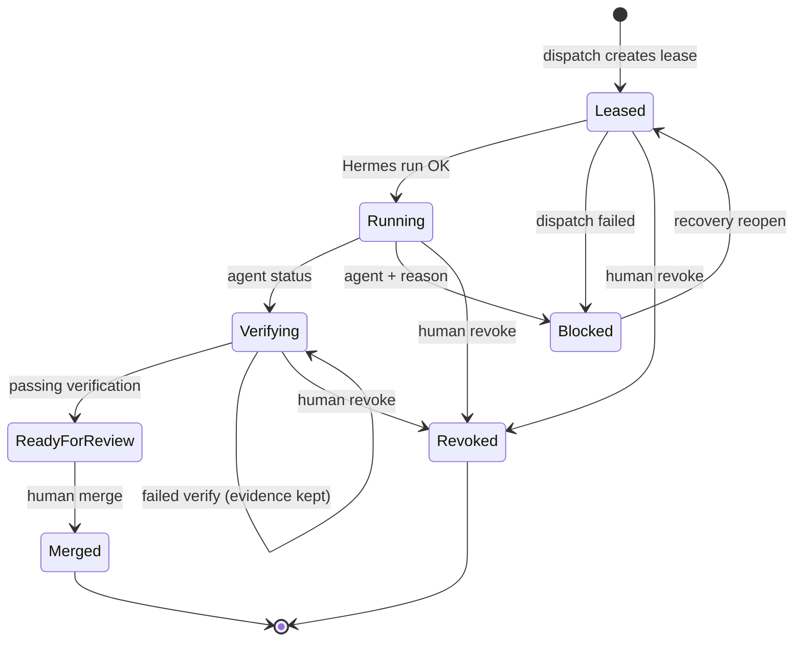

# Execution lease lifecycle

End-to-end reference for **execution leases** — the governance boundary between human operators and DietCode workers.

Conceptual overview: [concepts.md#execution-lease-governance-boundary](concepts.md#3-execution-lease-governance-boundary).

## State machine



| Status | Value | Who moves here |
|--------|-------|----------------|
| Leased | 0 | Dispatch (lease created, run starting) |
| Running | 1 | Dispatch success / recovery reopen |
| Blocked | 2 | Agent, dispatch failure, stale heartbeat, reconciliation |
| Verifying | 3 | Agent (`agent-status` or verify flow) |
| ReadyForReview | 4 | Passing `POST .../verification` or `jz agent done` |
| Revoked | 5 | Human revoke (terminal) |
| Merged | 6 | Human merge → task Complete |

Agents **cannot** jump directly to Merged or set kanban **Complete** without verification + merge.

## Typical happy path

```text
1. Human: create task, optional kanban column moves
2. Human: POST dispatch (critical → humanApprovedCritical)
3. System:  lease=Leased → Running, branch joyzoning/card-<id> in canonical workspace
4. Agent:  jz agent start (writes context.json)
5. Agent:  heartbeat, verify --cmd ..., agent done
6. System:  lease=ReadyForReview, verification JSON on lease
7. Human:  review diff in Workspace, POST merge
8. System:  lease=Merged, task=Complete
```

## Failure paths

| Scenario | Lease end state | Recovery |
|----------|-----------------|----------|
| Hermes down at dispatch | Blocked + `dispatch.failed` | `dispatch-retry` or `recover --mode reopen` |
| Run crashes | Blocked + `execution.failed` | `task fail`, recover, retry |
| Verify commands fail | Verifying (failed report stored) | Re-run verify; optional `supersede` |
| Stale heartbeat | Blocked or Revoked + expiry evidence | `recover`; worktree path kept |
| Wrong branch / abandon | Revoked | New dispatch creates new lease |

## Critical cards (`risk: 3`)

- Dispatch body must include `"humanApprovedCritical": true` (UI checkbox or `jz --approve-critical`).
- **Every** `dispatch-retry` needs a fresh approval if the prior grant was consumed.
- At most **one** critical lease in active states globally (`LeaseRuntime:MaxCriticalLeases`, default 1).

## Evidence

All transitions append to `EvidenceLogJson` on the lease. Common kinds:

| Kind | Meaning |
|------|---------|
| `dispatch.attempted` | First dispatch |
| `dispatch.retry` | Explicit retry |
| `dispatch.failed` | Hermes unreachable / run failed to start |
| `execution.failed` | Run died while `running` |
| `verification.failed` | Report with failing commands |
| `verification.superseded` | New report replaced old |
| `agent.heartbeat` | Harness heartbeat |
| `agent.verify` | Harness local verify |
| `lease.expired_blocked` | Stale or absolute expiry → blocked |
| `lease.expired_revoked` | Expiry with revoke policy |
| `recovery.reopen` | Human recovery |
| `recovery.superseded` | Replacement lease |
| `reconciliation.*` | Background service corrections |

## API and CLI mapping

| Action | REST | CLI (human) | CLI (agent) |
|--------|------|-------------|-------------|
| Dispatch | `POST .../dispatch` | `task run`, `task dispatch` | — |
| Heartbeat | `POST .../lease/heartbeat` | `task heartbeat`, `heartbeat` | `agent heartbeat` |
| Verify | `POST .../verification` | `task verify` | `agent verify` |
| Block | `POST .../lease/agent-status` | — | `agent blocked` |
| Ready for review | via verification | — | `agent done` |
| Merge | `POST .../lease/merge` | `task complete --yes` | forbidden |
| Revoke | `POST .../lease/revoke` | `task revoke --yes` | forbidden |
| Recover | `POST .../lease/recover` | `task recover` | forbidden |

Full HTTP details: [execution-orchestration-api.md](execution-orchestration-api.md).

## Background enforcement

`LeaseReconciliationHostedService` (every `ReconciliationIntervalSeconds`, default 60):

- Expires stale leases (heartbeat thresholds in `LeaseStaleOptions`)
- Blocks orphaned `running` when execution already finished
- Blocks when worktree directory missing
- Blocks merged tasks that still hold an active lease

`LeaseRuntimeService` enforces caps before creating or transitioning leases.

## Related

- [glossary.md](glossary.md) — term definitions  
- [cli.md](cli.md) — recipes  
- [dogfood-report.md](dogfood-report.md) — validated paths  
