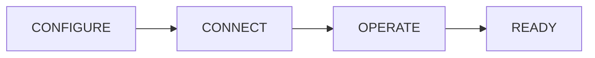

# Onboarding hub

Welcome to JoyZoning. This section is the **guided path** from zero to your first supervised agent task — written for operators who may not live in a terminal every day.

| | |
|---|---|
| **In a hurry?** | [5-minute quickstart](quickstart.md) |
| **Something broken?** | [Setup troubleshooting](troubleshooting-setup.md) |
| **Never used a terminal?** | [Desktop menu guide](desktop-menu-guide.md) |
| **Big picture first?** | [What is JoyZoning?](../what-is-joyzoning.md) → [Before you begin](before-you-begin.md) → [concepts.md](../concepts.md) |
| **Reviewing agent file changes?** | [workspace-state.md](../workspace-state.md) (PR-style, one card → one folder) |

---

## I'm stuck — pick one

| Problem | Go here |
|---------|---------|
| App won't open | [troubleshooting-setup.md § Tree 1](troubleshooting-setup.md#tree-1--app-wont-start) |
| Red **API** or **Dashboard** chip | [status-indicators.md](status-indicators.md) |
| Checklist won't turn green | [setup-checklist.md](setup-checklist.md) + [troubleshooting-setup.md § Tree 2](troubleshooting-setup.md#tree-2--checklist-blocked-getting-started) |
| Manager Chat won't reply | [api-keys-and-models.md](api-keys-and-models.md) |
| Don't understand a word | [plain-language-glossary.md](plain-language-glossary.md) |
| `jz` / Terminal errors | [first-run-cli.md](first-run-cli.md) · [troubleshooting-setup.md § Tree 4](troubleshooting-setup.md#tree-4--jz-cli-setup) |

---

## Reading levels

Docs are tagged by how much technical background they assume:

| Level | Who | Start here |
|-------|-----|------------|
| **Beginner** | Product, design, team leads — menus over Terminal | [before-you-begin](before-you-begin.md) · [desktop-menu-guide](desktop-menu-guide.md) · [plain-language-glossary](plain-language-glossary.md) |
| **Operator** | Developers using the cockpit daily | [quickstart](quickstart.md) · [whats-next](whats-next.md) · [setup-checklist](setup-checklist.md) |
| **Technical** | Install, config, CLI automation | [installation](installation.md) · [first-run-cli](first-run-cli.md) · [configuration.md](../configuration.md) |

---

## How this guide is organized

Patterns borrowed from **VS Code Welcome**, **Docker Desktop**, **Linear**, and **Stripe-style** docs (role-based nav + decision trees):

| Pattern | Where |
|---------|--------|
| **Choose your path** (GUI vs terminal) | [choose-your-path.md](choose-your-path.md) |
| **Phased journey** (Configure → Connect → Operate → Ready) | [setup-checklist.md](setup-checklist.md) |
| **Health grade** (Healthy / Degraded / Blocked) | [status-indicators.md](status-indicators.md) |
| **Decision trees** (symptom → fix) | [troubleshooting-setup.md](troubleshooting-setup.md) |
| **“You should see…”** checks | [quickstart](quickstart.md), [first-run-desktop](first-run-desktop.md) |
| **Menu map** (where to click) | [desktop-menu-guide.md](desktop-menu-guide.md) |

---

## Complete onboarding index

### Start & decide

| Doc | Description |
|-----|-------------|
| [before-you-begin.md](before-you-begin.md) | Is JoyZoning right for you? Time, keys, privacy |
| [choose-your-path.md](choose-your-path.md) | Desktop vs CLI vs both |
| [coming-from-hermes-chat.md](coming-from-hermes-chat.md) | From chat-only AI to supervised workflow |
| [plain-language-glossary.md](plain-language-glossary.md) | Jargon with everyday analogies |

### Install & configure

| Doc | Description |
|-----|-------------|
| [quickstart.md](quickstart.md) | Fastest desktop path (~5–15 min) |
| [installation.md](installation.md) | Full install, .NET 8, mistakes |
| [platform-macos.md](platform-macos.md) | Mac paths, Gatekeeper, `.app` |
| [platform-linux.md](platform-linux.md) | Linux control plane + CLI |
| [hermes-setup.md](hermes-setup.md) | One diet-hermes, profile `joyzoning` |
| [api-keys-and-models.md](api-keys-and-models.md) | LLM keys before Manager Chat |
| [settings-explained.md](settings-explained.md) | Every Settings toggle |

### First run

| Doc | Description |
|-----|-------------|
| [first-run-desktop.md](first-run-desktop.md) | Auto-setup, chips, Connection window |
| [first-run-cli.md](first-run-cli.md) | Terminal-only stack |
| [setup-checklist.md](setup-checklist.md) | Five required steps + optional milestones |
| [status-indicators.md](status-indicators.md) | Green/red chips and health grade |

### Operate & fix

| Doc | Description |
|-----|-------------|
| [whats-next.md](whats-next.md) | First dispatch → verify → merge |
| [desktop-menu-guide.md](desktop-menu-guide.md) | Where to click for each goal |
| [troubleshooting-setup.md](troubleshooting-setup.md) | Setup decision trees |

---

## Pick your starting point

| I want to… | Start here | Time |
|------------|------------|------|
| **Try JoyZoning in the desktop app** (recommended) | [quickstart.md](quickstart.md) → [first-run-desktop.md](first-run-desktop.md) | ~15 min |
| **Use only the terminal** (`jz`) | [first-run-cli.md](first-run-cli.md) | ~20 min |
| **I already have diet-hermes** | [hermes-setup.md](hermes-setup.md) | ~10 min |
| **I'm on Mac** | [platform-macos.md](platform-macos.md) | ~5 min read |
| **I'm on Linux** | [platform-linux.md](platform-linux.md) | ~10 min |
| **Something failed during setup** | [troubleshooting-setup.md](troubleshooting-setup.md) | varies |
| **Understand terms** | [plain-language-glossary.md](plain-language-glossary.md) | ~5 min |

---

## Journey phases (matches in-app checklist)



| Phase | Goal | Docs |
|-------|------|------|
| **CONFIGURE** | JoyZoning + diet-hermes installed | [installation.md](installation.md), [hermes-setup.md](hermes-setup.md) |
| **CONNECT** | API + dashboard healthy | [status-indicators.md](status-indicators.md), [api-keys-and-models.md](api-keys-and-models.md) |
| **OPERATE** | First chat, dispatch, optional TUI | [whats-next.md](whats-next.md), [desktop-ui.md](../desktop-ui.md) |
| **READY** | Core checklist green | [setup-checklist.md](setup-checklist.md) |

---

## Core checklist (five required steps)

Mirrors **Getting Started** in the desktop app:

1. [ ] **Control plane online** — `9470`
2. [ ] **diet-hermes ready** — one install
3. [ ] **API gateway** — `8642`
4. [ ] **Dashboard & token** — `9119`
5. [ ] **Open a workspace** — your project folder

Optional: first chat · first dispatch · TUI — [setup-checklist.md](setup-checklist.md).

---

## What runs on your machine

```
You (desktop or jz)
    ↓
JoyZoning  :9470   ← tasks, leases, timeline
    ↓
diet-hermes :8642 / :9119
    ↓
Your repo (canonical workspace, card branches)
```

| Port | Friendly name |
|------|---------------|
| **9470** | JoyZoning coordinator |
| **8642** | Hermes API |
| **9119** | Hermes dashboard |

---

## Quick actions (desktop)

| Action | When |
|--------|------|
| **Run smart setup** | First launch or moved Hermes path |
| **Guided wizard** | Smart setup failed |
| **Hermes connection** | Red chips |
| **Open workspace** | No project folder |
| **Connect Hermes TUI** | Full terminal in Execution |

---

## After onboarding

| Topic | Doc |
|-------|-----|
| Day-to-day flow | [whats-next.md](whats-next.md) |
| All screens | [desktop-ui.md](../desktop-ui.md) |
| Terminal | [cli.md](../cli.md) |
| Settings files | [configuration.md](../configuration.md) |
| FAQ | [faq.md](../faq.md) |
| Full product troubleshooting | [troubleshooting.md](../troubleshooting.md) |

---

[Documentation index](../README.md) · [Getting started overview](../getting-started.md) · [Concepts](../concepts.md)
