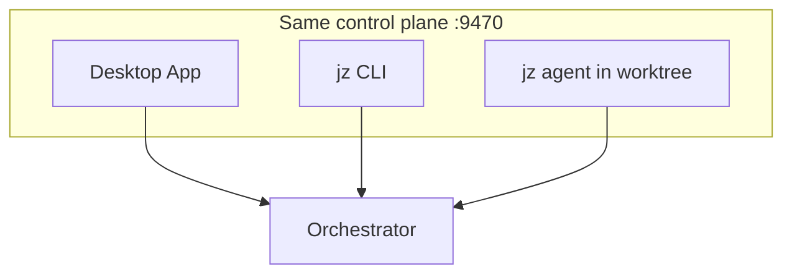

# Choose your path

JoyZoning offers **one policy** through **familiar surfaces** — like how GitHub lets you use the website *or* the CLI for the same repository rules.

You are always the **operator** (approve, merge, revoke). Agents work inside **leases** and cannot mark work Complete without you.

---

## Three ways to work (same rules)

| Path | Best for | Familiar if you use… |
|------|----------|----------------------|
| **Desktop app** | Visual kanban, diffs, approvals, Getting Started checklist | VS Code, Linear, Docker Desktop |
| **`jz` CLI** | Scripts, CI, SSH sessions, automation | `gh`, `kubectl`, `docker compose` |
| **Both** | Plan in desktop, verify in terminal (or vice versa) | Many DevOps workflows |

**Important:** `jz agent` is for **workers inside a lease worktree** — not a replacement for the desktop. It cannot merge or Complete tasks.

---

## Decision guide (non-technical)

Answer one question:

### “Do I want a visual board and status chips?”

**Yes → Desktop** ([quickstart.md](quickstart.md))

- Getting Started checklist with health grade  
- Drag kanban cards  
- Review file diffs before merge  
- Approvals inbox for risky tool calls  

### “Do I live in Terminal/iTerm and want scripts?”

**Yes → CLI** ([first-run-cli.md](first-run-cli.md))

- `jz task run`, `jz task verify`, `jz task complete --yes`  
- Same gates as the app (no back door to Complete)  

### “I want both”

**Recommended for power users:**

1. Desktop for planning (Manager Chat) and review (Workspace diff)  
2. `jz` for verification commands in CI or repeatable scripts  

Use one **workspace folder** and one **session** — both surfaces read the same SQLite state on `:9470`.

---

## Comparison table

| Task | Desktop | `jz` (operator) | `jz agent` (worker) |
|------|---------|-----------------|---------------------|
| Plan with Hermes | Manager Chat | — | — |
| Create / move tasks | Kanban | `task create`, status APIs | — |
| Dispatch to executor | Kanban **Dispatch** | `task run` | — |
| Watch run | Execution viewport | `task run --poll` | `agent heartbeat` |
| Run tests as proof | Via verify flow | `task verify --cmd` | `agent verify --cmd` |
| Mark ready for review | After verify | — | `agent done` |
| **Merge → Complete** | **You** (merge button) | `task complete --yes` | **Not allowed** |
| Approve risky tools | Approvals surface | `jz approval list` / `resolve` or `/approvals` in `jz tui` | — |

---

## Setup effort by path

| Path | Extra install steps |
|------|---------------------|
| Desktop | .NET 8 + clone JoyZoning + `./scripts/run-dev.sh` |
| CLI only | Above + control plane running + `./scripts/install-jz.sh` |
| CLI + agent harness | Dispatch a task first (creates worktree), then `cd` worktree |

Hermes (diet-hermes) setup is **shared** — see [hermes-setup.md](hermes-setup.md).

---

## Switching paths later

| From | To | Notes |
|------|-----|-------|
| Desktop → CLI | `export JOYZONING_SESSION_ID=…` from session list / Settings | [first-run-cli.md](first-run-cli.md) |
| CLI → Desktop | Open same workspace folder | Tasks appear on Kanban |
| Either → IDE | Keep coding in Cursor/VS Code; JoyZoning is supervision only | [concepts.md](../concepts.md) |

---

## Recommended first-time sequence

1. [quickstart.md](quickstart.md) — desktop, 5–15 min  
2. [setup-checklist.md](setup-checklist.md) — confirm five core steps  
3. [whats-next.md](whats-next.md) — first dispatch → verify → merge  
4. Optional: [first-run-cli.md](first-run-cli.md) — if you want automation  

[← Onboarding hub](README.md)
