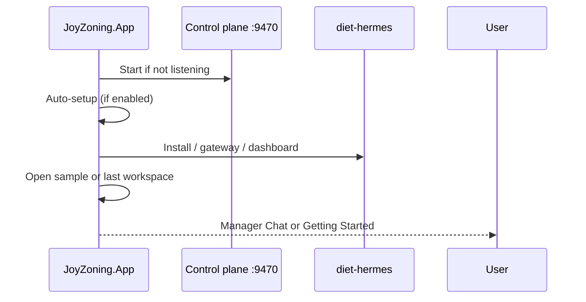

# First run (desktop)

What happens when you launch JoyZoning for the first time — and how to recover if a step fails.

**Prerequisites:** [installation.md](installation.md) or [quickstart.md](quickstart.md)

---

## Launch flow (overview)

You **do not** need to finish a blocking wizard before exploring — auto-setup runs in the background with a progress overlay.

---

## Step-by-step: what you should see

### 1. Control plane starts

| | |
|---|---|
| **What happens** | App spawns `JoyZoning.ControlPlane` on `http://127.0.0.1:9470` if nothing is listening |
| **You should see** | No error dialog; Getting Started step **“Control plane online”** completes |
| **If it fails** | Playbook **“Control plane offline”** on Getting Started · [troubleshooting.md](../troubleshooting.md) |

### 2. Auto-setup (Smart setup)

Controlled by **Settings → Automatic setup on launch** (default: on).

| Sub-step | Typical duration | You should see |
|----------|------------------|----------------|
| Find / install diet-hermes | 0–8 min (first time) | Overlay: “Setting up diet-hermes…” |
| Configure profile `joyzoning` | seconds | API port 8642 enabled |
| Start gateway | seconds | **API** chip turns green |
| Connect dashboard | 10–30 s | **Dashboard** chip green; token saved |
| Sample workspace | seconds | Manager Chat or Getting Started usable |

Implementation: `OnboardingAutoSetup` in the app — same as **Getting Started → Run smart setup**.

### 3. Landing surface

| Condition | Where you land |
|-----------|----------------|
| Core checklist incomplete | **Getting Started** hub |
| Core checklist complete | **Manager Chat** (or last surface) |

Reset checklist visibility: **Settings → Reset onboarding** (does not delete tasks).

### 4. Status bar chips

| Chip | Green means |
|------|-------------|
| **API** | `GET /api/hermes/health` → Healthy |
| **Dashboard** | Reachable + valid session token |

Click a chip → **Hermes → Connection…**  
Plain-language guide: [status-indicators.md](status-indicators.md).

---

## Settings that matter on day one

Open **Settings** (gear):

| Setting | Recommendation |
|---------|----------------|
| **Automatic setup on launch** | Keep on for first week |
| **Auto-connect on startup** | On if you use kanban sync daily |
| **Hermes install path** | Absolute path to diet-hermes root |
| **Copy health report** | Use before filing GitHub issues |

Changes to URLs/tokens apply **without** restarting the control plane.

---

## Open your real workspace

The sample project is for learning — switch when ready:

1. **Project → Open Workspace**  
2. Pick your git repo root (where `.git` lives)  
3. JoyZoning creates an **operator session** scoped to that folder  

**You should see:** Manager Chat empty state mentions your workspace; Kanban is empty or synced.

---

## Hermes Connection window (when auto-setup is not enough)

Menu: **Hermes → Connection…**

| Step | Action |
|------|--------|
| 1 | **Browse** to diet-hermes folder (must contain `pyproject.toml`) |
| 2 | **Test full connection** |
| 3 | **Connect all** (gateway + dashboard) |

Advanced: paste dashboard token only if automatic scrape failed.

---

## Guided wizard (legacy / thorough)

Menu: **Getting Started → Guided wizard** (four steps: welcome → paths → connect → workspace).

Use when:

- Corporate machine blocks auto-install  
- You maintain Hermes manually  
- You want to read each step slowly  

Most users complete [setup-checklist.md](setup-checklist.md) via smart setup instead.

---

## Optional milestones (not blocking)

Tracked on Getting Started hub:

| Milestone | Proves |
|-----------|--------|
| First Manager Chat message | LLM + gateway path works |
| First dispatch | Kanban → lease → executor |
| Hermes TUI connected | Dashboard WebSocket + PTY |

---

## After first run succeeds

Continue to [whats-next.md](whats-next.md) for your first **dispatch → verify → merge** cycle.

[← Onboarding hub](README.md) · [Setup checklist](setup-checklist.md)
