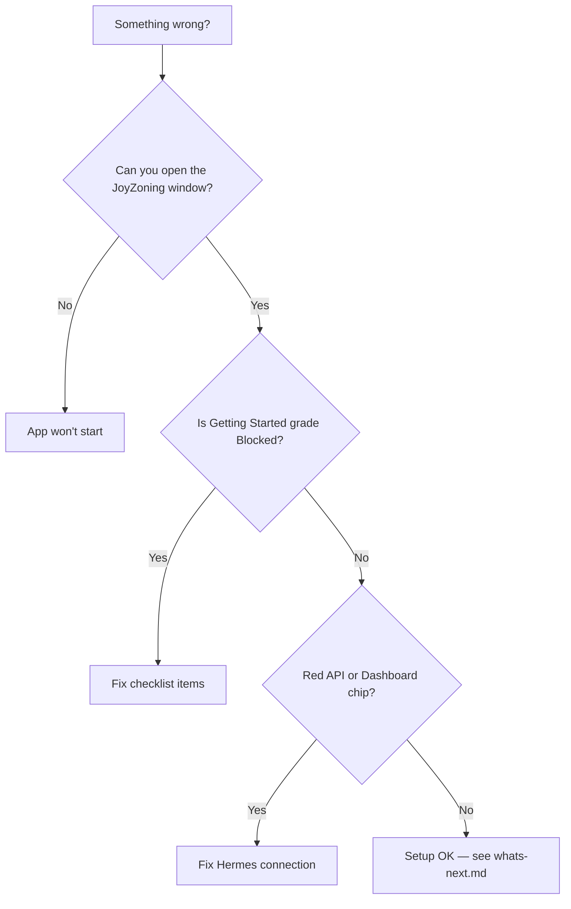
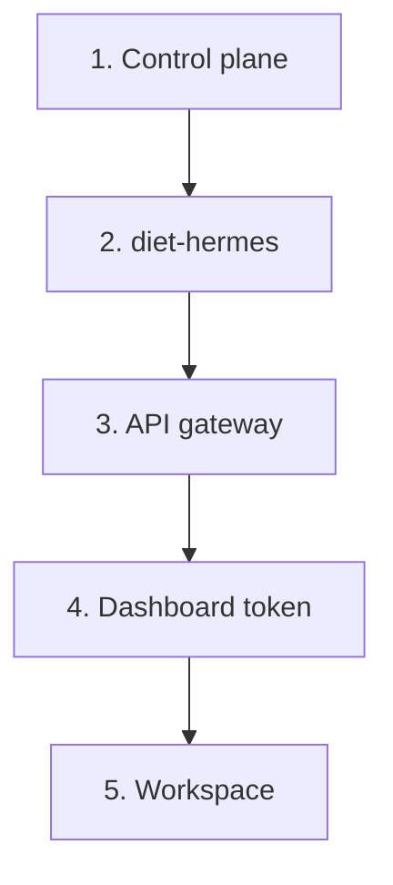
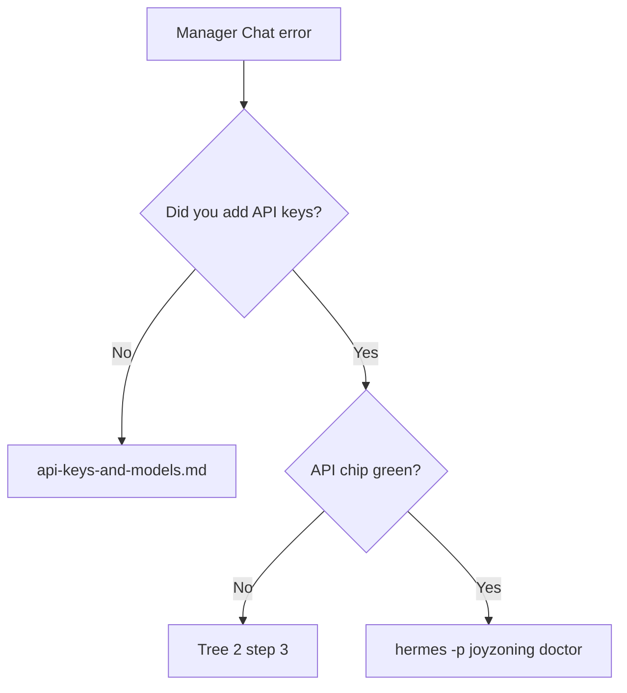

# Setup troubleshooting

**Reading level:** Beginner → Operator — follow the trees top to bottom.

Symptom-first fixes for **install and first launch only**. Runtime/kanban issues: [troubleshooting.md](../troubleshooting.md).

---

## Start here: three questions



---

## Tree 1 — App won’t start

| Symptom | Try this | Doc |
|---------|----------|-----|
| `dotnet` not found | Install .NET 8; add `~/.dotnet` to PATH | [installation.md § .NET 8](installation.md#net-8-on-macos) |
| Build errors | `export PATH="$HOME/.dotnet:$PATH"` then `dotnet run --project src/JoyZoning.App` | [installation.md](installation.md) |
| Window flashes and closes | Run control plane in Terminal; read log | [first-run-desktop.md](first-run-desktop.md) |
| macOS “unidentified developer” | Right-click → Open, or sign locally | [platform-macos.md](platform-macos.md) |

---

## Tree 2 — Checklist blocked (Getting Started)

Work **top to bottom** — order matches dependencies.



### Step 1 — Control plane offline

| Check | Command (optional) |
|-------|-------------------|
| Something on :9470 | `curl -s http://127.0.0.1:9470/api/health` |

**Fix (desktop):** Quit and reopen app (auto-spawns CP).

**Fix (manual):**

```bash
export DOTNET_ROOT="$HOME/.dotnet" PATH="$HOME/.dotnet:$PATH"
cd JoyZoning
dotnet run --project src/JoyZoning.ControlPlane
```

### Step 2 — diet-hermes not ready

| Check | Pass looks like |
|-------|-----------------|
| Folder exists | `pyproject.toml` in Install Root |
| CLI works | `<folder>/.venv/bin/hermes --version` |

**Fix:** Getting Started → **Run smart setup** OR:

```bash
JOYZONING_DIET_HERMES_DIR=~/Downloads/diet-hermes-main-master \
  ./scripts/install-diet-hermes.sh
```

**Fix (path):** Settings or `appsettings.Development.json` → correct `InstallRoot`.

### Step 3 — API gateway red

**Fix (one click):** **Hermes → Ensure Gateway**

**Fix (terminal):**

```bash
~/Downloads/diet-hermes-main-master/.venv/bin/hermes -p joyzoning gateway
```

**Verify:** API chip green · `curl -s http://127.0.0.1:8642/health`

### Step 4 — Dashboard / token

**Fix:** **Hermes → Connection… → Connect dashboard** (wait ~15s)

**If kanban still empty:** Connection → **Refresh token** (Advanced)

**Verify:** Dashboard chip green

### Step 5 — No workspace

**Fix:** **Project → Open Workspace** → select your git repo root

Sample workspace is OK for learning — not required to pass if you opened any folder.

---

## Tree 3 — Manager Chat errors



| Error vibe | Likely cause |
|------------|--------------|
| Auth / 401 | Key missing in **joyzoning** profile `.env` |
| Timeout | Gateway down or provider outage |
| Model not found | Run `hermes -p joyzoning model` |

---

## Tree 4 — `jz` CLI setup

| Symptom | Fix |
|---------|-----|
| `jz.dll` not found | Re-run `./scripts/install-jz.sh`; use wrapper at `~/.local/bin/jz` |
| .NET 8 required | `export DOTNET_ROOT=$HOME/.dotnet` |
| `cannot execute binary file` | Do not symlink wrapper over binary — [first-run-cli.md](first-run-cli.md) |
| Session required | `export JOYZONING_SESSION_ID=<guid>` |
| doctor hermes warn | Start gateway (Tree 2 step 3) |

---

## Tree 5 — “It worked yesterday”

| Cause | Fix |
|-------|-----|
| Mac slept; services stopped | **Connect all** in Hermes Connection |
| Wrong `hermes` on PATH | Use `<InstallRoot>/.venv/bin/hermes -p joyzoning` |
| Port 9470 taken by old build | `lsof -i :9470` · kill stale process |
| Token expired after dashboard restart | Refresh dashboard token |

---

## Still stuck? Collect a health report

**Desktop:** Settings → **Copy health report**

**CLI:**

```bash
jz doctor
curl -s http://127.0.0.1:9470/api/hermes/health
curl -s http://127.0.0.1:9470/api/hermes/dashboard
```

Open a GitHub issue with OS version, report text, and what you expected: [github.com/CardSorting/JoyZoning/issues](https://github.com/CardSorting/JoyZoning/issues)

---

## Related

- [status-indicators.md](status-indicators.md) — chip meanings  
- [setup-checklist.md](setup-checklist.md) — ordered checklist  
- [troubleshooting.md](../troubleshooting.md) — full product symptoms  

[← Onboarding hub](README.md)
