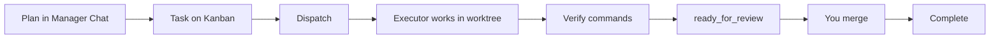

# What's next after setup

Your checklist is green — this is your **first real operator cycle**, using the same pattern as code review: **plan → execute → prove → approve**.

**Time:** ~20 minutes for first dispatch + merge.

---

## The operator loop (remember this)



**Rule:** Only **you** merge. Agents stop at `ready_for_review`.

---

## Step 1 — Plan (Manager Chat)

1. Open **Manager Chat**  
2. Describe outcome: “Add input validation to POST /api/tasks”  
3. Optional: **Parse** bullets from reply → individual lines  
4. Optional: **→ Task** to create one card from the reply  

**You should see:** Streaming assistant text; no red error banner.

---

## Step 2 — Track (Kanban)

1. Open **Kanban**  
2. **New Task** or use imported Hermes cards (**Import from Hermes** if dashboard connected)  
3. Set **risk**: start with **Low (1)** for learning  

| Risk | When |
|------|------|
| 1 Low | Everyday feature work |
| 2 Medium | Larger change, still routine |
| 3 Critical | Production-sensitive — needs approval each dispatch |

---

## Step 3 — Dispatch (start executor)

1. Drag card toward **In Progress** or click **Dispatch**  
2. For **critical**: check approval box  

**You should see:**

- Execution viewport shows steps  
- Branch `joyzoning/card-<task-id>` in your project folder (canonical workspace)  
- Timeline events (`lease.created`, `hermes.run.*`)

**CLI equivalent:**

```bash
jz task run "$TASK_ID" --poll 10
```

---

## Step 4 — Observe (Execution + optional TUI)

| Surface | Use for |
|---------|---------|
| **Execution** | Tool steps, terminal preview |
| **Hermes TUI** | Full interactive terminal (like dashboard chat pane) |
| **Timeline** | Debug if run stalls |

Connect TUI: **Execution → Connect dashboard & TUI** (needs green Dashboard chip).

---

## Step 5 — Approvals (when prompted)

If Hermes requests a risky tool:

1. Open **Approvals**  
2. Choose **Once**, **Task**, **Session**, or **Deny**  

Same policy as messaging gateway — scoped grants reduce repeated prompts.

---

## Step 6 — Verify (proof before merge)

Run checks **in the task workspace** (desktop flow or CLI):

```bash
jz task verify "$TASK_ID" \
  --cmd "dotnet build" \
  --cmd "dotnet test"
```

Or from inside the lease workspace as agent:

```bash
jz agent verify --cmd "dotnet test"
jz agent done
```

**You should see:** Lease → `ready_for_review`; failing commands keep you in **verifying**.

---

## Step 7 — Review (Workspace)

1. Open **Workspace**  
2. **Changed files** list  
3. Split diff — red removed, green added  

Review like a PR — JoyZoning is not your editor; open IDE for deep edits if needed.

---

## Step 8 — Merge (human sign-off)

Desktop: drag to **Complete** when merge allowed, or use merge action when `ready_for_review`.

CLI:

```bash
jz task complete "$TASK_ID" --yes
```

**You should see:** Card **Complete**; evidence log preserved on lease.

---

## Habits that scale (Linear / GitHub style)

| Habit | Why |
|-------|-----|
| One active lease per card | Avoids conflicting branches on the same workspace |
| Verify before merge | Audit trail for “done” |
| Low risk until process trusted | Critical cap = 1 global lease |
| Import kanban when team uses Hermes board | Single source of truth |
| Copy health report when stuck | Faster support |

---

## Learn more by scenario

| Scenario | Doc |
|----------|-----|
| Critical production change | [use-cases.md](../use-cases.md) |
| CI verify without merge | [cli.md](../cli.md) |
| Restart mid-run | [troubleshooting.md](../troubleshooting.md) |
| Full UI tour | [desktop-ui.md](../desktop-ui.md) |

---

## Optional power-ups

- [CLI automation](../cli.md) — `jz` recipes  
- [Lease lifecycle](../lease-lifecycle.md) — all states  
- [Hermes integration](../hermes-integration.md) — SSE, sync rules  

[← Onboarding hub](README.md)
