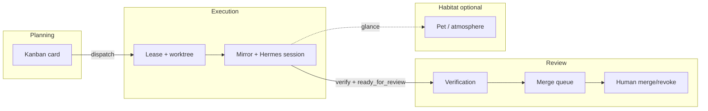

# JoyZoning operational modes

JoyZoning is a **multi-mode operator system**. Each mode uses a different mental model on purpose. **Do not replace the Jira/Kanban workflow** and **do not force one metaphor** (board, terminal, PR, or pet) across planning, execution, and review.

The architecture already separates these concerns:

| Mode | Canonical metaphor | Primary state |
|------|-------------------|---------------|
| **Planning** | Jira / Kanban | `WorkTask`, kanban sync, backlog |
| **Execution** | JSDP worker orchestration | `ExecutionLease`, Hermes sessions, canonical workspace |
| **Review** | GitHub PR | merge queue, verification, approve/revoke |
| **Habitat / Ambient** | Optional atmosphere | presentation, pet mood, care meters |

Code registry: `JoyZoningOperationalModes` in `src/JoyZoning.Domain/Orchestration/JoyZoningOperationalMode.cs`.

---

## Why modes exist

Operators think differently at different times:

- **Planning** — “What’s on the board? What should we pull next? Who owns this card?”
- **Execution** — “What’s running? Which worker? What changed in the workspace?”
- **Review** — “What files changed? Did tests pass? Can I merge or should I revoke?”
- **Habitat** — “Is anything on fire at a glance?” (supplementary, not authoritative)

Collapsing these into a single “dashboard” or a single card type creates the wrong affordances (e.g. merge buttons on a backlog view, or kanban drag-and-drop on a PR review).

---

## 1. Planning Mode

**Mental model:** Jira/Kanban — backlog, decomposition, prioritization, assignment/intake.

**Owns:**

- Card lifecycle at the **intent** layer (`WorkTask`, status, risk, Hermes kanban id)
- Manager chat for decomposition and routing (Hermes manager session)
- Import/sync with Hermes kanban (`KanbanSyncService`, outbox revisions)

**Does not own:**

- Workspace paths, lease state, or merge readiness (those belong to execution/review)
- Human merge/revoke (review only)

**Surfaces:**

| Surface | Role |
|---------|------|
| Desktop **Kanban** | Canonical planning board |
| Desktop **Manager Chat** | Planning conversation |
| Watch **session board** / task picker | Lightweight planning intake only |
| `jz` task create / status | CLI planning |

**API hints:** `/api/tasks`, `/api/tasks/import-kanban`, kanban PATCH via Hermes.

---

## 2. Execution Mode

**Mental model:** JSDP worker orchestration — leases, isolated Hermes sessions, canonical workspace, runtime activity.

**Owns:**

- `ExecutionLease` status machine (leased → running → verifying → ready_for_review)
- Per-run `ExecutionSession.HermesSessionId` (parallel workers do not share one chat)
- Canonical workspace execution (`workspacePath` = session root, branch `joyzoning/card-<id>`)
- Parallel worker observability (`/parallel-workers`, `protocol: jsdp`)
- Workspace polling (`/api/tasks/{id}/workspace/changed`, SignalR activity stream)

**Does not own:**

- Whether work is **approved to land** (review)
- Backlog ordering (planning)

**Surfaces:**

| Surface | Role |
|---------|------|
| Desktop **Execution viewport** | Canonical run observation |
| Desktop **Timeline** | Event audit |
| Watch **Parallel Workers** | Per-worker lease + workspace path |
| Watch **workspace snapshot / stream** | Single-task runtime |
| `jz agent` | Worker-side lease transitions |

**API hints:** `/api/tasks/{id}/workspace/changed`, `/api/sessions/{id}/parallel-workers`, dispatch, heartbeat, verify.

---

## 3. Review Mode

**Mental model:** GitHub PR — merge readiness, changed files, verification, conflicts, human approve/revoke.

**Owns:**

- `WorkerMergeState`, merge queue buckets, `OperatorDecisionSummary`, risk flags
- `VerificationReport` on the lease (evidence for merge)
- Human-only `POST .../lease/merge` and `POST .../lease/revoke`
- Conflict visibility (overlap, git unmerged paths, failed verification)
- Canonical workspace paths **after** revoke or failure (never hidden for inspection)

**Does not own:**

- Starting runs (execution) or card creation (planning)

**Surfaces:**

| Surface | Role |
|---------|------|
| Desktop **Approvals** + **Workspace** diffs | Canonical review |
| Watch **Merge & reconciliation** panel | Review queue + decision dialogs |
| `jz` merge/revoke (with `--yes`) | CLI review |

**API hints:** `/api/sessions/{id}/merge-queue`, `decision-preflight`, `/lease/merge`, `/lease/revoke`.

**Guardrails (read-model only):** approve blocked on `merge_conflict` / `merge_failed`; warnings for missing verification, large change sets, overlap; revoke warns when changed files exist but never blocks.

---

## 4. Habitat / Ambient Mode

**Mental model:** Optional JoyZoning layer — emotional/environmental visualization, orchestration *atmosphere*, worker presence. **Not** the canonical operational surface.

**Owns:**

- Presentation copy, pet mood, care meters, thought bubbles
- AFK/habitat visuals (`web/watch` AFK components)
- “How does it feel?” — not “what is the lease id?”

**Does not own:**

- Authoritative merge decisions, kanban truth, or lease mutations

**Surfaces:**

| Surface | Role |
|---------|------|
| Watch **Synthesis Pet**, care meters, habitat shells | Ambient only |
| Watch presentation (`useLiveTask`) | Friendly framing from workspace poll |

When habitat and review/execution UI appear on the same page (e.g. Pet Shell), **preserve boundaries**: habitat chrome must not become the only path to merge/revoke; review panels remain explicitly labeled and API-backed.

---

## Mode flow (typical)

Kanban remains the **intent contract**. Leases are **execution authority**. Merge queue is **review evidence**. Habitat is **optional context**.

---

## Engineering rules (future UI / read models)

1. **Name the mode** in new components (`data-joyzoning-mode`, file headers, or `operational-modes.ts`).
2. **Do not add merge actions** to planning-only views without review guardrails.
3. **Do not add kanban backlog semantics** to merge-queue or parallel-worker APIs.
4. **Habitat may summarize** execution/review state; it must **not** replace review APIs or decision preflight.
5. **Read models stay mode-scoped:** planning APIs return tasks; execution APIs return leases/mirrors; review APIs return merge/decision fields.
6. **Hermes kanban sync stays the planning bridge** — JoyZoning does not invent a second board.
7. **Watch UI uses one shell** — `OperatorModeShell` only; legacy `WatchDashboard` / `PetShell` delegate without stacking panels.

---

## API registry

`GET /api/operational-modes` returns the mode descriptors from `JoyZoningOperationalModes` (slug, primary question, forbidden actions, surfaces, API hints) plus registry-wide transitions.

Per-worker and per-live-task hints:

| Field | Where | Meaning |
|-------|--------|---------|
| `recommendedMode` | parallel-workers, merge-queue, workspace/changed | Best mode to open next |
| `availableModeTransitions` | same | Cross-mode handoff targets with labels |

## Watch navigation

**Canonical shell:** `OperatorModeShell` — the only supported operator composition. `WatchApp` routes here directly; `WatchDashboard` and `PetShell` are thin legacy wrappers that delegate (no stacked panels).

Watch uses a **mode switcher** (`?mode=planning|execution|review|habitat`) so only one mode’s landing is visible at a time. Habitat is the default glance; Review owns approve/revoke; Planning owns kanban; Execution owns workers/mirrors.

Campfire-style ambient visuals (`StatusHero`, `Spotlight`, workshop tabs) live under **Habitat** via `CampfireAmbientExtras` when `theme="campfire"` — they are non-canonical (`data-canonical-surface="false"`).

**Production notes:** `ModeSwitcher` loads labels from `GET /api/operational-modes` (falls back to `operational-modes.ts`). Live task and worker APIs expose `recommendedMode` / `availableModeTransitions`. User-selected modes are pinned in `sessionStorage` until depart.

**Live binding guard:** `createWatchLiveBinding()` (Watch) brands runtime props from `useLiveTask` + session state. Empty `connLabel`, error connection state, or missing snapshot/session id render `WatchOperatorDisconnected` — never a fake operator shell.

---

## Related docs

- [architecture.md](architecture.md) — stack and leases
- [concepts.md](concepts.md) — operator cockpit pillars
- [workspace-state.md](workspace-state.md) — card → worktree (review mental model)
- [execution-orchestration-api.md](execution-orchestration-api.md) — lease API
- [development.md](development.md) — parallel workers + merge queue endpoints
- [web/watch/README.md](../web/watch/README.md) — watch surfaces by mode
