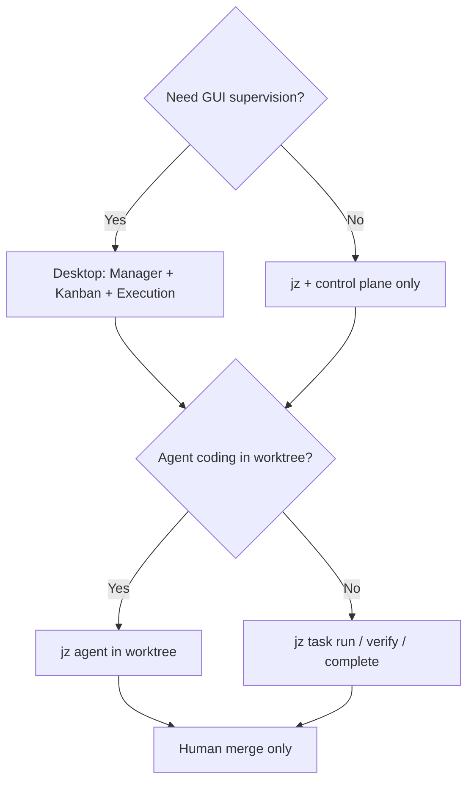

# Use cases

Concrete scenarios showing how JoyZoning’s **operator + lease** model plays out. Each maps to UI, `jz`, or API paths documented elsewhere.

---

## 1. Plan in chat, execute on the board

**You want:** Hermes breaks down a feature; work lands as trackable tasks.

| Step | Surface | Action |
|------|---------|--------|
| 1 | Manager Chat | Ask for implementation plan |
| 2 | Manager Chat | **Parse** bullets or **→ Task** for one item |
| 3 | Kanban | Review card in Backlog / Planned |
| 4 | Kanban | **Dispatch** when ready |

**Concept:** Manager session owns planning; kanban is the handoff surface to executors. [concepts.md](concepts.md#one-hermes-two-roles)

---

## 2. Supervised feature branch (happy path)

**You want:** An agent implements a task; you review diff and merge only if tests pass.

```bash
# Human
jz task create --title "Add health endpoint" --risk 1
jz task run "$TASK" --poll 10

# Agent (in worktree)
cd "$WORKTREE"
jz agent verify --cmd "dotnet build" --cmd "dotnet test"
jz agent done

# Human
jz task complete "$TASK" --yes   # merge, not skip verification
```

**Desktop:** Kanban → select card → **Workspace** (1:1 canonical workspace, PR-style diff) → **Merge** when `ready_for_review`. Execution is live context; Workspace is disk truth. [workspace-state.md](workspace-state.md)

Script reference: `scripts/examples/agent-happy-path.sh`

---

## 3. Production config change (critical path)

**You want:** Extra gate before any high-risk dispatch.

| Step | Requirement |
|------|-------------|
| Create task | `--risk 3` or risk Critical in UI |
| Dispatch | Approval checkbox or `--approve-critical` |
| Concurrency | Second critical dispatch fails while first is active |
| Retry | New approval on each `dispatch-retry` |

See [execution-orchestration-api.md](execution-orchestration-api.md#critical-card-dispatch-example) and `scripts/examples/critical-dispatch.sh`.

---

## 4. Verification failed — no silent Complete

**You want:** Red CI in the worktree does not ship.

| What happens | Result |
|--------------|--------|
| `jz agent verify --cmd "exit 1"` | Exit 1; lease not ready for review |
| `jz agent done` | Blocked until verify passes |
| Human | Fix or revoke; never bypass with raw status Complete |

Script: `scripts/examples/agent-verification-failure.sh`

---

## 5. Hermes asked for approval mid-run

**You want:** Tool calls that need human consent do not stall silently.

| Step | Surface |
|------|---------|
| 1 | Approvals inbox shows pending request |
| 2 | Choose Once / Task / Session / Deny |
| 3 | Timeline records `approval.granted` or denied |

Grants can auto-approve similar later requests for the same task/session.

---

## 6. Crash mid-run — recover without guessing

**You want:** Restart JoyZoning and know what was in flight.

| Situation | Flow |
|-----------|------|
| Control plane restarted | Executions marked **Interrupted**; Recovery menu |
| Lease blocked after dispatch fail | `jz task recover --mode reopen` then `dispatch-retry` |
| Stale agent heartbeat | Reconciliation → blocked + evidence; recover or revoke |

[troubleshooting.md](troubleshooting.md#executions-and-recovery)

---

## 7. Team-shaped kanban with Hermes

**You want:** Board in Hermes dashboard stays source of truth for status.

| Setting | Effect |
|---------|--------|
| Connect dashboard | Token for kanban plugin API |
| Import / auto-sync | Pull Hermes cards; push local changes |
| Dispatch | Pushes In Progress to Hermes kanban |

Local edits since last sync **win** on pull for those tasks. [hermes-integration.md](hermes-integration.md#kanban-two-way-sync)

---

## 8. Terminal-only operator (no GUI)

**You want:** CI or SSH session drives the same governance.

```bash
export JOYZONING_URL=http://127.0.0.1:9470
export JOYZONING_SESSION_ID=$(jz --field .id session create --name ci --workspace "$REPO")

# Full workflow via jz only — see cli.md recipes
```

Dogfood tests validate API + CLI boundary: [dogfood-report.md](dogfood-report.md).

---

## 9. Audit “what did the agent do?”

**You want:** Evidence for retro or compliance.

| Source | Content |
|--------|---------|
| Timeline | `joy_events` — tools, approvals, status changes |
| Lease record | `EvidenceLogJson`, `VerificationReportJson` |
| Workspace | `git diff` per changed file |

Replay API: `GET /api/events?since=&correlationId=`. [event-catalog.md](event-catalog.md)

---

## Choosing a path



Start from [getting-started.md](getting-started.md) for install, then [concepts.md](concepts.md) for the why.
