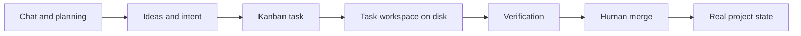
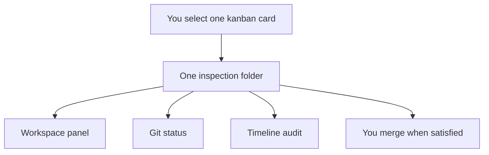
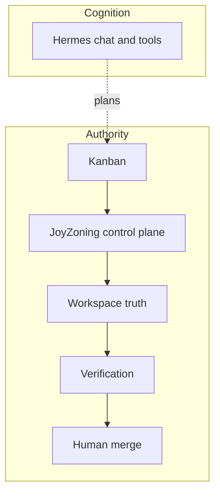

# What is JoyZoning?

**Reading level:** Anyone curious what this project actually is — no background in agent frameworks, leases, or orchestration required.

**Related:** [philosophy.md](philosophy.md) (how we build) · [workspace-state.md](workspace-state.md) (one card → one truth) · [concepts.md](concepts.md) · [jsdp.md](jsdp.md) · [onboarding/plain-language-glossary.md](onboarding/plain-language-glossary.md)

---

## 1. One paragraph summary

JoyZoning is a **governed execution runtime for AI-assisted software work** on your own machine. AI tools can help write code, run commands, and plan tasks — but real software projects still need **review**, **boundaries**, **verification**, and **human ownership** before changes become part of the project. JoyZoning provides that structure: a local control plane that tracks work on a board, runs agents in your **real project folder** (one branch per card), records what happened, requires **tests or checks** where you define them, and keeps **final sign-off** with you — not with the model. Multi-role delivery uses **JSDP** — sequential roles with a merge gate between each. It works alongside one local [diet-hermes](https://github.com/NousResearch/hermes-agent) install; it is not a replacement IDE and not a second chat app.

---

## 2. The problem JoyZoning solves

Teams already use AI for coding. In practice, several failure modes show up quickly:

| Failure mode | What it feels like |
|--------------|-------------------|
| **Chat becomes the source of truth** | “We agreed in the thread” — but the repo does not match |
| **Too much change at once** | Large, hard-to-review diffs across the whole project |
| **Unclear ownership** | Nobody knows who approved what or which task is “live” |
| **Hard-to-review changes** | Output is prose and tool logs, not a clear file list |
| **Invisible state** | Restart the app — in-flight work is lost or ambiguous |
| **Autonomous chaos** | Multiple agents stepping on each other without a queue |
| **“The AI said it was done”** | Completion is a sentence in chat, not a verified, merged change |

These hurt more on **real repos** than on demos: branches, tests, production risk, and accountability matter. JoyZoning treats AI-assisted work like **engineered work** — queued, scoped, logged, verified, and approved — instead of an open-ended conversation that accidentally edits disk.

---

## 3. The core idea

Use this framing:

| | Role |
|---|------|
| **Chat state** | **Cognition** — planning, reasoning, suggestions, tool use in conversation |
| **Workspace state** | **Truth** — files on disk, git status, diffs, test results tied to a task |

**Chats and plans are temporary and conversational.** They are great for thinking; they are a poor system of record for “what shipped.”

**Files, git, and task-scoped workspaces are durable and reviewable.** That is what you diff, what CI runs against, and what you merge.

Software work should be **governed by durable state**, with chat feeding decisions — not replacing them.



---

## 4. One card → one workspace → one truth

This is the central mental model.

- Each **kanban card** is one piece of work.
- When you care about **what changed**, you **select that card**.
- JoyZoning resolves **one inspection path** for that card — always your opened project folder.
- **Review**, **git status**, **verification**, and **timeline events** all refer to **that same path** (and branch when dispatched).

After you **dispatch**, the agent works on branch `joyzoning/card-<id>` in that folder — like a **feature branch per ticket**, not a hidden sandbox copy. Before dispatch, you see your normal project on the default branch.

| Familiar pattern | JoyZoning |
|------------------|-----------|
| **GitHub PR → Files changed** | Workspace → changed file list for the selected card |
| **VS Code → Source Control** | Same folder, diff before you accept changes |
| **Feature branch per issue** | `joyzoning/card-<id>` in the canonical workspace |

Full detail: [workspace-state.md](workspace-state.md).



---

## 5. The architecture in human terms

JoyZoning is layered. Each piece has a job you may already recognize from normal software teams:

| Piece | Plain role | Think of it as… |
|-------|------------|-----------------|
| **Kanban** | Scheduler / work queue | A board of tickets — what is next, what is blocked, what is done |
| **Lease** | Temporary permission to work on one card | A signed work order: this task, this folder, this risk level, this expiry |
| **Card branch** | `joyzoning/card-<id>` in the session workspace | Feature-branch checkout for one ticket |
| **Hermes** | Planning, chat, tools | The AI “engine” for conversation and tool use (one local install) |
| **Verification** | Proof work meets reality | Running tests, builds, or commands you care about — results stored on the task |
| **Human merge** | Final approval | You decide the change becomes **Complete** on the board and in project history |
| **`jz`** | Operator shell | Terminal commands for dispatch, verify, merge — same rules as the desktop app |
| **`jz agent`** | Constrained worker harness | What runs **inside** the lease workspace — heartbeat, verify, submit for review — **not** merge |

Nothing here requires a datacenter or a proprietary cloud. The **control plane** runs locally (default `http://127.0.0.1:9470`) and stores orchestration state in SQLite on your machine.

```
You (operator)
    → JoyZoning desktop or jz
        → control plane (rules, board, leases, events)
            → Hermes (AI runs in bounded folders)
                → files on disk (truth)
    → you review → you merge
```

---

## 6. Cognition vs authority

This split is intentional and runs through the whole product.

### What Hermes / AI can do (cognition)

- Plan and break down work  
- Write and edit code inside the assigned folder  
- Reason about errors and suggest fixes  
- Run tools (terminal, search, etc.) during a run  
- Stream progress in chat or the execution view  

### What JoyZoning decides (authority)

- Which **task** is active on the board  
- Which **folder** is authoritative for inspection  
- Whether **verification** passed and is recorded  
- Whether work is **ready for your review** (not “done” in the business sense)  
- Whether changes may become **real project state** (merge → Complete)  

**AI can operate. Humans still own authority.**

Manager Chat might say “finished.” JoyZoning still shows **files changed**, **test results**, and **lease status** until **you** merge. Agents cannot mark a card **Complete** or merge on your behalf in the governed paths.

Terminal split (for developers): [hermes-aligned-terminal-strategy.md](hermes-aligned-terminal-strategy.md).

---

## 7. Why this is different from “AI agent swarms”

JoyZoning is **not** trying to be:

- A recursive society of agents approving each other  
- Hidden orchestration you cannot inspect  
- A single chat window that is also the database, scheduler, and deploy button  
- Unbounded mutation of your repo with no review gate  
- AI **self-approving** completion or production changes  
- Lock-in to a vendor cloud for your source of truth  

JoyZoning **is** intentionally:

| Property | Meaning for you |
|----------|----------------|
| **Local-first** | Control plane and data on your machine |
| **Git-native** | Changes are normal files and diffs you can review |
| **Review-first** | Workspace and verification before merge |
| **Bounded** | One active lease per card, canonical workspace + card branches, risk levels, approvals for sensitive work |
| **Observable** | Timeline and evidence — what ran, when, with what outcome |
| **Recoverable** | Blocked or revoked work preserves folders and logs; you can retry or recover |

You get structure similar to **ticket + PR + CI**, with **probabilistic AI sessions** as workers instead of only deterministic scripts.

---

## 8. What YOLO mode actually means

**YOLO mode** sounds reckless; in JoyZoning it means **autonomous execution within policy boundaries** — not autonomous **authority**.

Within configured limits, automation can:

- Pick up tasks from the board  
- Dispatch and run workers  
- Run verification commands  
- Retry or recover within rules  
- Move work toward **ready for review**  

It **cannot**:

- **Merge** or mark tasks **Complete** without you  
- Bypass **leases** or work in undeclared folders  
- Skip **verification** you require for merge  
- Bypass **critical approvals** for high-risk work  

YOLO accelerates **doing**; it does not remove **sign-off**. Detail: [yolo-mode.md](yolo-mode.md).

---

## 9. Familiar analogies

| You already know… | JoyZoning maps to… | Important difference |
|-------------------|--------------------|----------------------|
| **GitHub PR workflow** | Card → worktree → diff → review → merge | Workers are AI runs, not only human commits |
| **CI/CD pipeline** | Dispatch → run in workspace → verify → gate | Verification is attached to the **task/lease**, not only a YAML file |
| **Kubernetes scheduling** | Kanban picks work; leases cap concurrency | Schedules **tasks**, not arbitrary pods; human merge is the release |
| **VS Code Source Control** | Workspace panel for one scoped folder | Scoped by **selected card**, not only repo root |
| **Ticket-based engineering** | Kanban + evidence + status | Executor is often an AI session with tools |

The useful analogy: **familiar engineering workflow**, with **AI as the implementer** inside bounds you set.

---

## 10. What the operator should mentally picture

A simple day-in-the-life narrative:

**You (operator)**

1. Open the app and connect to your local Hermes install.  
2. Plan in **Manager Chat** — goals, breakdown, priorities.  
3. Tasks appear on **Kanban**; you select a card.  
4. **Dispatch** — JoyZoning creates a lease and an isolated **worktree**.  
5. Watch **Execution** for live tool output if you want context.  
6. Open **Workspace** — same mental step as opening a PR’s **Files changed**.  
7. Check **verification** (tests/builds) recorded on the task.  
8. **Merge** when satisfied — the only path to **Complete** for governed work.  

**AI (worker)**

1. Runs inside the **bounded worktree** for that card.  
2. Edits files, runs commands, attaches evidence.  
3. Stops at **ready for review** — not at “shipped.”  

You are the **release manager**; the AI is the **implementer in a cordoned workspace**.

---

## 11. Final mental model

| Piece | One-line role |
|-------|----------------|
| **Hermes** | Cognition cockpit — how agents think, chat, and use tools |
| **JoyZoning** | Runtime kernel — what is allowed to become durable project state |
| **Kanban** | Scheduler — queue and status of work |
| **Workspace** | Truth — files and diffs for the selected card |
| **`jz`** | Operator shell — human commands against the same rules as the UI |
| **`jz agent`** | Constrained worker — inside the lease folder only |
| **Human merge** | Final authority — Complete after review and verification |



Use Hermes to **explore and execute ideas**. Use JoyZoning to **govern, observe, and sign off** — with **one card, one folder, one truth** when it is time to review what actually changed.

---

## Read next

| If you want to… | Open |
|-----------------|------|
| Click through the desktop | [onboarding/desktop-menu-guide.md](onboarding/desktop-menu-guide.md) |
| Install and run | [onboarding/quickstart.md](onboarding/quickstart.md) |
| Understand 1:1 folders | [workspace-state.md](workspace-state.md) |
| Use the terminal | [cli.md](cli.md) · [hermes-aligned-terminal-strategy.md](hermes-aligned-terminal-strategy.md) |
| Technical terms | [glossary.md](glossary.md) |
