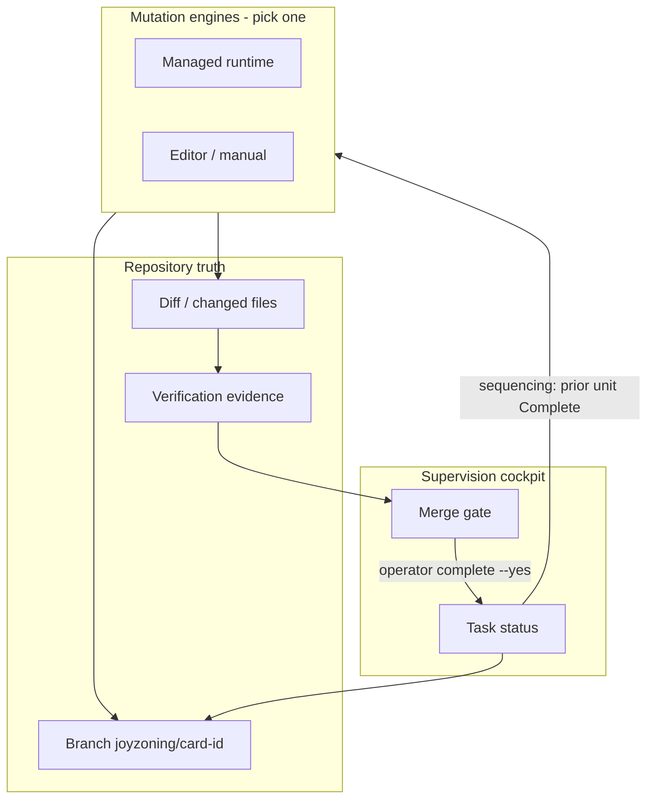
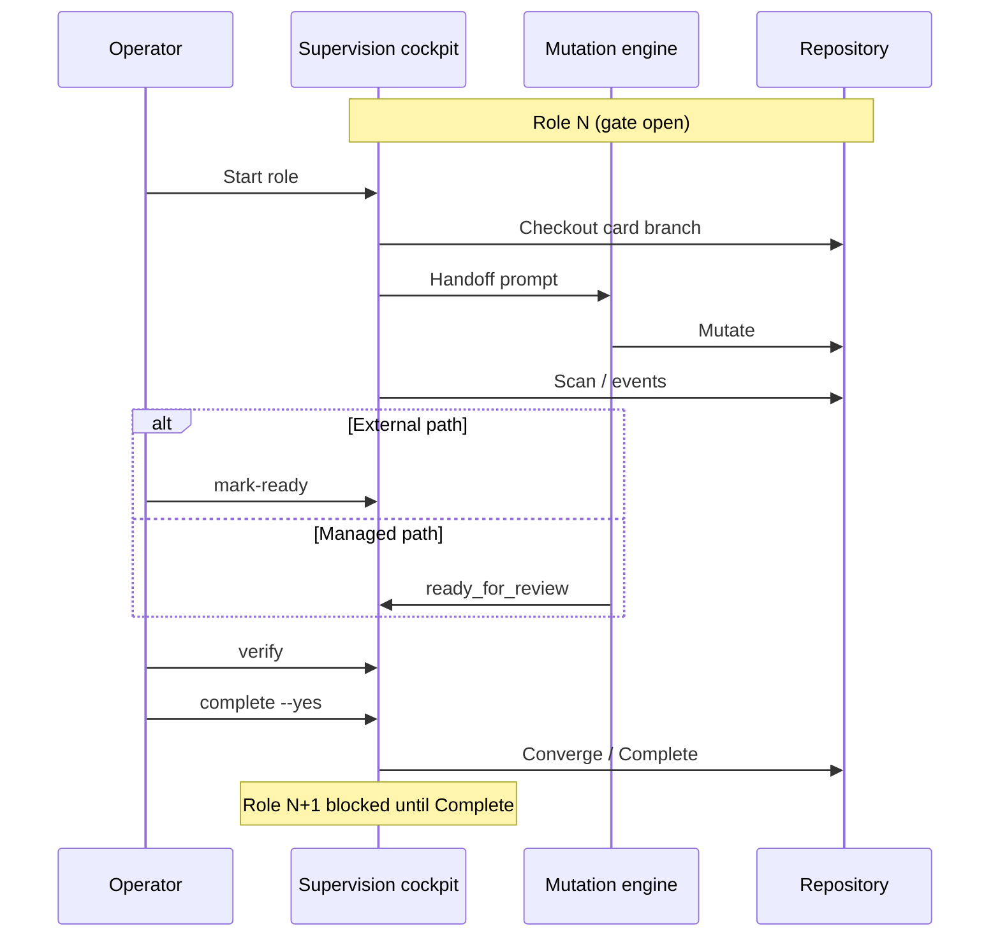

# JoyZoning: Human-Supervised Delivery for Generative Software Mutation

**Version:** 1.2 (May 2026)  
**Status:** Conceptual framework — observed under generative mutation load  
**License:** MIT

---

## Executive summary

Generative environments are **software mutation systems**: they raise the throughput of proposed repository change far faster than they raise the capacity to **converge** that change into owned, comprehensible reality.

The deepest asymmetry is structural:

> **Generative systems increase mutation capacity faster than human systems increase convergence capacity.**

**Mutation** (here) means a *proposed* change to repository state—not delivery. **Convergence** means stabilizing *accepted* repository reality so a finite operator can again maintain a coherent mental model of the system. **Trust** still flows through review, evidence, and merge—not through fluent narrative.

Modern coding agents are highly effective **mutation engines**. They are not, by themselves, **convergence systems**. Unconstrained mutation produces operational entropy: unstable narratives, overlapping architectures, and **informational debt**—debt in the maintainability of *understanding*, not only of code.

This paper articulates a durable framework for **human-supervised convergence**—discovered through building and operating **JoyZoning**, a local operator cockpit that embodies the framework. JoyZoning is not the thesis; the thesis is the separation of dimensions (mutation, reviewability, convergence, trust, operator cognition) and the disciplines that bind them. JoyZoning is one implementation example.

- **Chat plans.** Advisory narrative.
- **The repo is truth.** Inspectable state.
- **You merge.** Operator-owned acceptance.

**Cockpit, not engine.** Supervision layers should survive **engine churn**—model vendors, IDEs, and agent runtimes change; repository governance and merge authority should not.

**Companion:** [whitepaper-summary.md](whitepaper-summary.md)

---

## Conceptual glossary

| Term | Definition |
|------|------------|
| **Mutation** | A *proposed* repository state change—a diff not yet accepted into project lineage. |
| **Generation** | The act of producing candidate mutations (models, agents, editors). |
| **Convergence** | Stabilizing *accepted* repository reality through review, verification, merge authority, sequencing, preserved intent, and bounded scope—so an operator regains a coherent mental model. |
| **Repository truth** | Inspectable disk state (branch, diff, command output) as operational observability—not chat narrative. |
| **Reviewability** | The property that a change unit can be comprehended by a finite reviewer within bounded attention. A **systems constraint** bridging mutation and trust. |
| **Informational debt** | Accumulated difficulty of maintaining accurate understanding of the system—distinct from technical debt. |
| **Cognitive stabilization** | Disciplines (e.g. sequential roles, merge gates, lock artifacts) that prevent review collapse under high mutation throughput. |
| **Engine churn** | The rapid turnover of inference providers, IDEs, and agent runtimes—motivating supervision decoupled from any single engine. |
| **Merge authority** | The operator’s exclusive power to accept mutation into lineage after review and evidence. |

---

## Conceptual model: separate dimensions

These dimensions are often collapsed in tooling and conversation. Treating them separately explains why mutation acceleration does not imply delivery acceleration.

| Dimension | Question it answers | Scales with… |
|-----------|-------------------|--------------|
| **Mutation throughput** | How fast can candidates be produced? | Models, agents, parallelism |
| **Reviewability** | Can a human comprehend a bounded change unit? | Diff clarity, scope, sequencing |
| **Verification** | What executable evidence supports claims? | Commands, CI, operator time |
| **Convergence** | Is accepted reality stable before more mutation? | Gates, merge, preserved intent |
| **Trust** | Who may assert “done”? | Merge authority—not chat fluency |
| **Operator cognition** | Can one mind hold the system story? | Attention, boundaries, informational debt |

When mutation throughput rises while reviewability and convergence capacity do not, the system enters **informational debt**: verification becomes symbolic, merges become faith-based, situational awareness erodes, and the codebase may remain buildable while remaining **psychologically opaque** to its supervisor.

---

## Abstract

Generative coding environments are **mutation systems**. They accelerate proposed change. Delivery still requires **convergence mechanisms**: review surfaces, verification evidence, sequencing, preserved intent, and human merge authority grounded in repository state—not in natural language that can imply completion without evidence.

**Convergence is not** merely passing tests, generating code, obtaining agent consensus, or finishing a prompt. **Convergence is** the point at which a human operator can once again answer: *what is the accepted state of this repository, and what may safely build on it?*

Existing patterns often optimize mutation. They under-invest in convergence. The operational failure is predictable: code soup, scope drift, chat “done” without diff, QA collapse, loss of canonical workspace truth.

**JoyZoning** implements human-supervised convergence as a local operator cockpit. The ideas in this paper stand even if the implementation changed: **repository truth**, **reviewability**, **merge authority**, and **cognitive stabilization** under load.

**Generative AI changed the economics of mutation, not the economics of trust.**

---

## 1. Introduction: mutation systems and delivery

### 1.1 Software mutation systems

A generative coding environment—chat assistant, agent runtime, IDE integration—is best understood as a **software mutation system**: infrastructure that increases the rate at which repository state *may* change.

**Mutation** = proposed repository state change.

Such systems can be extraordinarily effective at mutation throughput. Delivery systems, however, still require **convergence**: the stabilization of accepted reality before further mutation accumulates. **Mutation without convergence produces unstable operational reality**—many candidate worlds, unclear ownership, narratives that diverge from disk.

> **Modern coding agents are highly effective mutation engines. They are not inherently convergence systems.**

The bottleneck has moved. Pre-generative delivery was often limited by typing and specification. Generative-assisted delivery is limited by **whether finite humans can converge** what was mutated.

| Era | Dominant constraint |
|-----|---------------------|
| Pre-generative | Code production, specification clarity |
| Generative-assisted | Convergence, reviewability, trust, operator cognition |

Primitives that predate generative editing—branches, diffs, tests, audit trails, accountable merge—remain the convergence substrate. Tools that stop at chat or unbounded file edit export convergence work to the operator.

### 1.2 Convergence (formal)

**Convergence** = stabilizing accepted repository reality through:

- **Review** on a bounded, inspectable change unit  
- **Verification** (executable evidence when policy requires)  
- **Merge authority** (operator acceptance into lineage)  
- **Sequencing** (when multiple roles or agents participate)  
- **Preserved intent** (artifacts later roles must honor)  
- **Bounded mutation scope** (one card, one branch, one role at a time)

**Convergence is not:**

| Often mistaken for convergence | Why it is insufficient |
|--------------------------------|-------------------------|
| Passing tests once | Tests on the wrong branch or incomplete scope do not establish accepted reality |
| Generating code | Production of candidates is mutation, not acceptance |
| Agent or chat consensus | Narrative agreement without disk inspection is epistemically weak |
| Prompt completion | Ending a session ≠ merge into project lineage |

**Convergence is:** a human operator can once again maintain a **coherent mental model of accepted system state**—and delegate the next bounded mutation from that stable reference frame.

Modern tooling **over-optimizes generation** and **under-invests in convergence**. JoyZoning, as implementation, is **convergence-biased**: reviewable units, recorded evidence, merge gates—not maximal autonomous throughput.

### 1.3 Framework and implementation

This paper’s framework is **general**. **JoyZoning** is the **embodiment** encountered in practice: a local-first operator cockpit supervising mutation regardless of engine.

JoyZoning is **not** another IDE, model, or autonomy doctrine. It supervises **whether proposed mutations may advance**. It does not claim proof of correctness or replace CI. It is governance for **human-supervised convergence**—inspectable, sequenced, evidenced, merge-gated.

**Operators want evidence before completion.** Sustainable supervision—not maximal autonomy.

---

## 2. Problem statement

Failure modes below appear when **mutation systems** operate on non-trivial repositories **without** convergence discipline. The framework was shaped by operational exposure under load—not by preference for ceremony.

### 2.1 Why common patterns fail operationally

| Pattern | Mutation strength | Convergence failure |
|---------|-------------------|---------------------|
| **Chat-only assistance** | Fast narrative, planning | No isolated review unit; “done” without diff |
| **IDE inline assistants** | Tight edit loop | Weak sequencing, audit, multi-role stabilization |
| **Autonomous auto-merge** | Throughput | Removes merge authority; trust without review |
| **Multi-agent swarms** | Parallel mutation | Reviewability collapse; integration entropy |
| **CI/CD alone** | Integration verification | No in-flight mutation bounds or role order |

The failure is rarely “the model cannot code.” It is **unbounded mutation** without **reviewability**, and **completion signals** that do not bind to repository truth.

### 2.2 Failure modes

| Failure mode | Mechanism | Cost |
|--------------|-----------|------|
| **Code soup** | Parallel mutation without convergence | Archaeological review; unknown architecture |
| **Scope drift** | Unbounded mutation per “role” | Intent erosion; QA explosion |
| **Informational debt** | Throughput > comprehension | Opaque system despite green builds |
| **Chat completion claims** | Narrative substitutes for disk | Faith-based merge; incidents |
| **QA collapse** | Verification lag | Spot-checking; burnout |
| **Loss of repository truth** | Sandboxes or chat as “the project” | Observability failure |

Responses that proved necessary in practice: **repository truth**, **reviewability bounds**, **merge gates**, **cognitive stabilization (JSDP)**, **engine-agnostic supervision**.

### 2.3 Informational debt

**Technical debt** concerns maintainability of *code*. **Informational debt** concerns maintainability of *understanding*.

Generative mutation can accumulate informational debt **faster** than technical debt: unclear diffs, overlapping rewrites, unverifiable changes, chat-only completion claims, unstable architecture narratives, concurrent “done” stories.

> **High mutation throughput without reviewability creates informational debt.**

Verification under informational debt becomes **symbolic**—commands run without confidence in scope. Merges become **faith-based**. Operators lose **situational awareness**. The system becomes **psychologically opaque** even when artifacts exist.

**Reviewability is the bridge between mutation and trust.** Without it, trust cannot scale with mutation volume.

---

## 3. Design principle: repository truth

Repository truth is the convergence anchor: **operational observability**, not philosophical purity.

| Layer | Character | Role |
|-------|-----------|------|
| **Chat / planning** | Narrative | Advisory |
| **Repository state** | Inspectable | **Truth** |
| **Operator** | Review, verify, merge | **Accountability** |

### 3.1 Narrative vs inspectable state

**Chat is narrative**—compressive, persuasive, capable of implying completion without evidence.

**Repository state is inspectable reality**—diffs, branches, logs on *this* tree.

**Diffs are epistemically stronger than summaries.** Summaries assist; diffs ground. **Verification commands** ground claims in executable evidence attached to the task.

### 3.2 Delivery implication

> **JoyZoning treats generated code as proposed repository mutation, not completed work.**

Delivery is operator acceptance into lineage—on a **stable review surface**, with evidence when required. The framework does not require a specific product name; it requires **truth on disk**.

---

## 4. Cockpit, not engine

### 4.1 Separation of supervision and mutation

**Cockpit, not engine:** supervise mutation; do not compete as the mutation engine.

| Supervision layer owns | Mutation engines own |
|------------------------|----------------------|
| Task status, sequencing, gates | Edits, refactors, local iteration |
| Branch identity per unit | Implementation tactics |
| Verification evidence | Tool execution |
| Audit trail | Advisory “stop” signals |
| Merge authority | — |

Engines—models, IDEs, agent runtimes—are **mutation sources**. None are **merge authority**.

### 4.2 Engine churn

**Engine churn** is a first-class operational fact: inference providers, IDE integrations, and agent runtimes **change faster** than mature delivery disciplines are reinvented. Workflows hard-wired to one engine become brittle; supervision tied to one vendor repeats the “chat is truth” failure in a new shell.

Therefore:

> **Durable supervision layers should outlive inference providers.**

Repository governance—branch per unit, diff review, evidence, merge gate, sequencing—matters more for **delivery** than provider selection. **Cockpit, not engine** is not branding; it is **decoupling convergence from churn**.

JoyZoning implements this decoupling (managed path with one runtime integration; external path with any editor). The **framework** stands without either path.

### 4.3 Implementation note (JoyZoning)

JoyZoning runs local control plane state (:9470), kanban tasks, workspace inspection, and CLI (`jz`) with the same gates as desktop UI. Canonical workspace = folder opened; card branch = `joyzoning/card-<id>`. Details in §8.

---

## 5. Execution paths

Two embodiment paths share **convergence mechanics**; they differ only in **where mutation occurs**. **Same merge gate. Different engine.**

### 5.1 Comparison table

| Dimension | **Managed** (integrated agent runtime) | **External** (editor / manual) |
|-----------|----------------------------------------|--------------------------------|
| **Start** | Dispatch / `task run` | `start-external` / `delivery-chain next --external` |
| **Runtime lease** | Yes | **No** (expected) |
| **Where mutation occurs** | Integrated execution view | Operator IDE or terminal |
| **Stop surface** | `ReadyForReview` | `mark-ready` |
| **Verification** | Shared command evidence | Shared |
| **Convergence** | Operator `complete --yes` | Same |
| **Specific runtime required** | Yes (managed path) | **No** |

### 5.2 Managed path (summary)

Dispatch → lease + handoff → mutation on card branch → verify → review → operator merge → **Complete**.

### 5.3 External path (summary)

`start-external` → prompt + branch → mutation in editor → scan → `mark-ready` → verify → operator merge → **Complete**.

Convergence mechanics are **engine-independent**; only the mutation locus changes.

### 5.4 Lifecycle diagram

---

## 6. JSDP: cognitive stabilization under mutation load

**JSDP** (JoyZoning Sequential Delivery Protocol) is a **cognitive stabilization strategy** for high-mutation environments—not a throughput maximizer.

**Operate like a line dance, not a jazz band.** One step. One role. One merge. Next step.

Under high mutation velocity, choreography is how a finite operator **survives convergence**—not how a committee enjoys process. JSDP does **not** maximize mutation throughput. It **maximizes survivable convergence**.

### 6.1 What stabilization provides

| Instability | Stabilization mechanism |
|-------------|-------------------------|
| Simultaneous architectural drift | One role at a time |
| Lost intent | Product Lock, Architecture Lock as reference frames |
| Integration entropy | Merge gate = synchronization point before next mutation |
| Review collapse | Bounded scope per role; explicit handoff sections |
| Parallel “done” narratives | One branch + one merge per role |

**Merge gates** are **synchronization points**: narrative pauses; disk must catch up to claimed intent before the next role mutates.

**Accepted roles become stable reference frames**—the next mutation extends reality, not rewrites it silently.

### 6.2 Rules

1. One role at a time on a chain.  
2. One bounded session per role; one branch `joyzoning/card-<task-id>`.  
3. Role N **Complete** (merged) before Role N+1 begins.  
4. Lock artifacts preserve intent; follow-ups do not silently redesign.

### 6.3 Default eight-role chain

| Seq | Role | Intent |
|-----|------|--------|
| 1 | **Product Lock** | `docs/product-lock.md` |
| 2 | **Architecture Lock** | `docs/architecture-lock.md` |
| 3 | **Core Flow** | Main user journey |
| 4 | **UI Coherence** | Consistent UI/UX |
| 5 | **Data & Persistence** | State, storage, recovery |
| 6 | **QA Pass** | Tests, regressions |
| 7 | **Polish & Recovery** | High-impact fixes only |
| 8 | **Release Seal** | Runbook, ship verification |

### 6.4 Reviewability under load

**Reviewability is a systems constraint.** Without reviewability, verification is symbolic and merge is faith-based.

Sequential choreography **reduces integration entropy** and **bounds operator attention** to one story at a time. It denies **unbounded simultaneous architectural mutation** on one convergence surface—not all parallelism everywhere.

### 6.5 Sequence diagram

---

## 7. Human factors: operator cognition under load

Human factors are the **limiting reagent**—not an appendix.

> **The operator’s ability to maintain a coherent mental model is the limiting reagent in generative mutation systems.**

### 7.1 Finite infrastructure

Operators are **finite infrastructure**. Attention, working memory, and QA capacity **do not scale linearly** with mutation volume. **Understanding system state is itself work**—often underestimated when generation appears “free.”

**QA is a scarce cognitive resource.** When verification cannot keep pace with mutation, quality does not average out; it collapses into spot-checking, narrative trust, or withdrawal.

### 7.2 Cognition and orchestration

**Orchestration complexity can exceed implementation complexity.** A modest application domain may still produce **dominant mutation-management cost**: tracking branches, roles, conflicting narratives, and incomplete convergence. The limiting work becomes **supervision**, not feature coding.

This observation is repeatable: the **mutation-management problem** can dwarf the **software problem**.

### 7.3 Review surfaces and merge gates

Operators require **stable review surfaces**—one unit, one branch, one diff set, one evidence record. Without them, every review **re-derives context** from chat—a high-error, high-cost mode.

**Merge gates are cognitive boundaries**: candidate mutation must not blur into accepted reality until the operator’s model aligns with disk.

### 7.4 Informational opacity

High parallelism without reviewability yields **psychological opacity**: artifacts exist, but the operator cannot confidently narrate what the system *is*. That opacity is **informational debt**—and it compounds with each unmerged mutation wave.

### 7.5 Sustainable supervision

> **The goal is not full autonomy. The goal is sustainable supervision.**

After sufficient mutation throughput, **stable convergence disciplines become more—not less—important.** Additional generation without convergence boundaries **increases** informational debt; it does not clear it.

---

## 8. Implementation sketch (JoyZoning)

JoyZoning embodies the framework locally: control plane, kanban tasks, workspace scanner, verification runner, merge gate, audit events, JSDP chains, managed and external paths. Component table unchanged in role—implementation detail for readers who deploy the system.

| Component | Convergence function |
|-----------|-------------------|
| Control plane | State, gates, API |
| Workspace inspection | Repository truth on disk |
| Verification runner | Evidence attachment |
| Merge gate / JSDP queue | Convergence enforcement |
| Audit (`joy_events`, `external.*`) | Post-hoc observability |

The **framework** does not require this stack; it requires the **functions**.

---

## 9. Agent-agnostic discipline

**JSDP and merge authority bind to repository mutation—not to a runtime.**

External workflow (editor/manual): start → mutate on branch → mark-ready → verify → operator merge. Agents must not usurp **Complete**.

**Engine churn** reinforces agnosticism: gates and evidence outlive engines.

---

## 10. Comparison to common patterns

| Pattern | Mutation | Convergence gap |
|---------|----------|-----------------|
| Chat-only | High narrative throughput | No review unit; informational debt |
| Auto-merge agents | High | No merge authority |
| Swarms | Very high parallel mutation | Reviewability collapse |
| IDE assistants | High local mutation | Weak sequencing / stabilization |
| CI/CD | Low in-flight mutation | Strong at boundary, weak mid-flight |

Supervision sits **between** mutation systems and **human-owned merge authority**.

---

## 11. Case study: TinyQuest Campfire

**TinyQuest** is a local-first React Native (Expo) app—**grounded observation**, not promotion.

### 11.1 Two problems, unequal weight

- **Software problem:** Modest—a cozy mobile companion (quests, journal, hydration, settings). Generative tools were adequate to the **domain**.
- **Mutation-management problem:** Dominant—tracking what changed, in what order, under which intent, with what evidence.

> **The orchestration layer became more cognitively expensive than the application domain itself.**

That inversion is the case study’s core finding.

### 11.2 What failed first

Unconstrained parallel mutation raised **output** faster than **comprehension**. The bottleneck was **understanding what changed**—not **producing changes**. Informational debt accumulated: competing sketches, opaque diffs, verification harder than generation.

### 11.3 Cognitive stabilization (JSDP)

JSDP restored **comprehensibility** through synchronization points—not maximum throughput:

- Lock artifacts as **stable reference frames**  
- One role converged before the next mutated  
- Survivable QA for a single operator  

### 11.4 Engine change without framework change

External editor workflow (same gates, no managed runtime lease) showed **convergence discipline outlived the engine**. Mutation locus changed; stabilization did not.

### 11.5 General lesson

When mutation is cheap, **convergence is the product**. Tools that only raise mutation throughput without reviewability bounds **export cost** to operators—as informational debt and eventually as codebase risk.

---

## 12. Lessons learned

1. **Mutation capacity and convergence capacity scale differently.**  
2. **Reviewability bridges mutation and trust**—without it, verification is symbolic.  
3. **Informational debt can outrun technical debt.**  
4. **Convergence is operator comprehension of accepted state—not prompt completion.**  
5. **Cognitive stabilization maximizes survivable convergence, not throughput.**  
6. **Merge gates are synchronization points, not bureaucracy.**  
7. **Supervision should survive engine churn.**  
8. **Orchestration cost can dominate domain cost** under high mutation load.

---

## 13. Limitations

The framework does not prove correctness; it depends on review quality; it adds overhead on trivial changes; external paths require operator discipline; it does not replace CI or team process. JoyZoning as implementation is local-first, single-operator biased. **Modest claims, operational scope.**

---

## 14. Future work

Richer review surfaces; editor integrations respecting branches; policy templates; shared audit; stronger evidence adapters—implementation directions, not framework requirements.

---

## 15. Conclusion

Generative environments made **mutation** inexpensive. They did not make **convergence** inexpensive. Trust still requires inspectable state, reviewable units, evidence when policy demands, and a human who merges.

As **mutation throughput** rises across the industry, **convergence disciplines**—repository truth, reviewability, merge authority, cognitive stabilization—become **more important**, not less. That is not a prediction about “the future of AI.” It is the same invariant that applied when diffs replaced verbal handoffs: **delivery follows accepted reality, not proposed reality.**

The limiting question is whether a finite operator can **converge** the repository to a state they understand and accept before informational debt makes the system opaque.

Historical pattern suggests teams that treat mutation systems as convergence systems—not as oracles—will outperform teams that optimize narrative confidence. The mechanism is mundane: **inspect disk, bound scope, evidence, merge, then mutate again.**

JoyZoning names one embodiment. The framework is the point.

---

**Chat plans. The repo is truth. You merge.**

---

## References (project documentation)

| Topic | Document |
|-------|----------|
| Execution paths | [execution-paths.md](execution-paths.md) |
| External-agent JSDP | [external-agent-jsdp.md](external-agent-jsdp.md) |
| JSDP protocol | [jsdp.md](jsdp.md) |
| Philosophy | [philosophy.md](philosophy.md) |
| Architecture | [architecture.md](architecture.md) |
| API | [control-plane-api.md](control-plane-api.md) |
