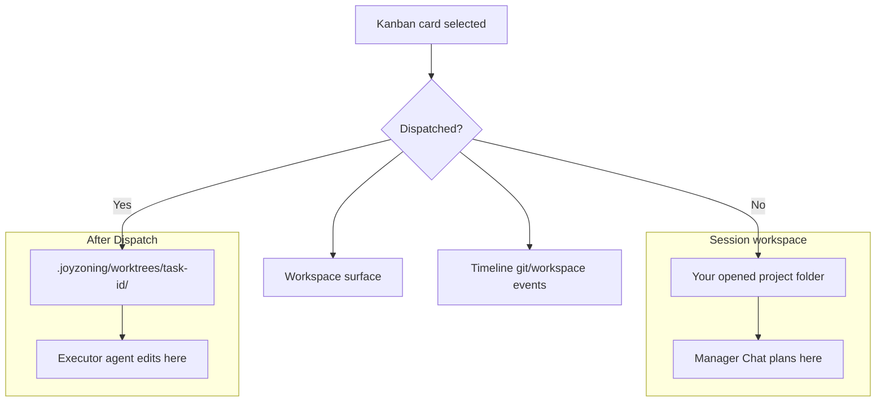

# Workspace state — one card, one folder, one truth

JoyZoning keeps **what you see**, **what git reports**, and **what the audit log records** aligned. That is the **1:1 workspace state** model: one selected task at a time maps to **one inspection folder**, and every surface reads that same folder through the control plane.

**Who this is for:** everyone — especially operators who do not want to guess which directory the agent edited.

**Start with the big picture:** [what-is-joyzoning.md](what-is-joyzoning.md) · **See also:** [desktop-ui.md](desktop-ui.md) (Workspace surface) · [desktop-menu-guide.md](onboarding/desktop-menu-guide.md) (where to click) · [plain-language-glossary.md](onboarding/plain-language-glossary.md) (everyday words) · [event-catalog.md](event-catalog.md) (timeline types)

---

## The rule in one sentence

> **Pick a kanban card → JoyZoning shows the files that card’s agent is allowed to change — not a random parent folder.**

If the card has been **dispatched**, that folder is the **lease worktree** (sandbox copy). If not, it is your **session workspace** (the project you opened). The header always tells you which.

---

## Familiar patterns (industry mirror)

JoyZoning borrows layouts you may already know:

| You may know… | JoyZoning equivalent | What stays 1:1 |
|---------------|----------------------|----------------|
| **GitHub PR → Files changed** | Workspace → **Changed** list | Same paths git sees |
| **VS Code → Source Control** | Workspace + split diff | Red/green hunks before you “merge” |
| **CI job → workspace artifact** | Lease worktree under `.joyzoning/worktrees/<task-id>/` | Agent edits only inside the job folder |
| **Linear issue → linked branch** | Kanban card → one worktree | Card selection drives inspection |
| **Slack thread vs ticket** | Manager Chat vs Kanban card | Chat plans; card + lease is the contract for code |

The cockpit does **not** ask you to reconcile chat scrollback with disk. It asks you to reconcile **one card** with **one folder** and **one timeline**.

---

## Two folders (only two you need)

| Folder | Everyday name | When it is used |
|--------|---------------|-----------------|
| **Session workspace** | “The project I opened” | Planning, undispatched cards, browsing the repo |
| **Lease worktree** | “The agent’s practice lane” | After **Dispatch** — all executor edits for that card |

**Label in the app:** Workspace header shows either **Lease worktree · …path** or **Session workspace · …path**. If the label and the changed-file list do not match what you expect, click **Refresh** or re-select the card.

---

## What “1:1” means technically

For the **active card**, these read the **same resolved path**:

| Surface | What it shows |
|---------|----------------|
| **Workspace** | File tree, changed files, diff preview |
| **Timeline** (Git / Workspace filters) | `git.status.changed`, `workspace.file.changed` |
| **`jz /workspace`** (with `/use <task>`) | Same API as desktop |
| **Background monitor** | Periodic scan of active lease worktrees → `OnWorktreeRefreshed` |

Resolution is centralized in the control plane (`WorkspaceInspection`): **task id → lease worktree if present, else session root**. No duplicate heuristics in the UI.

**Git source of truth:** `git status --porcelain` on that path. Non-git folders fall back to “recently modified files” (24h) — the header still reflects the correct folder.

---

## Operator journey (non-technical)

Follow this like a **PR review checklist**:

| Step | Where in the app | You are checking… |
|------|------------------|-------------------|
| 1 | **Kanban** — click the card | “This is the task I care about” |
| 2 | **Workspace** — read the header | “Lease worktree” vs “Session workspace” |
| 3 | **Changed** list | Same idea as PR file list — what will merge |
| 4 | Click a file — **diff** | Red removed / green added (or file preview) |
| 5 | **Execution** (optional) | Live terminal preview — *conversation*, not the merge gate |
| 6 | **Timeline** → filter Git or Workspace | Audit trail matches the same paths |
| 7 | **Kanban** — **Merge** when satisfied | Only you sign off → **Complete** |

**Important:** Manager Chat and Hermes TUI show **thinking and tools**. **Workspace** shows **files on disk** for the selected card. Trust Workspace + verification for sign-off, not chat alone.

---

## When the UI updates (you do not need to poll)

| Event | What refreshes Workspace |
|-------|---------------------------|
| You select a kanban card | Task-scoped inspection |
| You click **Dispatch** | Switches to lease worktree |
| Agent changes files | Background monitor (~45s) or **Refresh** |
| Execution phase changes | Auto-refresh if that card is selected |
| SignalR `OnWorktreeRefreshed` | Auto-refresh when selected card matches |

---

## Cognition vs authority (terminal split)

| Question | Use this | Not this |
|----------|----------|----------|
| “What should we build next?” | **Manager Chat** / `hermes --tui` | Workspace |
| “What files did the agent actually change?” | **Workspace** | Chat scrollback |
| “May this become project state?” | **Verify** + **Merge** | Agent saying “done” |

Full terminal strategy: [hermes-aligned-terminal-strategy.md](hermes-aligned-terminal-strategy.md).

---

## Troubleshooting “wrong folder” feelings

| Symptom | Likely cause | What to do |
|---------|--------------|------------|
| Empty **Changed** but agent was busy | Card not dispatched — still on session root | **Dispatch**, then re-open Workspace |
| Changes under `main` unexpectedly | Editing outside JoyZoning lease | Open **Lease worktree** path in your IDE, or dispatch properly |
| Stale file list | Deduped snapshot — no git delta yet | Click **Refresh**; wait one monitor interval |
| Timeline shows events but Workspace empty | Different card selected | Re-select the card on Kanban |
| Not a git repo | Porcelain unavailable | Changed list uses recent files; merge still human-gated |

More: [troubleshooting.md](troubleshooting.md) · [troubleshooting-setup.md](onboarding/troubleshooting-setup.md)

---

## Configuration (optional)

Background scans: `LeaseRuntime:WorktreeMonitorEnabled` (default `true`), `WorktreeMonitorIntervalSeconds` (default `45`). See [configuration.md](configuration.md).

---

## API reference (integrators)

| Endpoint | Resolves |
|----------|----------|
| `GET /api/workspace/*` | Explicit `workspaceRoot` (+ optional `sessionId` for timeline) |
| `GET /api/tasks/{id}/workspace/*` | Lease worktree or session root for that task |

[control-plane-api.md](control-plane-api.md) · [event-catalog.md](event-catalog.md)

---

## Read next

| Audience | Doc |
|----------|-----|
| What JoyZoning is (plain English) | [what-is-joyzoning.md](what-is-joyzoning.md) |
| Click-by-click | [onboarding/desktop-menu-guide.md](onboarding/desktop-menu-guide.md) |
| Concepts spine | [concepts.md](concepts.md) |
| Terminal operators | [cli.md](cli.md) (`/workspace`, `/use`) |
| Product history | [mvp-roadmap.md](mvp-roadmap.md) Phase 27 |
