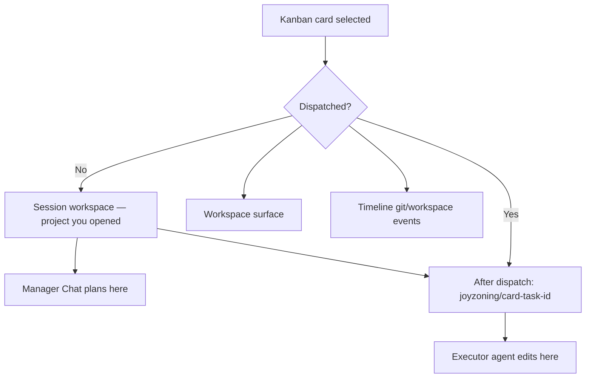

# Workspace state — one card, one workspace, one truth

JoyZoning keeps **what you see**, **what git reports**, and **what the audit log records** aligned. That is the **1:1 workspace state** model: one selected task at a time maps to **one inspection path** (and branch when dispatched), and every surface reads that same context through the control plane.

**Philosophy:** [philosophy.md](philosophy.md) · **Who this is for:** everyone — especially operators who do not want to guess which directory the agent edited.

**See also:** [desktop-ui.md](desktop-ui.md) · [desktop-menu-guide.md](onboarding/desktop-menu-guide.md) · [plain-language-glossary.md](onboarding/plain-language-glossary.md) · [event-catalog.md](event-catalog.md)

---

## The rule in one sentence

> **Pick a kanban card → JoyZoning shows the files that card’s work affects — in your real project folder, on that card’s branch when dispatched.**

There is **no** separate sandbox copy under `.joyzoning/worktrees/` and **no** `.joyzoning/live/` mirror. The session workspace you opened **is** where agents work.

---

## Familiar patterns (industry mirror)

| You may know… | JoyZoning equivalent | What stays 1:1 |
|---------------|----------------------|----------------|
| **GitHub PR → Files changed** | Workspace → **Changed** list | Same paths git sees |
| **VS Code → Source Control** | Workspace + split diff | Red/green hunks before you merge |
| **Feature branch per ticket** | Branch `joyzoning/card-<task-id>` | Card selection drives branch + inspection |
| **Linear issue → linked branch** | Kanban card → one branch in canonical root | Card selection drives inspection |
| **Slack thread vs ticket** | Manager Chat vs Kanban card | Chat plans; card + lease is the contract for code |

The cockpit does **not** ask you to reconcile chat scrollback with disk. It asks you to reconcile **one card** with **one folder** (and branch) and **one timeline**.

---

## Two views (same folder)

| View | Everyday name | When it is used |
|------|---------------|-----------------|
| **Session workspace** | “The project I opened” | Planning, undispatched cards, browsing the repo |
| **Card branch** | “This ticket’s line of work” | After **Dispatch** — executor edits on `joyzoning/card-<id>` |

**Label in the app:** Workspace header shows **Session workspace** or the active **card branch** and path. If the changed-file list does not match what you expect, click **Refresh** or re-select the card.

---

## What “1:1” means technically

For the **active card**, these read the **same resolved path** (`OperatorSession.WorkspaceRoot`):

| Surface | What it shows |
|---------|----------------|
| **Workspace** | File tree, changed files, diff preview |
| **Timeline** (Git / Workspace filters) | `git.status.changed`, `workspace.file.changed` |
| **`jz task watch`** | Polls `GET /api/tasks/{id}/workspace/changed` |
| **Watch UI** | `useLiveTask` + SignalR `OnWorktreeRefreshed`, `OnTaskLiveUpdated` |

Resolution is centralized in the control plane (`WorkspaceInspection`): **task id → workspace root**, with branch `joyzoning/card-<id>` when a lease is active. No duplicate heuristics in the UI.

**Git source of truth:** `git status --porcelain` on that path. Non-git folders fall back to “recently modified files” (24h) — the header still reflects the correct folder.

---

## Operator journey (non-technical)

Follow this like a **PR review checklist**:

| Step | Where in the app | You are checking… |
|------|------------------|-------------------|
| 1 | **Kanban** — click the card | “This is the task I care about” |
| 2 | **Workspace** — read the header | Path + branch for this card |
| 3 | **Changed** list | Same idea as PR file list — what will merge |
| 4 | Click a file — **diff** | Red removed / green added |
| 5 | **Execution** (optional) | Live terminal preview — *conversation*, not the merge gate |
| 6 | **Timeline** → filter Git or Workspace | Audit trail matches the same paths |
| 7 | **Kanban** — **Merge** when satisfied | Only you sign off → **Complete** |

**Important:** Manager Chat and Hermes TUI show **thinking and tools**. **Workspace** shows **files on disk** for the selected card. Trust Workspace + verification for sign-off, not chat alone.

---

## When the UI updates

| Event | What refreshes Workspace |
|-------|---------------------------|
| You select a kanban card | Task-scoped inspection |
| You click **Dispatch** | Switches to card branch view |
| Agent changes files | `GET /api/tasks/{id}/workspace/changed` or **Refresh** |
| SignalR `OnWorktreeRefreshed` / `OnTaskLiveUpdated` | Auto-refresh when selected card matches |
| Execution phase changes | Auto-refresh if that card is selected |

Legacy `.joyzoning/worktrees/` and `.joyzoning/live/` directories are **not** used. If you still have them from older runs, they are pruned on merge/revoke — you may delete them manually: `rm -rf <workspace>/.joyzoning/worktrees <workspace>/.joyzoning/live`.

---

## Cognition vs authority (terminal split)

| Question | Use this | Not this |
|----------|----------|----------|
| “What should we build next?” | **Manager Chat** / `hermes --tui` | Workspace |
| “What files did the agent actually change?” | **Workspace** | Chat scrollback |
| “May this become project state?” | **Verify** + **Merge** | Agent saying “done” |

Full terminal strategy: [hermes-aligned-terminal-strategy.md](hermes-aligned-terminal-strategy.md).

---

## Troubleshooting “wrong folder” feelings

| Symptom | Likely cause | What to do |
|---------|--------------|------------|
| Empty **Changed** but agent was busy | Card not dispatched — still on default branch | **Dispatch**, then re-open Workspace |
| Changes on unexpected branch | Editing outside JoyZoning lease | Confirm card selected; check `git branch` |
| Stale file list | No git delta yet | Click **Refresh**; run `jz task watch <id>` |
| Timeline shows events but Workspace empty | Different card selected | Re-select the card on Kanban |
| Not a git repo | Porcelain unavailable | Changed list uses recent files; merge still human-gated |

More: [troubleshooting.md](troubleshooting.md) · [jsdp.md](jsdp.md) (legacy folder cleanup)

---

## API reference (integrators)

| Endpoint | Resolves |
|----------|----------|
| `GET /api/workspace/*` | Explicit `workspaceRoot` (+ optional `sessionId` for timeline) |
| `GET /api/tasks/{id}/workspace/*` | Canonical workspace for that task (card branch when leased) |
| `GET /api/tasks/{id}/workspace/changed` | Git porcelain; triggers SignalR when hash changes |

[control-plane-api.md](control-plane-api.md) · [event-catalog.md](event-catalog.md) · [development.md](development.md)

---

## Read next

| Audience | Doc |
|----------|-----|
| Why canonical workspace | [philosophy.md](philosophy.md) |
| What JoyZoning is (plain English) | [what-is-joyzoning.md](what-is-joyzoning.md) |
| Click-by-click | [onboarding/desktop-menu-guide.md](onboarding/desktop-menu-guide.md) |
| JSDP chains | [jsdp.md](jsdp.md) |
| Concepts spine | [concepts.md](concepts.md) |
